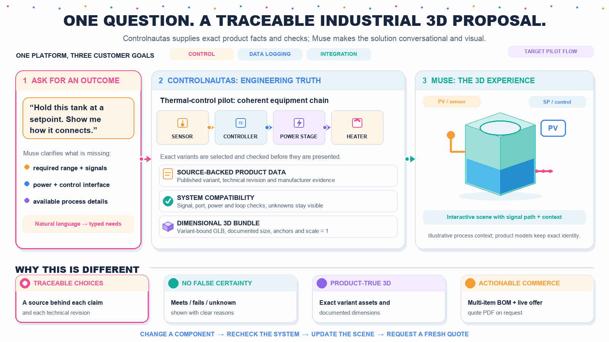

<p align="center">
  
</p>

<h1 align="center">Controlnautas × Muse<br/>Industrial Agent Commerce API</h1>

<p align="center">
  <strong>Hack AI Commerce · AI Valley</strong><br/>
  The engineer arrives with a production problem. Muse designs a plant solution.<br/>
  Controlnautas remains the source of truth for catalog, specs, 3D, price, and quotes.
</p>

<p align="center">
  <a href="https://data.controlnautas.com/healthz"></a>
  <a href="https://data.controlnautas.com/docs/openapi-industrial-v2-demo.yaml"></a>
  <a href="LICENSE"></a>
  
</p>

<p align="center">
  <a href="https://data.controlnautas.com">Live API</a> ·
  <a href="https://data.controlnautas.com/docs/openapi-industrial-v2-demo.yaml">OpenAPI</a> ·
  <a href="https://data.controlnautas.com/api/industrial/v2/configurations/heating-chamber/bundle">Heating Chamber Bundle</a> ·
  <a href="#architecture">Architecture</a> ·
  <a href="#judge-path-no-website-required">Judge path</a>
</p>

---

## What this project is

**Controlnautas** is a B2B industrial commerce stack (**Medusa 2** + PostgreSQL).  
This Hack AI Commerce build exposes a **machine-readable Industrial API** so **Meta Muse** can turn a **plant problem** into an **integrated solution** — not a shopping cart of SKUs.

Typical client intent: *“I dry coffee beans on a conveyor and need closed-loop temperature/humidity control.”*  
Muse should compose the loop from real catalog products (PID controller, TZone temp/RH sensor, supervisory HMI), show how they mount on the line, render them **integrated in 3D at real scale**, surface live PID/plant context, then quote only what is sellable today.

The API enables Muse to:

1. **Map a process need** to catalog roles (sensor → PID → power stage → heater / load)  
2. **Evaluate** requirements with a deterministic tri-state engine (`meets` / `does_not_meet` / `not_documented`) — never “probably compatible”  
3. **Load dimensional GLB** models (meters, +Y up, +Z forward) with honest fidelity labels  
4. **Read OEM datasheets** over HTTPS (page-backed evidence)  
5. **Request live USD offer / stock** from Medusa and issue a **preliminary quote PDF**

There is **no second chatbot on our website**. Muse is the conversational and spatial layer. Our backend is the authority for facts, geometry identity, money, and documents.

> Storefront UI is **intentionally deferred** for the demo: the product surface for judges and agents is the **HTTPS API + Muse**.

---

## Architecture

```text
Engineer  →  Meta Muse (conversation + 3D artifact)
                 │  HTTPS + OpenAPI
                 ▼
         Controlnautas Industrial API
         (Medusa 2 · PostgreSQL · CAS GLB · ReportLab PDF)
                 │
                 ├─ technical snapshots + evidence refs
                 ├─ strict evaluator (no LLM in the loop)
                 ├─ content-addressed GLB delivery
                 └─ live commerce offer / preliminary quote
```

| Responsibility | Owner |
|---|---|
| Dialogue, scene composition, artifact UX | **Meta Muse** |
| Specs, ports, evidence, unknown handling | **Controlnautas API** |
| Compatibility verdicts | **Deterministic evaluator** (not the LLM) |
| 3D product identity / scale | **Catalog GLB** (CAS) |
| Price, stock, quote PDF | **Medusa commerce** |
| Missing SSR / heater | Explicit `missing_roles` — **no invented SKUs** |

---

## Pilot solution: closed-loop thermal process

Demo process family: industrial heating / drying control (e.g. coffee-bean drying on a conveyor).

| SKU | Product | Role in the loop |
|---|---|---|
| `CN-X5PRIME-HE-XP5` | Horner X5 Prime OCS | Supervisory HMI / PLC |
| `CN-N1200` | NOVUS N1200 | Process PID controller |
| `CN-THT02` | TZone THT-02 | Temp / RH transmitter on the line |

**Declared missing (not sold as fake catalog items):** `actuator_power_switching` (SSR) · `thermal_load_heater`

Bundle flags (honest):
- `ready_for_3d_presentation: true` — show the line solution with catalog models + labeled placeholders for missing roles  
- `ready_for_procurement: false` while SSR / heater roles are unresolved

---

## Live endpoints

Base URL: **https://data.controlnautas.com**

| Resource | URL |
|---|---|
| Health | https://data.controlnautas.com/healthz |
| OpenAPI 3.1 (demo) | https://data.controlnautas.com/docs/openapi-industrial-v2-demo.yaml |
| Capabilities | https://data.controlnautas.com/api/industrial/v2/capabilities |
| Product search | https://data.controlnautas.com/api/industrial/v2/products/search?q=novus |
| Product snapshot | https://data.controlnautas.com/api/industrial/v2/products/CN-N1200 |
| 3D metadata | https://data.controlnautas.com/api/industrial/v2/products/CN-N1200/model3d |
| Heating chamber bundle | https://data.controlnautas.com/api/industrial/v2/configurations/heating-chamber/bundle |
| Example GLB | https://data.controlnautas.com/industrial-assets/73e2bfc0f7d02c8f0e69c95f95a019492215b46b70daeb7fd474c478b545fcf2/CN-N1200.glb |
| OEM datasheet (N1200) | https://data.controlnautas.com/demo/datasheets/CN-N1200.pdf |
| OEM datasheet (X5) | https://data.controlnautas.com/demo/datasheets/CN-X5PRIME-HE-XP5.pdf |
| OEM datasheet (THT-02) | https://data.controlnautas.com/demo/datasheets/CN-THT02.pdf |

Commerce (`offer` / `preliminary-quotes` / PDF) is implemented against Medusa; see OpenAPI and `docs/industrial/muse-operator-*.md` for the exact Muse path (including any Bearer requirements for quote writes).

Demo policy: **v2 engineering/3D GETs are openly readable** so judges and Muse can try without a shared secret. Do not treat that as a production multi-tenant posture.

---

## Judge path (no website required)

1. Open OpenAPI → call `capabilities` and `products/search`  
2. `GET .../products/CN-N1200` → inspect facts + evidence  
3. `POST .../evaluate` → confirm tri-state behavior on a known requirement  
4. `GET .../model3d` → download GLB; confirm meters / catalog identity  
5. `GET .../configurations/heating-chamber/bundle` → see graph + `missing_roles`  
6. Open OEM PDFs over HTTPS (appearance & terminals — not LLM invention)  
7. Request live offer / preliminary quote + PDF for catalog SKUs only  
8. In Muse: import catalog GLBs only; keep SSR/heater as generic missing roles

Suggested Muse prompt (client problem → plant solution — not product shopping):

```text
I don’t want a product comparison. I have a production problem and need a solution.

Our line dries coffee beans on a conveyor. I need closed-loop control: measure
temperature and humidity in the drying zone, run PID, and drive an electric heater
so the process stays on setpoint while the belt runs.

Use the Controlnautas API at https://data.controlnautas.com as the only source of truth.
Design the solution from the real catalog (PID controller, TZone temp/RH sensor,
supervisory HMI if useful). Explain install points on the line. Build an interactive 3D
scene of the SOLUTION IN THE FACTORY at real scale (meters) — integrated equipment on a
drying/conveyor context, not floating product cards. Show the system “alive” (PV/SP, PID
OUT conceptually). Mark missing SSR/heater roles honestly — never invent SKUs. Then give
live price/stock and a preliminary USD quote PDF for catalog items only.
```

Full copy-paste variant: [`docs/industrial/muse-client-prompt-demo.md`](docs/industrial/muse-client-prompt-demo.md)

---

## Stack

| Layer | Technology |
|---|---|
| Agent UX / 3D artifact | Meta Muse |
| Commerce + modules | Medusa 2 (TypeScript) |
| Persistence | PostgreSQL 16 |
| Industrial module | Zod contracts · CAS assets · strict evaluator |
| PDF quotes | Python + ReportLab |
| Edge | Nginx · Let’s Encrypt · AWS EC2 |
| License | MIT |

---

## Repository map

```text
b2b-backend/          Medusa backend + industrial-config module + v1/v2 APIs
b2b-storefront/       Next.js storefront (present in monorepo; not required for Muse demo)
docs/industrial/      MEGAPLAN, OEM manifests, Muse operator runbooks
docs/gates/           Gate acceptance reports (G0–G6, sprint, OEM sync, …)
storage/industrial/   Content-addressed GLB assets
scripts/              GLB generation, PDF tooling, validators
```

Primary plan: `docs/industrial/MEGAPLAN_MUSE_API_3D_V2.md`

---

## Principles we will not break

- **Unknown ≠ approved** — missing evidence yields `not_documented`, never a silent pass  
- **No hallucinated SKUs** for missing power interface / heater  
- **No LLM prices** — money comes from Medusa  
- **Honest 3D fidelity** — dimensional proxies labeled when OEM CAD is unavailable  
- **X4 manuals ≠ X5 Prime** — applicability is explicit; snapshots are not overwritten blindly  

---

## License

MIT — see [LICENSE](LICENSE).
