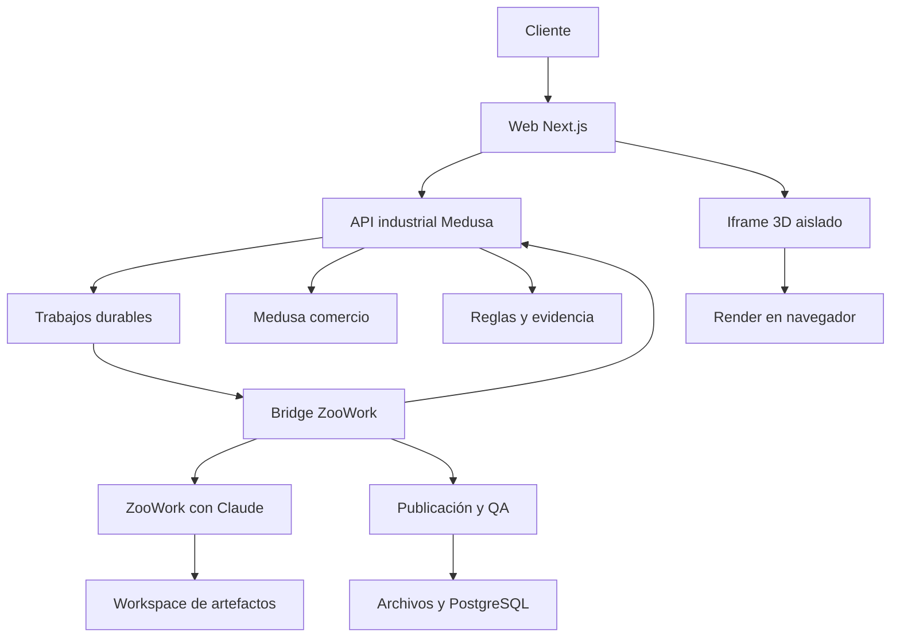
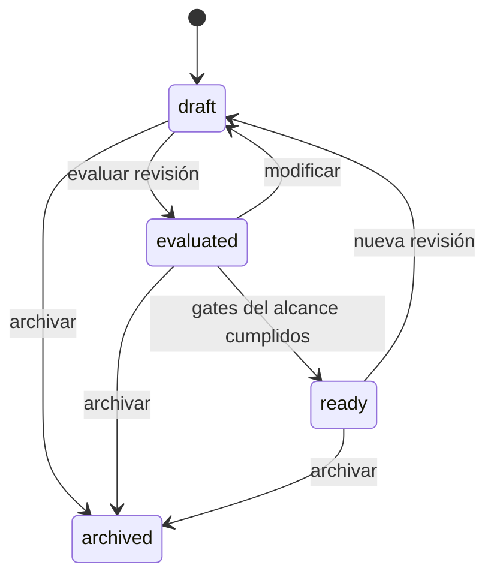

# PLAN MAESTRO DE INGENIERÍA — CONTROLNAUTAS + ZOOWORK + CLAUDE + ARTEFACTOS 3D

**Versión:** 3.0 · **Fecha de diseño:** 3 de octubre de 2026 · **Zona del evento:** America/Los_Angeles.

**Destino:** IA constructora que implementará, probará y desplegará el proyecto reutilizado.

**Decisión aceptada:** ZooWork con Claude vigente y explícito, nuestra API industrial/comercial y artefactos 3D publicados en la misma web. Muse queda fuera del recorrido nuevo. Se mantiene la tienda y la API heredada por compatibilidad.

**Naturaleza del documento:** especificación técnica autocontenida. No afirma que las funcionalidades nuevas ni la integración ZooWork ya estén implementadas/probadas. Define implementación, invariantes, errores, fases, evidencia y aceptación.

**Prioridad:** cerrar P0 de extremo a extremo primero; consolidar P1 y ampliar P2 después. Un solo deployment del proyecto, con procesos internos coordinados y plataforma ZooWork administrada externa.

---

## Índice de capítulos

- 1. Mandato de ejecución y decisión definitiva
- 2. Alcance de producto, piloto y prioridades
- 3. Entradas, investigación y registro de evidencia
- 4. Inventario del repositorio reutilizable
- 5. Arquitectura objetivo y decisiones ADR
- 6. Versiones, runtime y compatibilidad del checkout
- 7. Organización del código y compatibilidad HTTP
- 8. Convenciones, unidades, errores y límites
- 9. Catálogo técnico versionado
- 10. Evidencia y preparación documental sin RAG vectorial
- 11. Persistencia, índices y migraciones
- 12. Puertos, terminales y conexiones industriales
- 13. Evaluador determinista de productos y sistemas
- 14. Búsqueda y selección de candidatos
- 15. Activos CAD/GLB y verificación dimensional
- 16. ZooWork, Claude vigente y adaptador de plataforma
- 17. API HTTP v2 y contratos por operación
- 18. Configuraciones, revisiones y modificaciones
- 19. Bundle de ingeniería y presentación
- 20. Herramientas de aplicación y protocolo del agente
- 21. Objetivos del cliente y modos de presentación
- 22. Simulación numérica posterior: especificación acotada
- 23. Ofertas, BOM y cotizaciones de varios artículos
- 24. PDF y descarga de cotizaciones
- 25. Web existente, chat y publicación del artefacto 3D
- 26. Autenticación, autorización y aislamiento
- 27. Rendimiento, caching y costos
- 28. Observabilidad, auditoría y operación
- 29. Entornos, configuración y deployment único
- 30. CI/CD, rollback y recuperación
- 31. Estrategia de pruebas y matriz técnica completa
- 32. Criterios de aceptación de la primera prueba real
- 33. Fases, tareas, dependencias y puertas de salida
- 34. Instrucción para la IA constructora y ejecución continua
- 35. Trazabilidad de investigaciones y cambios de alcance
- 36. Riesgos efectivos, condiciones y mitigaciones
- 37. Evolución posterior y condiciones para añadir RAG
- 38. Entregables y checklist final
- 39. Fuentes primarias y antecedentes públicos
- 40. Apéndices de contratos, ejemplos y fixtures
- 41. Orquestación durable: turnos, eventos y recuperación
- 42. Pipeline de artefactos y protocolo visual detallado
- 43. Contratos adicionales de conversación y publicación
- 44. Guiones de validación de extremo a extremo y demo
- 45. Detalle de ingeniería de invariantes y auditoría final

---

## 1. Mandato de ejecución y decisión definitiva

### 1.1 Resultado contratado

Construir sobre el proyecto existente de Controlnautas una experiencia de ingeniería comercial conversacional: el cliente explica su aplicación industrial; ZooWork con un modelo Claude vigente pregunta, consulta datos, propone una configuración, solicita la evaluación determinista, construye un artefacto 3D y entrega una cotización preliminar obtenida del backend. El resultado visual se publica y se abre dentro de la misma web existente. No integrar Muse en el recorrido nuevo.

Este documento es una especificación de implementación, no un informe de funcionalidades ya construidas. Los nombres de módulos, tablas, herramientas y endpoints nuevos son decisiones de diseño. Solo se consideran existentes los archivos identificados en el inventario. Las pruebas anteriores no acreditan el funcionamiento de ZooWork. La implementación debe producir evidencia nueva por gate.

La IA constructora debe ejecutar, comprobar y documentar cada tarea. No limitarse a generar archivos de ejemplo. Debe conectar los servicios reales del entorno autorizado, conservar la tienda, cerrar el recorrido completo y dejar un release reproducible. Si no dispone de una credencial o un activo real, debe registrar exactamente ese bloqueo, continuar los trabajos independientes y evitar simular que la integración real pasó.

### 1.2 Decisiones que no deben reabrirse durante el piloto

| Decisión | Especificación normativa |
|---|---|
| Plataforma de agente | ZooWork Managed Agents, invocado desde nuestro servidor |
| Familia del modelo | Claude de Anthropic, versión vigente disponible y verificada en el catálogo de la cuenta |
| Fijación | Alias explícito y config version registrados; no Auto ni cambio silencioso de proveedor |
| Comercio | Medusa existente como autoridad de variantes, precios y disponibilidad |
| Web | Next.js existente; agregar chat, páginas de solución y presentación |
| Backend | TypeScript/Node; módulos compatibles con Medusa |
| Persistencia | PostgreSQL existente; tablas del nuevo módulo con ownership y revisión |
| Integración | Application-executed custom tools; las credenciales quedan en nuestro backend |
| Representación | GLB por variante, unidades y anchors verificados; contexto conceptual rotulado |
| Presentación | HTML/JavaScript generado por Claude en ZooWork y publicado por nuestro servicio |
| Ejecución visual | Navegador del cliente, iframe aislado; biblioteca Three.js fijada |
| Deployment | Un solo proyecto y release coordinado; los procesos internos no son proyectos separados |
| Recuperación documental | Lookup estructurado y documentos Markdown/PDF relevantes; sin vector DB inicial |
| Validación | Reglas explícitas triestado; el LLM no sustituye los resultados |

La versión más reciente de Claude no se obtiene inventando un identificador. El procedimiento de selección del §16 es obligatorio. La orden de usar Claude prevalece sobre la existencia de modelos alternativos en ZooWork. Si la cuenta no dispone del Claude elegido, registrar `MODEL_UNAVAILABLE`; no contratar un proveedor distinto ni llamar directamente a Anthropic como atajo.

### 1.3 Orden de autoridad

1. Instrucciones explícitas del titular y alcance acordado en este documento.
2. Código y locks del checkout realmente seleccionado, contratos HTTP comprobados y datos publicados.
3. Documentación oficial y exports del SDK instalado, contrastados con una llamada al despliegue autorizado.
4. Fichas/CAD del fabricante con applicability a variante y revisión exactas.
5. Este diseño de schemas, servicios y reglas; modificarlo solo mediante ADR con prueba y migración.
6. Investigaciones y planes anteriores como contexto. Sus recomendaciones de Muse o de motores propios no están activas.

El PDF redactado por Muse no es prueba de endpoints públicos de Meta ni de compatibilidad de ZooWork. Los ejemplos de Reddit son antecedentes de capacidad de generación, no pruebas de nuestro producto. El porcentaje orientativo discutido no constituye un SLA, una medición estadística ni un criterio de aceptación.

### 1.4 Autonomía y restricciones de ejecución

Trabajar en una rama o checkout aislado del repositorio confirmado. Conservar cambios previos del usuario. No borrar catálogos, reiniciar una DB real, regenerar seeds destructivos o forzar pushes. Preparar el deployment en el entorno de prueba ya autorizado; no interpretar un plan como autorización para alterar el e-commerce productivo o enviar cotizaciones a terceros.

No mezclar este proyecto con automatización de Cscape, JEV/Jeff, programación de PLC, administración de WordPress ni infraestructura de otros eventos. No crear un sistema dedicado al secado de arroz: los procesos del cliente son variables. Los fixtures ilustrativos sirven para verificar reglas y no fijan la aplicación comercial del producto.

Los nombres heredados `muse` en el código y `/api/muse/v1` se conservan únicamente para compatibilidad. No significan que Muse siga ejecutándose. La nueva API pública es neutral: `/api/industrial/v2`. No reemplazar masivamente nombres de archivos solo para cambiar la marca.

### 1.5 Definición de terminado

El piloto está terminado cuando una sesión real de la web utiliza Claude mediante ZooWork, llama a herramientas ejecutadas por nuestro backend, obtiene evidencia técnica, crea una configuración versionada, produce un artefacto 3D servido por nuestra web y genera una cotización/PDF consistente. Un cambio de requisito produce la revisión y reevaluación correspondientes. La tienda y los endpoints v1 siguen operando. La prueba negativa de datos faltantes no produce un falso cumplimiento. Los clientes no pueden leer archivos ni soluciones ajenas.

Se requiere código, migraciones, contratos, fixtures, pruebas ejecutadas, registro de modelo/SDK, release, runbook y evidencia de la demo. Un video aislado, una imagen estática o una respuesta de chat no sustituyen el recorrido funcional.

## 2. Alcance de producto, piloto y prioridades

### 2.1 Problema y experiencia

Controlnautas comercializa productos industriales con variantes, interfaces y restricciones distintas. El cliente necesita relacionar su intención con artículos concretos, comprender la propuesta, verificar qué requisitos cumplen y conocer el costo preliminar. Una respuesta convincente puede omitir una condición técnica; una imagen atractiva puede dibujar un equipo equivocado. El sistema debe preservar la identidad comercial y técnica desde el primer lookup hasta la escena y el PDF.

La web tendrá una entrada «Diseñar una solución» y una página de trabajo con chat, estados de procesamiento, panel de requisitos, resultado técnico, BOM y acceso al 3D. En escritorio, chat y solución pueden convivir; en móvil, alternar pestañas. La escena no debe ser requisito para leer los resultados ni para descargar la cotización.

### 2.2 Recorridos independientes del proceso

| Prioridad del cliente | Preguntas mínimas | Presentación principal |
|---|---|---|
| Adquisición/almacenamiento de datos | Variables, interfaces, intervalo, destino, retención requerida | Camino sensor → adquisición → almacenamiento; capacidades documentadas y faltantes |
| Control de una variable | Variable, rango, SP, actuador, potencia/interfaz, restricciones | PV/SP/MV, controlador, camino de medición y mando; ratings y alertas |
| Integración de equipos | Equipos existentes, protocolos, roles, alimentación, canales | Puertos, buses, gateways, incompatibilidades y elementos no documentados |
| Visualización de montaje | Equipos exactos, dimensiones conocidas, posición contextual | Escena dimensional de productos y contexto conceptual |

Se pueden combinar prioridades. Preguntar el objetivo primario; no inferir que todo cliente necesita simulación PID. Si el cliente no sabe un parámetro, guardar null y explicar su efecto. No imponer que conteste decenas de preguntas antes de ver un borrador útil.

### 2.3 Alcance P0 para el hackathon

P0 debe incluir: lectura del catálogo existente, corrección de evaluador, contratos v2 mínimos, sesión web con ZooWork, Claude fijado, herramientas autenticadas, configuración y evaluación, bundle, GLB/proxies dimensionales de los productos que realmente se muestran, un artefacto HTML con escena interactiva, presentación en la web, ofertas actuales y cotización/PDF. Incluir un caso de incompatibilidad y uno de ausencia documental visibles.

Usar inicialmente hasta tres variantes ya documentadas; no prometer que cubren cualquier sistema industrial. El backend sigue siendo extensible y no se hardcodea una combinación única. Si faltan actuadores, interfaces de potencia o gateways comerciales, la configuración debe mostrarlos como roles pendientes, no inventarlos ni incluirlos en el BOM cotizado.

P0 puede usar `dimensional_proxy_verified` cuando no existe CAD exacto, siempre que las dimensiones estén documentadas y el detalle aproximado se indique. Si tampoco hay dimensiones, el producto se muestra `illustrative`, no «a medida». No convertir una ilustración en un activo dimensional mediante escalado a ojo.

### 2.4 Alcance P1 después del recorrido completo

Administración técnica más cómoda, expansión de catálogo, comparaciones de configuraciones, geometría más fiel, cache refinada, PDFs multilínea enriquecidos, pruebas de carga mayores y recuperación automática más completa. P1 debe reutilizar el mismo deployment; no habilitar un segundo proveedor de agente.

### 2.5 Alcance P2 explícitamente posterior

Simulación numérica de procesos con parámetros físicos suficientes, PID ilustrativo reproducible, ingestión real de telemetría, conectores OT, análisis documental semántico, catálogos de mayor tamaño y comprobación mecánica avanzada. La matemática del §22 especifica una ampliación acotada; no es requisito para una demo que promete solo ingeniería comercial y 3D.

### 2.6 Exclusiones

No Muse, puente interagente, RAG vectorial por defecto, Z3, FastAPI adicional, motor CAD en cada request, render farm/GPU propia, Kubernetes, agentes entrenados propios, aprendizaje online de reglas, programación/descarga a PLC ni simulador universal de fábricas. No compras, pagos ni órdenes de venta ejecutadas por el agente. La cotización es preliminar y su alcance comercial se indica con claridad.

### 2.7 Presupuesto de tiempo

El evento publicado es el 3 de octubre de 2026 en San Francisco; el programa anuncia entrega de proyectos a las 17:00 hora local [EV01]. La IA debe consultar el tiempo restante real al comenzar y ejecutar la ruta P0 primero. No convertir este documento extenso en una obligación de terminar P2 antes de la entrega. Reservar tiempo para un deployment, smoke real y ensayo; no empezar una migración mayor de plataforma cuando el recorrido ya está funcionando.

## 3. Entradas, investigación y registro de evidencia

### 3.1 Material de partida

| ID | Material disponible | Papel |
|---|---|---|
| SRC-01 | `02-hackday26_F-cursor-full-project-import-5dca.zip` | Copia de código inspeccionada; baseline reutilizable |
| SRC-02 | `01-especificacion-tecnica-motor-3d.pdf` | Propuesta conceptual de integración y datos 3D |
| SRC-03 | `MEGAPLAN_CONTROLNAUTAS_MUSE_API_3D_V2.md` | Núcleo de ingeniería previo, revisado aquí para ZooWork |
| SRC-04 | `01-Arquitectura-de-Co-digo-Abierto-para-Ingenieri-a-Conversacional_-Un-Ensamblaje-de-Componentes-para-la-Validacio-n-y-Visualizacio-n-de-Soluciones-Industriales.md` | Investigación de alternativas y límites |
| SRC-05 | `02-Arquitectura-de-Plataforma-E-Commerce-Industrial-A.md` | Investigación de arquitectura comercial/industrial |
| SRC-06 | Documentación y SDK públicos de ZooWork | Contratos del proveedor; revisar versión y comportamiento efectivo |
| SRC-07 | Repositorio citado por el titular `armando-token/hackday26v2` | Candidato para ejecución; comparar con el ZIP, no asumir contenido idéntico |

Este archivo es autocontenido. No exige que la IA constructora lea un plan anterior para conocer los contratos nuevos. Se conserva la ingeniería válida de snapshots, evidencia, puertos, evaluación, dinero y cotizaciones; las responsabilidades conversacionales y visuales se redefinen para ZooWork.

### 3.2 Registro obligatorio al comenzar

Crear `docs/industrial/sources.json` con nombre, tipo, origen, timestamp de obtención, SHA-256, licencia si corresponde, alcance de uso y estado de revisión. Para código: commit SHA y lock hashes. Para documentación del proveedor: URL, fecha, SDK al que se contrastó y extracción local solo cuando su licencia/política lo permite. Para manuales: fabricante, modelo, revisión, variant applicability y numeración de páginas.

No usar un ID, hostname, API key, stock o precio de un reporte histórico como dato actual. Las referencias de fabricantes deben comprobarse contra el archivo real. Un archivo `.md` puede ser una transcripción derivada; la ausencia de una línea no demuestra que una capacidad esté prohibida.

### 3.3 Clasificación de certezas

| Clase | Ejemplo | Tratamiento |
|---|---|---|
| Observado en código | Endpoint v1 y función del evaluador | Revisar su implementación y pruebas, no solo el README |
| Documentado por proveedor | Custom tools, workspace y lectura de archivos | Implementar con SDK fijado y probar en el despliegue autorizado |
| Antecedente comunitario | Claude/Three.js en Artifacts | Evidencia de viabilidad general; no equivalencia de plataforma o calidad |
| Diseño de este proyecto | ScenePlan, worker, tablas y límites | Crear schemas, servicios, tests y ADR |
| No comprobado | WebGL/GLB en el visor interno de ZooWork | No es dependencia de esta arquitectura |
| Requiere cuenta real | Alias Claude disponible, resolución de custom tools | Gate de integración, sin mocks presentados como éxito real |

### 3.4 Resultado de la investigación que gobierna el diseño

ZooWork ofrece modelos de varios proveedores, herramientas ejecutadas por aplicación y operaciones de archivos/artefactos. Los Artifacts de Claude.ai no se heredan por acceder al modelo. El diseño usa los archivos que Claude crea en el workspace de ZooWork y los publica en nuestra propia web. Por tanto, el visor interno del proveedor no es el lugar de ejecución del 3D ni un requisito de despliegue.

La guía histórica de ZooClaw sobre Blender/OpenClaw es un antecedente de pipeline GLB/web, no una prueba de que Blender esté instalado en ZooWork. No instalar Blender en su runtime ni en nuestra web para el piloto. El CAD se prepara offline; la escena usa archivos previamente aprobados.

### 3.5 Información que no se debe inventar

No están acreditados por esta investigación: credenciales de la cuenta, créditos/tier contratados, alias Claude exacto de esa cuenta, límites efectivos del despliegue, GLB oficiales de los tres productos, equivalencia visual con Muse, permisos de publicación productiva y rendimiento bajo miles de usuarios. El plan determina cómo obtener/verificar esos datos sin rediseñar la arquitectura ni pedir al titular que elija dos deployments.

## 4. Inventario del repositorio reutilizable

### 4.1 Base observada

| Elemento | Estado observado | Acción |
|---|---|---|
| Medusa | Paquetes del backend `2.17.0` | Mantener línea compatible, encapsular extensiones |
| Backend TS | `b2b-backend/apps/backend` | Principal núcleo de implementación |
| Storefront | Next `15.3.9`, React `19.0.5` | Reutilizar páginas y mejorar versión soportada en G1 |
| Datos técnicos | `technical_profile`, `technical_fact`, `technical_source` | Reusar evidencia y construir snapshots publicados |
| Evaluación | `src/lib/muse/evaluator.ts` | Corregir ausencias/rangos; extraer núcleo v2 estricto |
| Oferta | `src/lib/muse/offer.ts` | Reutilizar como adaptación comercial; normalizar dinero |
| Cotización | `preliminary-quotes/route.ts` | Mantener v1; crear modelo multilínea v2 |
| PDF | `src/lib/muse/pdf-generator.ts` + `scripts/generate-quote-pdf.py` | Reutilizar ReportLab; corregir aislamiento de trabajos |
| OpenAPI | `docs/openapi.json`, `docs/openapi.yaml` | Publicar v1 intacta y nueva v2 consistente |
| Búsqueda | SQL con `ILIKE` y hechos técnicos | Lookup exacto, filtros estructurados y FTS opcional |
| Activos 3D | No se encontraron GLB/glTF/STEP/Blend en el ZIP revisado | Crear pipeline y catálogo de activos |
| Pruebas | Unitarias, integración y scripts de fases/benchmark | Reusar, actualizar resultados esperados incorrectos |

Estas son observaciones estáticas, no certificación del despliegue. Los reportes antiguos se conservan como historial y no cuentan como resultados de la nueva versión.

### 4.2 Archivos de entrada de código comprobados

Todas las rutas siguientes son relativas a la raíz del checkout de la IA constructora:

```text
b2b-backend/apps/backend/src/api/api/muse/v1/evaluate/route.ts
b2b-backend/apps/backend/src/api/api/muse/v1/products/search/route.ts
b2b-backend/apps/backend/src/api/api/muse/v1/products/[variantId]/route.ts
b2b-backend/apps/backend/src/api/api/muse/v1/products/[variantId]/offer/route.ts
b2b-backend/apps/backend/src/api/api/muse/v1/preliminary-quotes/route.ts
b2b-backend/apps/backend/src/api/api/muse/v1/quotes/[quoteId]/pdf/route.ts
b2b-backend/apps/backend/src/lib/muse/evaluator.ts
b2b-backend/apps/backend/src/lib/muse/schema-validator.ts
b2b-backend/apps/backend/src/lib/muse/db.ts
b2b-backend/apps/backend/src/lib/muse/offer.ts
b2b-backend/apps/backend/src/lib/muse/auth-guard.ts
b2b-backend/apps/backend/src/lib/muse/idempotency.ts
b2b-backend/apps/backend/src/lib/muse/pdf-generator.ts
b2b-backend/apps/backend/src/modules/b2b-pim/service.ts
b2b-backend/apps/backend/src/modules/b2b-pim/models/technical-profile.ts
b2b-backend/apps/backend/src/modules/b2b-pim/models/technical-fact.ts
b2b-backend/apps/backend/src/modules/b2b-pim/models/technical-source.ts
b2b-backend/apps/backend/medusa-config.ts
b2b-backend/apps/backend/medusa-config.js
b2b-storefront/src/app/[countryCode]/(main)/products/[handle]/page.tsx
b2b-storefront/src/modules/products/templates/hvac-product.tsx
b2b-storefront/src/lib/catalog/catalog-source.ts
b2b-storefront/src/lib/catalog/catalog-cache.ts
scripts/generate-quote-pdf.py
docs/openapi.json
docs/openapi.yaml
docs/llms.txt
docker-compose.yml
```

### 4.3 Discrepancias que G0/G1 debe resolver

1. README menciona PostgreSQL 16; el Compose incluido usa imagen PostgreSQL 15. Determinar la versión efectiva con `SHOW server_version` en el entorno autorizado. No cambiar de major copiando el README.
2. Backend declara npm `11.12.1`; storefront declara Yarn `4.12.0` y contiene también `package-lock.json`. Elegir un lockfile por paquete y demostrar instalación reproducible.
3. El README describe alguna ruta PDF distinta de la ruta real/OpenAPI. La actual observada es `/api/muse/v1/quotes/{quoteId}/pdf`; conservar la URL generada por el código.
4. La API demo usa USD; `money.ts` conserva utilidades PEN. No reutilizar indiscriminadamente ese módulo como si ya fuera multimoneda.
5. `offer.ts` calcula con `parseFloat` y `Math.round(amount * 100)`; el piloto v2 debe normalizar importes con precisión decimal explícita.
6. `db.ts` tiene fallback de credenciales de desarrollo. En producción, ausencia de `DATABASE_URL` debe detener el arranque.
7. `medusa-config.ts` y `.js` coexisten. Identificar cuál carga realmente la CLI; dejar una fuente autoritativa o documentar generación, sin dos configuraciones divergentes.
8. El ZIP contiene symlinks, incluidos enlaces a `/home/ubuntu/hackday26/...`. Rehacer la publicación documental portable; no depender de esas rutas.
9. `src/api/muse` enlaza a `api/muse`, lo que puede crear alias. Verificar rutas registradas y evitar duplicación involuntaria en v2.
10. Los CORS actuales agregan orígenes hardcodeados y excluyen dominios de la tienda principal. Parametrizar por entorno; no ampliar por intuición a toda la red.
11. `docs/llms.txt` incluye precios y stock demo escritos. Sustituir esos valores estáticos por instrucciones de consulta a la oferta actual; conservar etiqueta de demo.
12. El worker PDF persistente asocia respuestas por orden FIFO. Si un trabajo vence y una respuesta llega tarde, puede asignarse a otro trabajo. Cambiar a correlación por `job_id` o usar procesos aislados con concurrencia acotada.


### 4.4 Delta obligatorio del nuevo proyecto

Agregar un adaptador ZooWork server-side, un ejecutor durable de turnos, tablas de conversación/binding/outbox, schemas de herramientas, servicio de publicación de presentaciones, pipeline de artefactos y páginas Next. El directorio heredado `src/lib/muse` sigue siendo válido como origen de helpers; no instalar un SDK de Meta para el recorrido nuevo.

El ZIP contiene tres productos con documentación real: `CN-X5PRIME-HE-XP5`, `CN-N1200` y `CN-THT02`. Los valores USD y stocks escritos en el README son valores demo históricos; leer Medusa al cotizar. `CN-THT02` no debe renombrarse como PT100 ni representarse como tal por comodidad. Un fixture PT100 sintético tiene identidad distinta y no se vende como producto real.

El README y `docs/DECISIONS.md` describen diferentes momentos de PEN/USD y distintas superficies de descarga PDF. La ruta implementada se verifica en handlers y proxy. El contrato nuevo no depende de resolver esas discrepancias mediante cambios destructivos de catálogo.

Crear `docs/industrial/baseline-diff.md`: origen elegido, diferencias relevantes entre ZIP/repo, pruebas heredadas que se conservan, pruebas que tenían expected incorrecto, archivos de código a modificar y archivos que no se tocan. No declarar todos los paths del ZIP presentes en el repo remoto hasta compararlos.

### 4.5 Inspección segura y hashes

Inventariar package manifests, lockfiles, routes, migrations y assets. No imprimir `.env`, credenciales ni dumps de clientes. Buscar primero con `rg`. Registrar hashes de los archivos críticos antes y después. El hecho de tener dos `medusa-config` exige identificar cuál carga la CLI real; no corregir solo el archivo inactivo.

No ejecutar de forma automática scripts llamados `revert`, `delete`, `remove-*:apply` o reconciliaciones de catálogo al inspeccionar. El seed del piloto nuevo debe ser idempotente, aislado y limitado a IDs/metadata explícitos.

## 5. Arquitectura objetivo y decisiones ADR

### 5.1 Topología de un solo deployment



Las flechas describen responsabilidades. Las herramientas que el modelo solicita son ejecutadas por el bridge en nuestro servidor. El navegador no recibe una API key de ZooWork ni credenciales internas de Medusa. El proceso del bridge forma parte del mismo release que la web/backend; no tiene un hostname comercial separado ni necesita un nuevo servicio de nube.

### 5.2 Distribución de autoridad

| Responsabilidad | Autoridad |
|---|---|
| Preguntas y comprensión del contexto | Claude en ZooWork, con confirmación de requisitos críticos |
| Identidad, variantes, precio y stock | Medusa y su adaptador comercial |
| Hechos técnicos | Snapshot publicado, evidencia y applicability |
| Compatibilidad de alcance conocido | Evaluador TypeScript con ruleset versionado |
| Selección propuesta | Claude; se valida antes de etiquetarla como cumplidora |
| Grafo de solución | Configuración persistida por nuestro backend |
| Layout y composición contextual | ScenePlan/artefacto producido por Claude |
| Fidelity del producto | Asset manifest y QA dimensional |
| Publicación | Servicio nuestro, tras validación estructural y aislamiento |
| Cálculo monetario/PDF | Backend; snapshot inmutable |
| Simulación física opcional | Modelo determinista acotado, nunca animación inventada |

La salida de un LLM no se convierte en fuente de verdad porque otro LLM la apruebe. Una regla determinista tampoco acredita requisitos que no fueron modelados: el reporte debe decir qué se evaluó y qué permanece fuera de alcance.

### 5.3 Stack

TypeScript, Node LTS, Medusa 2, PostgreSQL, Next/React existentes, Zod, SDK TypeScript de ZooWork, Three.js para el artefacto del cliente y ReportLab existente para PDFs. Blender/FreeCAD solo para activos offline si hace falta. Caddy y EC2 se reutilizan cuando el entorno confirmado coincide con el anterior. No añadir infraestructura por afinidad con sponsors.

El código de la aplicación y las bibliotecas seleccionadas mantienen licencias compatibles. ZooWork y Claude son servicios externos propietarios elegidos explícitamente por el titular; no describir este conjunto como «100% open source». La dependencia del proveedor se encapsula en una interfaz, pero no se implementa otro proveedor durante el piloto.

### 5.4 Principio de artefacto delegado

Claude crea la composición y el archivo de presentación. Nosotros suministramos datos, assets y una envoltura pequeña para validación, publicación e aislamiento. No escribir un generador universal de plantas ni un solver de posiciones. Una biblioteca estándar ejecuta el 3D en el navegador. El wrapper no debe cambiar subrepticiamente la selección ni el contexto para que la demo funcione.

Se exige `scene.plan.json` además de HTML: las identidades, transforms, conexiones y fidelidad pueden contrastarse con el bundle sin interpretar texto o inspeccionar visualmente cada mesh. El HTML solo puede enriquecer la presentación; no contiene autoridad sobre cumplimiento, precios o stock.

### 5.5 ADR mínimos

| ADR | Decisión y evidencia requerida |
|---|---|
| 001 | Reutilizar Medusa/Next y mantener v1; baseline de rutas |
| 002 | ZooWork/Claude explícito; registro del catálogo real |
| 003 | Custom tools ejecutadas por aplicación; prueba de resolución |
| 004 | Workspace aislado por usuario; prueba de no lectura cruzada |
| 005 | Publicación propia de HTML; no depender del visor ZooWork |
| 006 | ScenePlan versionado; grafo técnico separado de layout |
| 007 | Sandbox opaco, assets inyectados y CSP sin red |
| 008 | Snapshots/rules/dinero como autoridad |
| 009 | Sin RAG inicial; métrica que justificaría añadirlo |
| 010 | Un release con worker y almacenamiento persistente |
| 011 | Simulación numérica posterior y acotada |
| 012 | Paquetes/runtime fijados con manifest de compatibilidad |

Cada ADR incluye consecuencias, alternativas descartadas, prueba, versión y condición concreta de revisión. No basta un listado de tecnologías.

## 6. Versiones, runtime y compatibilidad del checkout

### 6.1 Baseline observado versus objetivo

| Componente | Observado en fuentes | Objetivo |
|---|---|---|
| Medusa backend | Paquetes `2.17.0` coherentes | Mantener inicialmente; cambiar solo por incompatibilidad/advisory comprobado |
| Next | `15.3.9` | Línea 15 parcheada; referencia actual `15.5.27`, reconfirmar advisory al ejecutar |
| React | `19.0.5` | Versión compatible con Next y parcheada; registrar peer dependencies reales |
| Node | Repo/README 20+ | Node 24 LTS parcheado; 22 LTS si incompatibilidad probada |
| npm backend | `packageManager: npm@11.12.1` | Fijar la versión del workspace, revisar engines antes de instalar |
| Yarn storefront | `yarn@4.12.0` | Conservar y fijar; no instalar con npm sobre el mismo lock |
| Zod | Backend 4.2.0; storefront rango diferente | Schemas wire compartidos/generados, sin mezclar servicios del backend |
| ZooWork SDK | Repo público mostró `@zoowork-ai/sdk` 0.4.2 | Confirmar release publicado, instalar exacto, guardar integrity y exports |
| Three.js | No está en el núcleo actual | Versión exacta compatible con GLTFLoader/OrbitControls de la misma release |
| PostgreSQL | Reportes 16, Compose 15 | Identificar major real; no upgrade major implícito |
| Python/ReportLab | Generador ya existente | Venv y requirements reproducibles; conservar comportamiento |

Node 20 figura EOL en la tabla consultada [F11]. Next anunció parches de septiembre de 2026 [F12]. Esta comprobación no acredita que un build antiguo sea seguro. Hacer el update mínimo soportado y ejecutar regresión en rama; no saltar a Next 16 por estética de «última versión».

### 6.2 Selección y locking

No usar `latest` en package manifests nuevos. Resolver la versión vigente una vez durante G1/G2, instalar exacta, mantener lock y registrar el resultado en `docs/industrial/runtime-manifest.json`. `latest` puede utilizarse para consultar metadata en un comando de discovery, no en imports/CDN de producción.

Los packages del SDK Medusa deben pertenecer a un conjunto compatible. El storefront tiene dependencias `latest` heredadas; fijar a lo realmente resuelto y probado, sin ejecutar un upgrade masivo ciego. Conservar los dos gestores porque son dos paquetes existentes; eliminar locks redundantes solo tras confirmar el instalador autoritativo.

El manifest contiene versiones de Node/npm/Yarn, DB, Next/React/Medusa/Zod, SDK ZooWork, Three.js, GLB Validator, bundler, Python/ReportLab, browser QA, hash de locks y commit. El modelo Claude tiene su propio manifest, no se confunde con versión npm.

### 6.3 ESM del SDK

El SDK público declara ESM. No asumir que `require('@zoowork-ai/sdk')` funciona desde el output de Medusa. Usar un adaptador con import dinámico comprobado o un entrypoint ESM del worker empaquetado dentro del proyecto. Mantener la integración en `src/lib/industrial/zoowork` y cubrir el bootstrap con una prueba de ejecución del build real.

El worker puede arrancar desde un script ESM de release que use el SDK y llame a nuestros endpoints internos autorizados. No crear otro backend de negocio. Los helpers compartidos se exportan mediante contratos puros; la compatibilidad de módulos se verifica con output real, no solo con `tsc --noEmit`.

### 6.4 Reproducción

Construir con locks en entorno limpio, correr migraciones sobre DB descartable, seed aislado, build de backend/web/worker y smoke. El script de build debe fallar si falta un package requerido por artefactos. No instalar npm packages al recibir cada cliente; empaquetar dependencias visuales aprobadas en el release.

## 7. Organización del código y compatibilidad HTTP

### 7.1 Directorios existentes a conservar

`b2b-backend/apps/backend`, `b2b-storefront`, `docs`, `scripts`, datos `real-products-publish` y fixtures demo existentes. No recrear la tienda ni introducir un monorepo distinto. El checkout que se selecciona en G0 es la raíz para todos los paths siguientes.

### 7.2 Directorios nuevos propuestos

```text
b2b-backend/apps/backend/src/lib/industrial/
  contracts/ catalog/ evidence/ validation/ assets/
  configurations/ presentation/ commerce/ quotes/
  auth/ observability/ zoowork/ conversations/
  orchestration/ tool-dispatch/ artifact-publisher/
b2b-backend/apps/backend/src/modules/industrial-config/
  models/ migrations/ service.ts index.ts
b2b-backend/apps/backend/src/api/api/industrial/v2/
b2b-backend/apps/backend/src/api/store/industrial/
b2b-backend/apps/backend/src/api/admin/industrial/
b2b-backend/apps/backend/src/admin/routes/industrial-catalog/
b2b-storefront/src/modules/industrial/
  chat/ solution/ presentation/ evidence/ quote/
b2b-storefront/src/lib/industrial/
scripts/industrial/
  zoowork-probe.mts provision-agent.mts worker.mts
  validate-assets.mts validate-scene.mts package-artifact.mts
  demo-e2e.mts generate-contracts.mts
docs/industrial/ docs/gates/ fixtures/industrial/
```

Usar registro de módulo `industrial_config`, compatible con el framework instalado. Los nuevos paths son diseño, no afirmación de que ya existen. No crear interfaces de negocio paralelas bajo `zoowork` y `muse`: las reglas/comercio permanecen neutrales; solo el adaptador externo usa el nombre de proveedor.

### 7.3 Dependencias internas

`validation` no importa SDK, HTTP, DB ni filesystem. `catalog` resuelve snapshots aprobados. `commerce` encapsula Medusa y dinero. `configurations` aplica revisiones/CAS. `zoowork` conoce transportes/provider IDs. `tool-dispatch` valida inputs y contextos; llama a servicios de dominio. `artifact-publisher` copia, valida y empaqueta archivos; no ejecuta JavaScript del agente en el servidor web. `conversations` guarda turns/events/bindings. Las routes autentican y serializan.

No suponer una transacción distribuida entre Medusa, ZooWork y almacenamiento. Usar transacciones locales, estados y outbox; las llamadas externas se ejecutan fuera del lock de negocio. Los commits parciales se reconcilian mediante IDs/idempotencia, no rehaciendo cotizaciones o artefactos sin inspección.

### 7.4 Mantener v1

Preservar `/api/muse/v1/products/search`, `/products/{variantId}`, `/evaluate`, `/products/{variantId}/offer`, `/preliminary-quotes` y la descarga implementada `/quotes/{quoteId}/pdf`. El README menciona otra ruta de PDF; la implementación comprobada manda. Conservar `/healthz`, docs v1 y contrato salvo corrección de falsos positivos.

El adaptador v1 del nuevo evaluador retorna `satisfied=true` solo para `meets`; `does_not_meet` y `not_documented` dan false. Añadir estado/razón aditivos, actualizar tests y OpenAPI; no preservar una respuesta técnicamente falsa para pasar tests heredados.

### 7.5 Nueva API

Todas las operaciones nuevas están en `/api/industrial/v2`. Publicar `openapi-industrial-v2.json/yaml`. El sitio legado `/openapi.yaml` no cambia de versión silenciosamente. `llms.txt` explica rutas y fuentes actuales, no contiene valores de precio/stock copiados del README.

No implementar `/api/muse/v2` como una segunda API completa. Si existe trabajo previo no publicado en ese namespace, migrarlo con un ADR antes de fijar el contrato; un alias temporal solo se añade si hay consumidor real identificado. ZooWork utiliza exclusivamente el namespace neutral.

### 7.6 Contratos compartidos

Zod del servidor como autoridad, OpenAPI generado/verificado, tipos cliente generados y fixtures validables. CI detecta drift. El frontend no importa el SDK de ZooWork ni servicios backend. La carpeta de contratos del agente contiene JSON Schema de las herramientas y un instruction pack generado desde los mismos schemas.

## 8. Convenciones, unidades, errores y límites

### 8.1 Identificadores y campos

JSON wire usa `snake_case`, IDs opacos string y timestamps UTC RFC3339. `variant_id` es el ID canónico Medusa. SKU se admite en lookup, no como FK de persistencia. `instance_id` identifica un equipo colocado y permite dos instancias de la misma variante. `port_id` identifica un puerto dentro de un snapshot. Todas las relaciones físicas utilizan `instance_id + port_id`, no solo SKU.

Versiones separadas: `api_version`, `schema_version`, `technical_revision`, `configuration_revision`, `rule_set_version`, `asset_revision`, `model_version`. Una revisión de configuración es entero monotónico; las revisiones de documentos/modelos son IDs inmutables más checksum.

### 8.2 Unidades

| Magnitud | Unidad canónica API | Regla |
|---|---|---|
| Geometría de GLB y transformaciones | m | Archivo ya convertido; escala de instancia `[1,1,1]` |
| Dimensiones de catálogo | mm | Convertir una vez al contrastar con bbox en m |
| Temperatura | Cel | °C en UI; diferencias térmicas compatibles con K |
| Corriente de instrumentación | mA | Convertir antes de comparar; no confundir con A de potencia |
| Tensión | V | Campo explícito `ac`/`dc`; V no codifica naturaleza |
| Potencia | W | No deducir capacidad de salida lógica |
| Tiempo | s | ms solo en contratos de latencia, claramente nombrados |
| Humedad relativa | %RH | No representa humedad del grano/producto |
| Dinero | integer minor string + currency + scale | Aritmética exacta; no JSON BigInt |

Magnitudes usan códigos de unidad cerrados en v2 y dimensión física conocida. Valores `NaN`, Infinity, rangos invertidos y unidad desconocida se rechazan. Valores negativos son válidos en temperaturas/rangos donde el schema lo permite, no en dimensiones.

### 8.3 Estado técnico

`meets`, `does_not_meet`, `not_documented` son los únicos verdicts. La calidad dimensional usa otro eje, separado del nivel `fidelity` del activo definido en §15: `dimensionally_verified`, `illustrative` o `not_documented`. La configuración usa `draft`, `evaluated`, `ready`, `archived`. Los errores HTTP no se confunden con incompatibilidad: un sistema incompatible se devuelve HTTP 200 con resultado técnico negativo; una petición inválida usa 400/422.

### 8.4 Envelope de error v2

```json
{
  "error": {
    "code": "REVISION_CONFLICT",
    "message": "La configuración cambió; vuelva a leer su revisión actual.",
    "details": [{"path": "configuration_revision", "expected": 4, "received": 3}]
  },
  "request_id": "req_example"
}
```

HTTP: 400 JSON/schema inválido; 401 credencial ausente/inválida; 403 scope insuficiente; 404 recurso inexistente o ajeno; 409 idempotencia/estado; 412 If-Match obsoleto; 413 tamaño; 422 referencia/unidad inconsistente; 429 límite con Retry-After; 503 dependencia indisponible o cola saturada. No exponer SQL, stacktrace ni secrets en errores públicos.

### 8.5 Límites iniciales configurables

| Límite | Valor piloto | Comportamiento |
|---|---:|---|
| Cuerpo JSON normal | 256 KiB | 413 antes de parse excesivo |
| Texto de búsqueda | 200 caracteres | 400 |
| Resultados search | default 10, máximo 50 | Paginación, no catálogo entero |
| Instancias por configuración | 30 | 422, no truncamiento silencioso |
| Conexiones por configuración | 100 | 422 |
| Requisitos por evaluación | 100 | 422 |
| Líneas por cotización | 50 | 422 |
| Cantidad por línea v2 | 1..1000 | Entero; disponibilidad evaluada por contexto |
| Notas de cliente | 2000 caracteres | Texto, no HTML |
| Archivo GLB al publicar | 20 MiB | Rechazar o dividir fuera de línea |
| Objetivo GLB por producto piloto | ≤ 2 MiB | Budget de QA, no semántica técnica |
| Objetivo escena de archivos únicos | ≤ 6 MiB | Medir descarga real |
| Simulación opcional | ≤ 10000 puntos, ≤ 3600 s | Rechazo previo al cálculo |

Estos números son decisiones iniciales del proyecto, no límites publicados por ZooWork. G2/G14 los ajustan con evidencia.

## 9. Catálogo técnico versionado

### 9.1 Reusar PIM sin romper el vocabulario legado

Las tablas existentes conservan ocho propiedades y semántica pensada para la demo. No ampliar el enum PostgreSQL legado con decenas de nombres antes de comprobar su migración y consumidores. Crear un `TechnicalSnapshot` publicado dentro de `industrial-config`, derivado inicialmente de `b2b-pim` y enriquecido con atributos, interfaces, dimensiones y evidencia revisada.

El snapshot se asocia a `variant_id`. Un producto puede tener varias variantes y una variante varias revisiones; solo una revisión aprobada es la activa para nuevas configuraciones. Configuraciones anteriores permanecen ligadas a las revisiones originales. Las ofertas se leen aparte y nunca se congelan dentro del snapshot técnico.

### 9.2 Contenido del snapshot

| Campo | Tipo / condición | Uso |
|---|---|---|
| `snapshot_id` | ID opaco | Referencia inmutable |
| `variant_id` | Medusa variant ID | Identidad comercial |
| `sku`, `manufacturer`, `manufacturer_part_number` | Strings documentados | Resolución y presentación |
| `technical_revision` | String | Revisión de nuestro perfil, distinta de revisión del PDF |
| `schema_version` | `technical_snapshot/2.0` | Parse compatible |
| `state` | draft/reviewed/published/retired | Elegibilidad para nuevas configuraciones |
| `applicability` | variante, opción hardware, firmware si condiciona capacidad | Evitar herencias indebidas |
| `attributes` | Lista tipada | Datos comparables |
| `ports` | Lista de interfaces | Evaluación de conexión |
| `dimensions` | Envelope, corte/montaje, unidades, evidencia | Geometría verificable |
| `mounting` | Métodos documentados y restricciones | Evaluación mecánica acotada |
| `capabilities` | Funciones documentadas con condiciones | Control, logging, integración |
| `source_ids` | Lista de fuentes inmutables | Trazabilidad |
| `content_sha256` | Hash canónico | Detección de cambios |
| `published_at`, `reviewed_by` | Auditoría | Publicación responsable |

El registro publicado no se edita. Correcciones crean nueva revisión. `retired` impide selección nueva pero permite reabrir cotizaciones y configuraciones históricas.

### 9.3 Atributos tipados

Cada atributo contiene `attribute_id`, `property`, `scope` (equipo/puerto/función), `value`, `evidence_refs`, `applicability`, `data_status`. `data_status` admite `documented`, `explicitly_absent`, `conflicting`, `unknown`. Un valor ausente no se llena con cero. `unknown` lleva `value: null` y razón; no evidencia ficticia.

Discriminadores de `value.kind`:

- `boolean`: `value` true/false y evidencia explícita si determina aprobación/rechazo.
- `enum`: valor de vocabulario cerrado.
- `enum_set`: lista ordenada y semántica de completitud documentada.
- `quantity`: `value` numérico, `unit`, `dimension`.
- `range`: `min`, `max`, `unit`, `dimension`, `inclusive_min`, `inclusive_max`.
- `integer`: conteo no fraccionario y límites definidos.
- `text`: descriptivo; no utilizable para aprobar comparaciones numéricas.

No utilizar texto libre como sustituto de un enum técnico normalizado. Sin una interpretación revisada, se conserva la frase original y se devuelve `not_documented` para la regla concreta.

### 9.4 Diccionario inicial

Crear `technical-vocabulary.ts` y versión JSON publicada. Incluir como mínimo:

| Dominio | Propiedades iniciales |
|---|---|
| Alimentación | `supply_voltage`, `supply_nature`, `supply_power`, `supply_current` |
| Instrumentación | `signal_type`, `measurement_variable`, `measurement_range`, `sensor_element`, `rtd_wiring`, `channel_count`, `resolution`, `accuracy` |
| Comunicaciones | `physical_interface`, `protocol`, `protocol_role`, `baud_rates`, `parities`, `stop_bits`, `address_range`, `register_map_source` |
| Control | `control_function`, `output_type`, `output_voltage_range`, `output_current_rating`, `switching_nature` |
| Mecánica | `mounting_type`, `body_dimensions`, `panel_cutout`, `clearances`, `protection_rating` |
| Ambiente | `operating_temperature`, `storage_temperature`, `operating_humidity` |
| Registro | `logging_supported`, `logging_medium`, `logging_capacity`, `sampling_interval`, `export_protocol` |

No afirmar que el catálogo tendrá todas estas propiedades al cerrar D1. El informe de cobertura identifica las documentadas para los productos piloto y las pendientes. Un atributo `accuracy` debe indicar fórmula y condiciones; no reducir `%FS + digits` a un porcentaje inventado.

### 9.5 Dimensiones y fidelidad

Separar `body_envelope_mm`, `including_connectors_mm`, `panel_cutout_mm`, `mounting_geometry` y `minimum_clearance_mm`. Una envolvente con bornes no es el corte de panel. Un clearance de 10 o 25 mm del PDF no se convierte en regla universal. Si no existe requisito del fabricante, una separación de presentación se registra como `visual_spacing_assumption`, sin claim de instalación.

Registrar tolerancia de QA del modelo por eje y documento de origen. Para proxies piloto: objetivo de diferencia ≤ 1 mm por eje respecto de la dimensión nominal documentada, si el documento permite esa precisión. Si la dimensión original tiene tolerancia mayor o geometría variable, usar esa tolerancia y mostrarla. No derivar una tolerancia de fabricante de nuestro budget de QA.

### 9.6 Publicación

Estados: `draft -> reviewed -> published -> retired`. Revisar que variante exista, evidencia corresponda a esa variante, fuentes tengan checksum, unidades estén soportadas, puertos tengan IDs únicos y las capacidades críticas del piloto estén documentadas. Publicación realiza nueva fila/version, actualiza el puntero activo y emite invalidación de caché. Datos comerciales no se incluyen en el workflow técnico.

El revisor puede ser el titular o un responsable técnico designado. La IA prepara una matriz atributo/página/fragmento y propone normalización. Un modelo automático de extracción no cuenta por sí mismo como revisión dimensional o eléctrica. Mientras falta revisión real, continuar con D0 y marcar D1 pendiente.

## 10. Evidencia y preparación documental sin RAG vectorial

### 10.1 Fuentes

Extender por metadata/tabla auxiliar la `technical_source` existente sin romper lectores v1. Una fuente publicada incluye `source_id`, tipo, fabricante, modelo/variantes aplicables, URL original, asset interno si hay redistribución autorizada, revisión del fabricante, idioma, fecha de obtención, SHA-256, número de páginas y estado.

`evidence_ref` incluye `source_id`, `page`, `section`, `excerpt`, `attribute_path`, `applicability`, opcional bbox de extracción. `page` es 1-based para página física del PDF; si el documento imprime otro número, registrar `printed_page_label` separado. Las evidencias negativas requieren frase o tabla que niegue la capacidad o describa exhaustivamente la opción relevante.

### 10.2 Pipeline documental

1. Ingresar PDF original en área privada de preparación.
2. Calcular hash, detectar duplicado y registrar identidad.
3. Extraer texto con herramienta local; OCR solo si el PDF no aporta texto útil.
4. Conservar encabezados, tablas y contexto de modelo/opción.
5. Proponer hechos normalizados con página/fragmento.
6. Validar schema y contradicciones; no enviar a publicación aún.
7. Revisar atributos críticos: interfaces, dimensiones, alimentación, capacidad de salida y montaje.
8. Publicar fuente + snapshot técnico coherentes.
9. Generar resumen Markdown desde el snapshot, con enlaces a evidencia.
10. Invalidar caches técnicas y actualizar índice de búsqueda.

Las versiones generadas se regeneran; nunca sobrescriben el PDF original. OCR/texto extraído sirven para localizar evidencia, no garantizan interpretación correcta de tablas.

### 10.3 Markdown derivado

El Markdown conserva lectura rápida para ZooWork y humanos. Incluir identidad exacta, revisión técnica, atributos, unidades, lista de capacidades no documentadas y fuentes. No insertar precio ni stock como autoridad; enlazar a oferta viva. Generarlo a partir de datos estructurados para evitar contradicciones entre web, API y Markdown.

La API `/products/{variant_id}/documents` entrega manifest compacto, no todas las páginas en cada respuesta. Un endpoint de detalle por documento devuelve metadata y URL. El conector puede pedir una ficha completa cuando el requisito excede el snapshot.

### 10.4 Recuperación inicial

Lookup exacto por SKU/MPN, filtros tipados, búsqueda SQL y documentos por ID son suficientes para el piloto. FTS de PostgreSQL [F09] se añade si la búsqueda textual del catálogo lo necesita. No instalar embeddings por defecto. Leer un PDF solicitado es acceso documental; no obliga a montar RAG vectorial.

### 10.5 Preguntas no cubiertas

Si ZooWork pregunta sobre un parámetro que no existe en el snapshot, la API devuelve estado desconocido y los documentos pertinentes. ZooWork puede explicar el fragmento, pero una nueva afirmación crítica no se vuelve hecho publicado solo porque el asistente la mencione. Enviar propuesta de enriquecimiento al workflow de revisión si se requiere persistencia.

No ejecutar HTML/scripts embebidos en documentos. Tratar instrucciones dentro de manuales, Markdown o nombres de archivos como contenido de fuente, nunca como permisos para cambiar catálogo, precio o configuración.

## 11. Persistencia, índices y migraciones

### 11.1 Propiedad de tablas

`b2b-pim` mantiene sus tablas existentes. Nuevo módulo `industrial-config` es dueño de snapshots, activos, configuraciones, evaluaciones, cotizaciones v2, jobs y auditoría. El vínculo a variante comercial se resuelve con Module Links o adaptador validado compatible [F08]. Si se guarda `variant_id` como referencia externa, comprobar existencia y soft deletion en servicios; no añadir FK a tablas internas Medusa sin política de actualización explícita.

No usar `metadata` comercial como depósito único para conexiones, cotizaciones y matrices de evidencia. JSONB se usa para objetos acotados con schema/version y hash; columnas relacionales para búsqueda/ownership/estados.

### 11.2 Tablas propuestas

| Tabla lógica | Campos esenciales | Índices / invariantes |
|---|---|---|
| `industrial_technical_snapshot` | id, variant_id, revision, state, schema_version, content_json, content_sha256, reviewed_by, published_at | UNIQUE variant+revision; índice published por variante; contenido inmutable publicado |
| `industrial_catalog_entry` | id, variant_id, active_snapshot_id, enabled, catalog_mode | UNIQUE variante; puntero válido al mismo variant |
| `industrial_asset` | id, variant_id nullable, snapshot_id nullable, kind, revision, sha256, bytes, mime, storage_key, visibility, state, manifest_json | UNIQUE kind+sha256 por propietario; storage_key generado, no input libre |
| `industrial_asset_binding` | id, snapshot_id, asset_id, binding_kind | UNIQUE snapshot+asset+kind; modelo aprobado compatible |
| `industrial_configuration` | id, owner_id, title, current_revision, lifecycle, created_at, archived_at | owner+updated; IDs opacos; no acceso por título |
| `industrial_configuration_revision` | id, configuration_id, revision, schema_version, graph_json, requirements_json, focus_json, content_sha256, created_by | UNIQUE config+revision; append-only |
| `industrial_evaluation` | id, configuration_id nullable, config_revision nullable, input_sha256, snapshot_set_json, rules_version, result_json, created_at | config+revision; inputhash+rules para cache; immutable |
| `industrial_presentation_receipt` | id, owner_id, configuration_id, revision, bundle_sha256, artifact_ref nullable, assets_used_json, layout_json nullable, validation_json | receipt no demuestra física; URL externa no se fetch automáticamente |
| `industrial_quote` | id, owner_id, config_id nullable, config_revision nullable, state, currency, scale, total_minor nullable, snapshot_json, expires_at, idempotency_id | owner+created; snapshot immutable; total exacto |
| `industrial_quote_line` | id, quote_id, line_number, variant_id, quantity, snapshot_json, subtotal_minor nullable | UNIQUE quote+line; multivariante |
| `industrial_idempotency` | id, owner_id, operation, key_hash, body_hash, state, resource_id nullable, lease_expires_at | UNIQUE owner+operation+key_hash; resolución concurrente |
| `industrial_job` | id, owner_id, kind, state, attempt, lease_owner nullable, lease_expires_at, payload_ref, error_code nullable | state+next_run; no bearer en payload |
| `industrial_audit_event` | id, owner_id nullable, actor_id, action, resource_type/id, request_id, details_json, created_at | resource+created; detalles saneados |

Campos timestamps/soft delete se ajustan a DML Medusa. No llamar `deleted_at` a retiro de snapshot: publicaciones históricas no se borran con soft delete rutinario.

### 11.3 Invariantes de base

- Una revisión publicada no admite UPDATE de contenido; workflow impone append-only y prueba de integración. Si se usa trigger de protección, excluir solamente transición administrativa de estado con auditoría.
- Configuración `current_revision` apunta a una revisión existente del mismo ID.
- Cotización y líneas se insertan en una transacción del módulo propio.
- Misma clave idempotente por owner/operación no crea dos recursos.
- `total_minor` es `numeric(30,0)` o bigint con límite validado; wire string decimal entera.
- Checks: quantity positivo, bytes positivo, revision >= 1, estados de enum válidos.
- Hashes SHA-256 son hex minúscula de 64 caracteres y se validan antes de persistir.
- En objetos canónicos no incluir `request_id`, URLs firmadas ni tiempos volátiles en hashes de contenido.

### 11.4 Ejemplo SQL de intención

Este fragmento expresa invariantes; adaptar a migraciones generadas del módulo, no ejecutarlo aparte de ellas:

```sql
CREATE UNIQUE INDEX industrial_config_revision_unique
  ON industrial_configuration_revision (configuration_id, revision);

CREATE UNIQUE INDEX industrial_idempotency_unique
  ON industrial_idempotency (owner_id, operation, key_hash);

CREATE INDEX industrial_configuration_owner_updated
  ON industrial_configuration (owner_id, updated_at DESC);

CREATE INDEX industrial_snapshot_variant_state
  ON industrial_technical_snapshot (variant_id, state);
```

### 11.5 Migraciones

G0 obtiene dump de schema y copia de prueba. Generar migraciones con CLI Medusa del checkout [F06]; confirmar token registrado del módulo y luego `medusa db:generate <module-token>` / `medusa db:migrate`. No escribir cambios ad hoc en producción porque una migration falle.

Secuencia: expandir tablas nuevas -> importar revisiones demo -> verificar integridad -> activar lectores v2 -> habilitar escrituras -> migrar consumidores gradualmente. No cambiar enum/columnas v1 ni eliminar datos durante el primer despliegue. Down migrations que borran publicaciones se ejecutan solo en DB descartable; rollback real revierte aplicación y flags, conservando datos nuevos.

Las pruebas de migración incluyen DB vacía y copia sanitizada de base existente, segunda ejecución sin efectos extra, rollback de código con tablas expandidas y recuento de productos/variantes antes/después. El seed piloto se identifica por manifest con IDs creados y no toca productos ajenos.

### 11.6 Consistencia transaccional

Guardar revisión con compare-and-swap: transacción, lock de fila config, comprobar revision/owner, insertar nueva revisión, avanzar current_revision y auditar. Para evaluar múltiples snapshots, capturar IDs/revisiones primero y leer contenido inmutable; no mezclar active pointers actualizados a mitad de request.

La cotización lee ofertas mediante adaptador comercial y guarda timestamps por línea. No afirmar snapshot simultáneo de precio/stock de todos los artículos si la infraestructura no lo garantiza. La cotización preliminar no reserva inventario.

## 12. Puertos, terminales y conexiones industriales

### 12.1 Modelo de puerto

Un puerto no equivale a un borne individual. Un canal RTD puede utilizar tres terminales; un bus RS-485 puede utilizar A/B y referencia; una entrada lógica puede tener común. El modelo admite `terminals[]` con etiquetas originales, funciones y evidencia. El orden visual no determina polaridad.

Campos mínimos: `port_id`, `label`, `category`, `direction`, `signal_type`, `channel_group`, `capacity`, `configurable_modes`, `electrical`, `protocol`, `terminals`, `anchor_id`, `evidence_refs`, `data_status`.

Categorías: `instrumentation`, `communication`, `power_input`, `power_output`, `control_output`, `mechanical`. Direcciones: `input`, `output`, `bidirectional`, `passive`. Los pasivos RTD no se fuerzan a emisores activos de corriente.

### 12.2 Señales iniciales

| Señal | Datos necesarios |
|---|---|
| `current_4_20mA` | input/output, activo/pasivo si condiciona loop, alimentación, carga/compliance si necesaria, variable y escala |
| `voltage_0_10V` | rango, impedancia/carga si necesaria, referencia, input/output |
| `rtd_pt100` | elemento, 2/3/4 hilos, rango, canal RTD real, condiciones de compensación |
| `thermocouple` | tipo K/J/etc., entrada compatible y compensación documentada |
| `digital_dc` | naturaleza source/sink, tensión, corriente, común, función |
| `relay_contact` | seco/conmutación, ratings AC/DC y carga; no asumir capacidad de alimentar calefactor |
| `ssr_drive` | tensión/corriente de mando y entrada de SSR compatible |
| `rs485` | protocolo, roles, baud/parity/stopbits/address y fuente de mapa |
| `ethernet` | protocolo exacto, rol/cliente-servidor, medio; no inferir Modbus TCP de RJ45 |
| `power_ac` / `power_dc` | rango de alimentación, tensión/naturaleza, capacidad/carga cuando se dimensiona |

El piloto implementa solo las señales utilizadas por sus productos. El resto devuelve `RULE_NOT_IMPLEMENTED`, nunca aprobación por similitud textual.

### 12.3 Conexiones

Cada conexión usa `connection_id`, `kind`, `from: {instance_id,port_id}`, `to`, `selected_mode` si el canal es multifunción, `parameters`, `evidence_refs` opcionales para instrucciones y `purpose`.

`kind` puede ser `measurement`, `control`, `power`, `communication` o `mechanical`. Relaciones de flujo de proceso visual (`process_flow`) se guardan aparte: una tubería conceptual no usa un puerto eléctrico. Relaciones `controls`/`measures` son semánticas del lazo, no cable físico adicional.

### 12.4 Redes compartidas

Para buses, usar `networks[]`: ID, medium, protocolo, miembros, master/client instance, parámetros compartidos y direcciones por miembro. No modelar RS-485 multipunto como diez conexiones que consuman el mismo puerto diez veces incorrectamente. Los puertos se reservan por red, no por cada arco de visualización.

Validar direcciones únicas dentro de la red; coincidencia de parámetros; al menos un rol iniciador adecuado; máximo de miembros si está documentado. Número de nodos, terminación, bias y longitud pueden quedar desconocidos si no están especificados. No inventar esos límites.

### 12.5 Asignación de canales

Una instancia representa un equipo físico y un canal tiene capacidad de uso. Las configuraciones pueden seleccionar modo de un canal multifunción; no puede operar simultáneamente como RTD y corriente si la documentación no lo permite. Registrar reservas `instance_id + channel_group + channel_index` y verificar duplicados.

Para encontrar una asignación pequeña, implementar matching bipartito determinista sobre hasta 30 instancias/100 conexiones. Ordenar por requisitos más restrictivos; asignar canales compatibles; devolver alternativas o `not_documented` si falta evidencia. No usar Z3 antes de demostrar que este problema excede el algoritmo simple.

### 12.6 Ejemplos de resultado

- PT100 de 3 hilos a entrada configurada RTD de 3 hilos, rango cubierto y evidencia completa: `meets` para esas reglas.
- PT100 pasivo directo a entrada 4–20 mA: `does_not_meet`; requerir transmisor/acondicionador documentado.
- RS-485 en ambos equipos sin protocolo/rol confirmado: `not_documented`.
- Controlador con salida lógica a resistencia de 2 kW sin interfaz de potencia: `does_not_meet` por topología incompleta; no dibujar una conexión de potencia válida.
- Equipo con Ethernet pero sin evidencia Modbus TCP: `not_documented`, no `meets`.
- Capacidad de corriente conocida insuficiente: `does_not_meet`; capacidad ausente: `not_documented`.

Los ejemplos describen lógica de dominio, no características reales de los SKUs demo.

## 13. Evaluador determinista de productos y sistemas

### 13.1 Interfaz pura

`evaluateProduct(snapshot, requirements, context, ruleSet)` y `evaluateSystem(configurationRevision, snapshotsById, ruleSet)` devuelven estructura JSON sin efectos secundarios. Persistir resultados solo desde un workflow autorizado.

Cada regla produce `rule_id`, `rule_version`, `scope`, `status`, `reason_code`, `message`, `required`, `subjects`, `evidence_refs`, `missing_fields`, `assumptions`, `suggested_actions`. Mensajes son legibles y traducibles; los consumidores usan reason codes estables.

### 13.2 Agregación

Para reglas obligatorias:

1. Si alguna es `does_not_meet`, overall es `does_not_meet`.
2. Si ninguna falla y alguna es `not_documented`, overall es `not_documented`.
3. Si todas son `meets`, overall es `meets`.

Una lista vacía no demuestra cumplimiento: devolver `not_documented` con `NO_REQUIREMENTS`. Reglas no aplicables no se incluyen en el conjunto obligatorio; se registran en `not_applicable_rules` con motivo. No crear cuarto verdict `not_applicable` en el contrato triestado.

Severidad informativa y obligatoriedad son distintas. Una preferencia estética fallida no cambia compatibilidad eléctrica; una restricción requerida de alimentación sí. Almacenar resultados por categoría: producto, conexiones, capacidad, montaje, registro, control y presentación.

### 13.3 Requisitos tipados

Cada requisito tiene `requirement_id`, `target` (producto/instancia/red/sistema), `property`, `operator`, `value`, `required`, `origin`, opcional `notes`. Operadores v2: `equals`, `not_equals`, `includes_all`, `covers_range`, `gte`, `lte`, `supports_mode`. Evitar `contains` substring para capacidades.

La interfaz conversacional puede usar vocabulario natural, pero ZooWork debe mapearlo al vocabulario publicado. Si no puede, conserva el texto y solicita aclaración; la API no decide la intención con un LLM oculto.

### 13.4 Ausencias, negativos y conflictos

`not_equals` requiere evidencia de diferencia. No satisface una condición por inexistencia de hecho. `false` explícito y documentado es diferente de `null`. Enum sets solo prueban ausencia si la fuente es exhaustiva y aplicable. Si una fuente dice «opcional» y no consta que la variante lo incluya, devolver desconocido para esa opción.

Si dos fuentes aplicables de igual prioridad contradicen el dato y no existe revisión que resuelva conflicto, `not_documented` con `EVIDENCE_CONFLICT`. No escoger automáticamente el texto que aprueba el requisito. Fuentes obsoletas se conservan pero no sobreescriben revisión activa de firmware/hardware.

### 13.5 Rangos

`covers_range` significa cobertura del requerido por la capacidad:

```text
capacity.min <= requirement.min
AND capacity.max >= requirement.max
AND inclusión de límites compatible
AND dimensión física y naturaleza compatibles
```

No admitir la condición inversa. `[4,20]` no cubre `[0,25]`; `[0,25]` sí cubre `[4,20]` si unidad y señal son equivalentes. Convertir unidades con tabla cerrada antes de comparar. Los rangos de alimentación y señal no se mezclan aunque ambos tengan unidad V.

Falta de min/max o parser ambiguo da `not_documented`. Nunca retornar true como fallback. Para precisión decimal donde corresponda usar comparación decimal/racional; no emplear tolerancia flotante arbitraria para aprobar una capacidad insuficiente.

### 13.6 Reglas mínimas

| Rule ID | Condición | Datos faltantes |
|---|---|---|
| `IDENTITY_VARIANT` | Snapshot coincide con variante/instancia | ID o applicability |
| `SIGNAL_COMPATIBILITY` | Señal/mode compatible fuente-destino | Tipo/configuración |
| `RANGE_COVERAGE` | Destino/capacidad cubre rango requerido | Límites/unidad |
| `PORT_DIRECTION` | Conexión permitida por direcciones | Dirección |
| `CHANNEL_CAPACITY` | Canal libre y uso de grupo permitido | Channel group/capacidad |
| `POWER_SUPPLY` | Naturaleza/rango de fuente cubre carga | Alimentación/capacidad |
| `OUTPUT_ACTUATOR_INTERFACE` | Mando y elemento de potencia apropiados | Rating/puerto/interfaz |
| `RTD_WIRING` | Elemento e hilos soportados | 2/3/4 hilos |
| `PROTOCOL_ROLE` | Protocolo y roles compatibles | Protocolo/rol |
| `BUS_PARAMETERS` | Ajustes comunes posibles | Baud/parity/stop |
| `ADDRESS_UNIQUENESS` | Direcciones no duplicadas | Dirección definida |
| `MOUNTING_METHOD` | Montaje solicitado soportado | Método/corte |
| `LOGGING_CAPABILITY` | Ruta/capacidad de registro definida | Medio/capacidad/destino |
| `CONTROL_LOOP_COMPLETENESS` | Sensor-PV-control-salida-actuador-proceso conectados | Relación ausente |

Cada regla se implementa solo si corresponde al piloto. `POWER_SUPPLY` no representa dimensionamiento completo de protecciones ni instalación certificada. Resultados incluyen `validation_scope` con reglas realmente ejecutadas y `unverified_scopes` relevantes.

### 13.7 Propuestas y recomendaciones

Cuando falte transmisor/SSR/fuente, la API puede devolver `needed_role` y parámetros requeridos, luego search busca candidatos. Nunca incluir automáticamente el primer candidato en el BOM. ZooWork presenta opciones; una configuración nueva se evalúa antes de marcarla ready.

### 13.8 Cambios al código legado

Crear pruebas que reproduzcan los falsos positivos observados. Extraer o reimplementar el núcleo estricto sin conservar matching por substring como prueba suficiente. Adaptar v1 al nuevo núcleo y mantener operadores antiguos con mapeo explícito. Revisar tests que afirman absent -> false/feature absent: actualizar a unknown con booleans compatibles y evidencia del cambio.

No declarar que el README ya implementa triestado solo porque lo anuncia. La estructura actual observada del evaluador usa `satisfied:boolean`; este trabajo lo convierte en estado explícito.

## 14. Búsqueda y selección de candidatos

### 14.1 Contrato de búsqueda v2

`GET /api/industrial/v2/products/search` admite `q`, `sku`, `manufacturer`, `role`, `signal_type`, `protocol`, `mounting_type`, `has_model3d`, `limit`, `cursor`. Las capacidades de filtrado se anuncian en `/capabilities`. Los filtros estructurados solo encuentran hechos publicados; el resultado no implica compatibilidad del sistema.

Prioridad: igualdad SKU/MPN -> tokens normalizados de marca/modelo -> filtros estructurados -> texto. No atribuir puntuación de relevancia a validez técnica. El nombre similar de un producto no lo vuelve sustituto compatible.

### 14.2 Normalización

Normalizar case/espacios para búsqueda de texto y usar aliases controlados con evidencia. SKU original se devuelve sin alteración. Identificar colisiones de MPN/marca; no resolver a una variante arbitraria si hay más de una. Evitar traducción automática de identificadores.

Para texto español/inglés de catálogo, FTS puede usar dos índices/lenguajes o configuración `simple` para códigos. Mantener SKU en btree/índice exacto. Usar parámetros SQL, límites y orden estable. Si se añade `pg_trgm`, hacerlo como extensión explícita y solo tras medir necesidad; no pgvector.

### 14.3 Paginación

Cursor opaco codifica última clave de orden y hash de filtros; validar firma y tamaño. Orden estable por ranking fijo y `variant_id` como desempate. Para catálogo pequeño puede usarse offset internamente con cursor externo, documentando que cambios de catálogo alteran páginas; para producción adoptar keyset. No prometer snapshot global de catálogo entre requests sin implementarlo.

### 14.4 Respuesta compacta

Devolver identidad, `snapshot_id`, campos técnicos relevantes, disponibilidad de modelo, enlaces a detalle/documentos/oferta y razón de match. No enviar PDFs/base64 ni todos los facts de todos los productos. Si se incluye oferta compacta, marcar `observed_at` y estado comercial separado; no cachear precio como dato técnico.

### 14.5 Selección

ZooWork obtiene candidatos y llama evaluación. Se consideran aptos solamente los que satisfacen requisitos obligatorios documentados. Los desconocidos pueden presentarse como pendientes con preguntas claras, nunca como «cumple probablemente». Orden comercial/precio ocurre después de descartar incompatibilidades y mantiene estado de datos faltantes.

## 15. Activos CAD/GLB y verificación dimensional

### 15.1 Niveles de geometría

| Nivel | Origen | Claim permitido |
|---|---|---|
| `manufacturer_cad_verified` | CAD del fabricante, variante exacta y QA | Geometría derivada de ese CAD; declarar simplificaciones |
| `dimensional_proxy_verified` | Modelo construido desde dimensiones/planos documentados | Dimensiones verificadas; detalle visual aproximado |
| `illustrative` | Modelo visual contextual o sin dimensiones suficientes | Representación conceptual; no usar para verificar ajuste mecánico |

La clasificación del activo no prueba compatibility eléctrica. Un modelo muy detallado sin dimensiones verificadas sigue siendo ilustrativo. No hacer reconstrucción artística por IA y usar su bounding box como medida real del producto.

### 15.2 Pipeline offline

1. Seleccionar variante y revisión técnica publicables.
2. Buscar CAD oficial/archivo de fabricante, registrar origen y condición de publicación.
3. Si no existe, construir proxy paramétrico desde dibujo dimensional: cuerpo, conectores relevantes y superficie de montaje.
4. Conservar fuente STEP/Blend/FreeCAD si se dispone, fuera del request web.
5. Normalizar origen, ejes y unidades; aplicar transforms de exportación.
6. Simplificar sin eliminar bornes/puntos de conexión relevantes; generar material PBR básico.
7. Añadir anchors y extras con IDs estables.
8. Exportar GLB autocontenido con texturas incluidas.
9. Validar con glTF-Validator [F04], inspección numérica de bbox/anchors y revisión visual.
10. Producir manifest y reporte de QA.
11. Registrar checksum, versión y asociación de variante.
12. Publicar archivo inmutable y activar binding del snapshot.

No generar un modelo nuevo cada vez que ZooWork solicita el producto. No entregar STEP al navegador como formato principal ni asumir que ZooWork convierte CAD automáticamente.

### 15.3 Convención geométrica

Sistema derecho; +Y arriba; +Z delante [F03]. Vista frontal de nuestro producto mira hacia +Z, cuando es posible normalizar así; si CAD original usa otra convención, aplicar corrección offline y registrarla. X representa ancho, Y alto y Z profundidad del envelope normalizado.

Unidad del GLB: metros. Autoría puede ser mm, pero la conversión se aplica una sola vez al exportar. La escena utiliza translations en m y quaternions `[x,y,z,w]` normalizados. No permitir scale distinto de `[1,1,1]` para productos dimensionales; una vista ampliada de detalle se maneja con cámara o duplicado explicativo marcado, no alterando el tamaño del equipo instalado.

Origen: punto de montaje definido o centro de envelope, elegido por familia y descrito en manifest. No imponer centro geométrico para todos si el montaje necesita otra referencia. `body_bbox_m` incluye min/max en coordenadas locales luego de transforms; `geometry_bbox_m` registra envelope real de la malla y diferencia contra nominal.

### 15.4 Anchors

Cada punto físico tiene `anchor_id`, `node_name`, `position_m`, `rotation_quaternion`, `kind`, `port_id` o mounting reference y evidencia. Crear nodos sin mesh, nombres únicos por activo: `ANCHOR_AI1`, `ANCHOR_RS485`, `ANCHOR_PANEL_ORIGIN`, por ejemplo. Nombres son convención propia, no requisito de glTF; glTF no garantiza unicidad de node names.

Resolver transform local acumulando jerarquía de nodos. Las coordenadas del manifest deben coincidir con el GLB dentro de tolerancia definida, por ejemplo 0.5 mm para anchors de proxy cuando la fuente lo permite. La ubicación de etiqueta dibujada no es evidencia de un borne. Si la posición exacta no se conoce, anchor `approximate` y no usarlo para un claim constructivo.

Un canal multi-terminal puede tener varios terminal anchors o un anchor de puerto con lista de offsets. El piloto puede usar anchor de puerto para líneas lógicas, conservando el mapeo de bornes en JSON. Dibujar esas líneas como relaciones funcionales, no como cableado listo para instalación.

### 15.5 Manifest del modelo

Ejemplo sintético completo de metadatos geométricos:

```json
{
  "schema_version": "model_manifest/2.0",
  "asset_id": "asset_SYN_CTRL_01",
  "variant_id": "variant_SYN_CTRL_01",
  "snapshot_id": "ts_SYN_CTRL_r1",
  "asset_revision": "r1",
  "fidelity": "dimensional_proxy_verified",
  "format": "glb",
  "coordinate_system": "right_handed_y_up_z_forward",
  "linear_unit": "m",
  "instance_scale": [1, 1, 1],
  "origin": {"kind": "panel_mount_center", "description": "Fixture sintético"},
  "dimensions_mm": {"width": 96, "height": 96, "depth": 85},
  "body_bbox_m": {"min": [-0.048, -0.048, -0.085], "max": [0.048, 0.048, 0]},
  "geometry_bbox_m": {"min": [-0.048, -0.048, -0.085], "max": [0.048, 0.048, 0]},
  "anchors": [
    {
      "anchor_id": "a_pv1",
      "node_name": "ANCHOR_PV1",
      "port_id": "pv1",
      "position_m": [0.02, 0, -0.08],
      "rotation_quaternion": [0, 0, 0, 1],
      "accuracy": "synthetic_exact"
    }
  ],
  "qa": {
    "validator_errors": 0,
    "dimensional_error_mm": {"x": 0, "y": 0, "z": 0},
    "max_anchor_error_mm": 0,
    "triangle_count": 1200,
    "texture_max_dimension_px": 1024
  },
  "provenance": {"kind": "synthetic_fixture", "source_ids": []},
  "delivery": {
    "mime_type": "model/gltf-binary",
    "byte_length": 240000,
    "sha256": "aaaaaaaaaaaaaaaaaaaaaaaaaaaaaaaaaaaaaaaaaaaaaaaaaaaaaaaaaaaaaaaa"
  }
}
```

El hash `aaaa...` es placeholder de ejemplo. El fixture generado debe sustituirlo por el hash real. No aprobar QA real con valores hardcodeados.

### 15.6 Compatibilidad del archivo

Primer piloto: GLB 2.0 autocontenido, materiales metallic-roughness básicos, sin dependencia de Draco/Meshopt/KTX2 como extensiones requeridas. Eso evita requerir decoders adicionales en el artefacto del navegador. Si el gate de assets G6 confirma soporte, publicar variante optimizada separada conservando variante base.

No incluir URLs externas de texturas en el GLB piloto. No shaders propietarios, scripts ni rutas `file://`. La ingestión limita tamaño, count de nodes/accessors y texturas. El validador de formato no reemplaza el contraste dimensional.

### 15.7 QA de activo

Checks automáticos: header GLB/version/length; MIME correcto; cero errores de Validator; bounds calculados desde geometría transformada, no solo metadatos; metros correctos; ausencia de nonfinite values; anchors únicos y coincidentes; variant binding coherente; textura/budget; no resources externos; checksum de bytes final.

Checks visuales: frente/orientación, escala relativa frente a regla de referencia, conectores presentes, legibilidad básica, pivote correcto y no piezas flotantes. Usar harness local de QA mínimo si hace falta; no convertirlo en un generador industrial propio; el harness productivo mínimo se define en §25/§42. Guardar capturas e informe con commit y tool versions.

## 16. ZooWork, Claude vigente y adaptador de plataforma

### 16.1 Ruta única del proveedor

Nuestro backend usa ZooWork Managed Agents. ZooWork invoca Claude según `resource.model.primary` explícito. Nuestro bridge recibe eventos y ejecuta custom tools. Claude escribe archivos de artefacto en su workspace. El servicio de publicación propio recupera los archivos de ese agente y los sirve desde nuestra web. No se requiere llamar una API de Muse, usar Claude.ai ni ejecutar el visor interno de ZooWork.

### 16.2 Selección de la última versión disponible

Al provisionar: consultar `listModels()`/catálogo de la cuenta; guardar respuesta sanitizada, timestamp y deployment. Seleccionar un alias `selectable=true` de familia Claude con capacidad de herramientas/código y ventana suficiente. Contrastar nombre/revisión con metadata vigente del proveedor y documentación oficial de Anthropic. «Más reciente» significa release vigente confirmado en ese catálogo, no orden lexicográfico del nombre.

Si hay varios Claude vigentes, usar el modelo de mayor capacidad para razonamiento/código disponible en la cuenta del piloto, con nombre exacto registrado. No escoger una versión inferior automáticamente por menor costo. El manifest debe decir si existe otra versión posterior que la cuenta no permite. Si el catálogo no contiene metadata suficiente, registrar la selección explícita que muestra la plataforma y su limitación de verificación.

```json
{
  "provider": "zoowork",
  "family": "claude",
  "selected_alias": "<alias confirmado; este ejemplo no es un ID válido>",
  "selected_at": "<RFC3339>",
  "catalog_sha256": "<sha256>",
  "sdk_version": "<versión instalada>",
  "agent_config_version": 1,
  "automatic_provider_fallback": false,
  "selection_reason": "latest_available_claude_for_reasoning_and_code"
}
```

Los placeholders de este ejemplo no se copian a producción. Fijar un alias por release; guardar la config version efectiva por turno. Revalidar antes de una nueva entrega, no en cada request de usuario. Si el alias se retira, detener nuevos turnos con mensaje de indisponibilidad; hacer un cambio controlado a otro Claude vigente, conservar sesiones/hashes y registrar nueva config version. Nunca ocultar un cambio de modelo detrás del mismo manifest.

### 16.3 Capacidades a contrastar en la cuenta

| Capacidad | Documentación | Comprobación mínima |
|---|---|---|
| Create/start Agent | SDK oficial | Agent provisionado con ID propio y readiness observada |
| Claude explícito | Catálogo de modelos | Alias elegible y un turno real con config registrada |
| Custom tools | Tools guide | El agente solicita una herramienta y consume su resultado |
| Stream de eventos | SDK/events | Texto, tool calls y run.finished correctamente interpretados |
| Lectura de workspace | Files guide | HTML/JSON escrito por el agente se recupera byte por byte |
| Contexto y continuación | Sessions | Segundo turno en la misma conversación, sin contexto ajeno |
| Publicación nuestra | Diseño propio | Artefacto validado se abre por sesión web autorizada |

El SDK/guías señalan superficies en developer preview y comportamientos dependientes del despliegue. Algunas operaciones pueden retornar 501. G2 produce una prueba pequeña de esas capacidades antes del resto; no implementa una segunda ruta tecnológica. Esta prueba de conectividad consume un solo turno corto y no requiere construir dos productos.

### 16.4 Client server-side

Usar `createZooworkClient` con API key obtenida de variable secreta. El base URL solo se configura según el endpoint oficial de la cuenta; no adivinarlo. Incluir timeout, retries acotados y headers de identificación si el SDK lo permite. No enviar nuestras credenciales industriales dentro del prompt, instrucciones, archivos, tool schemas ni attachments.

La interfaz neutral propuesta:

```typescript
interface AgentPlatform {
  discoverModels(): Promise<ModelCatalog>;
  provision(binding: ProvisionRequest): Promise<PlatformAgentBinding>;
  startTurn(binding: PlatformAgentBinding, input: TurnInput): Promise<PlatformTurnRef>;
  stream(binding: PlatformAgentBinding, cursor?: string): AsyncIterable<NormalizedEvent>;
  resolveTool(binding: PlatformAgentBinding, result: ToolResolution): Promise<ResolutionAck>;
  pendingTools(binding: PlatformAgentBinding): Promise<PendingToolCall[]>;
  readWorkspaceFile(binding: PlatformAgentBinding, path: ApprovedPath): Promise<Uint8Array>;
  stop(binding: PlatformAgentBinding): Promise<void>;
}
```

Los tipos anteriores son propios. Mapearlos a exports reales, no pedir al SDK métodos inventados. `startTurn` usa creación/continuación de sesión según el SDK instalado; el binding guarda ID real. `readWorkspaceFile` usa endpoint de bytes, no el lector de texto para GLB/PDF. Un 200 no sustituye comprobar el body/status de la operación.

### 16.5 Provisioning de agentes e isolation

La documentación indica workspace compartido entre sesiones de un Agent. `actor.ref` atribuye identidad/memoria, pero no aísla archivos. Por eso, P0 usa **un Agent por principal de cliente**. Un usuario puede tener varias conversaciones propias; sus paths de artefactos se separan por conversación/turno/revisión. Otro usuario nunca reutiliza ese Agent.

Un operador único de demo puede tener un Agent propio persistente. Si la web admite visitantes, cada sesión invitada recibe principal propio y binding propio; aplicar cupo/rate limit para no crear Agents ilimitados. Vincular el Agent con owner/principal en nuestra DB, no confiar en IDs entregados por el browser. Una organización con varios usuarios no implica automáticamente un workspace común; mantener per-user hasta especificar colaboración autorizada.

Crear labels técnicas de proyecto/entorno/binding, sin PII. Usar lock/idempotencia local de provisioning para evitar Agents duplicados por doble click. Si create externo devuelve resultado incierto, reconciliar el agente con label única antes de repetir. Registrar estado `provisioning|ready|failed|retired`.

### 16.6 Readiness y actualización

Confirmar exports del helper de readiness y campos efectivos. El SDK consultado advierte que el estado de conectividad de canales no es readiness del Agent. Usar helper oficial compatible o la condición de estado deseado documentada; imponer deadline. No esperar un string `running` que el contrato no proporciona en el campo consultado.

Las actualizaciones del agente incrementan config version; `custom_tools` y políticas pueden ser replace-on-write. Provisionar una configuración completa y versionada, comprobar la versión tras modificarla y no hacer PUT idéntico en cada turno. El instruction pack y schemas tienen hashes vinculados a config version.

### 16.7 Límites y recuperación

Definir máximo 20 invitados activos inicialmente, un turno activo por conversación, dos turnos externos concurrentes globales como default de staging y un presupuesto de costo configurado por titular. Son límites de nuestro piloto, no capacidad anunciada de ZooWork. Si el proveedor ofrece otro límite, utilizar el menor y registrarlo.

No borrar Agents al finalizar una petición si necesitan continuidad. Retirar bindings inactivos según retención configurada; guardar datos propios necesarios antes de limpiar workspace. Si no creamos schedules, no hay schedules que limpiar; si se añadieran después, su ciclo de vida debe manejarse por separado.

## 17. API HTTP v2 y contratos por operación

### 17.1 Tabla normativa

Scope es autorización de la credencial, no método HTTP. Evaluar por POST sigue siendo operación de lectura si no persiste resultados de negocio.

| Método y ruta | Scope | Resultado |
|---|---|---|
| GET `/api/industrial/v2/capabilities` | `catalog:read` | Vocabulario, schemas, límites y capacidades propias |
| GET `/api/industrial/v2/products/search` | `catalog:read` | Candidatos paginados |
| GET `/api/industrial/v2/products/{variantId}` | `catalog:read` | Snapshot técnico activo o solicitado |
| GET `/api/industrial/v2/products/{variantId}/model3d` | `catalog:read` | Manifest + delivery autorizado |
| GET `/api/industrial/v2/products/{variantId}/documents` | `catalog:read` | Manifest documental |
| GET `/api/industrial/v2/products/{variantId}/offer` | `offers:read` | Oferta comercial contextual |
| POST `/api/industrial/v2/evaluate` | `catalog:read` | Requisitos de producto, sin persistencia |
| POST `/api/industrial/v2/systems/evaluate` | `catalog:read` | Grafo propuesto evaluado, sin guardarlo |
| POST `/api/industrial/v2/configurations` | `configurations:write` | Configuración revision 1 |
| GET `/api/industrial/v2/configurations` | `configurations:read` | Lista del owner, no global |
| GET `/api/industrial/v2/configurations/{configurationId}` | `configurations:read` | Revisión actual/histórica autorizada |
| PATCH `/api/industrial/v2/configurations/{configurationId}` | `configurations:write` | Nueva revisión con If-Match |
| POST `/api/industrial/v2/configurations/{configurationId}/evaluations` | `configurations:write` | Evaluación inmutable de revisión concreta |
| GET `/api/industrial/v2/configurations/{configurationId}/bundle` | `configurations:read` | Bundle pinned + URLs de entrega |
| POST `/api/industrial/v2/configurations/{configurationId}/presentation-receipts` | `configurations:write` | Registro de presentación/QA, sin HTML ejecutable |
| POST `/api/industrial/v2/simulations` | `simulations:run` | Resultado determinista acotado, si está habilitado |
| POST `/api/industrial/v2/quotes` | `quotes:write` | Cotización multilínea y estado PDF |
| GET `/api/industrial/v2/quotes/{quoteId}` | `quotes:read` | Snapshot propio de cotización |
| GET `/api/industrial/v2/quotes/{quoteId}/download-link` | `quotes:read` | URL de descarga limitada, renovable según política |
| GET `/api/industrial/v2/quotes/{quoteId}/pdf` | sesión/scoped download token | Bytes PDF o estado pendiente |

Además `/readyz` es readiness operativa. Los endpoints admin/store de §25 reutilizan servicios y no aceptan credencial ZooWork como acceso administrador.

### 17.2 Capabilities

Devolver `api_version`, `schema_versions`, `supported_signal_types`, `supported_rules`, `supported_focus`, `limits`, `catalog_mode`, `simulation_enabled`, `quote_currencies`, links a OpenAPI y vocabulario. `quote_currencies` refleja las regiones habilitadas, no USD/PEN supuestos. No incluir secretos, IDs internos de infraestructura ni promesas no probadas de ZooWork.

### 17.3 Detalle de producto

Parámetro path `variantId`: ID canónico; SKU por search/lookup. Query `snapshot_id` opcional permite obtener revisión histórica publicada de esa misma variante. Devolver `product_identity`, `technical_snapshot`, `model3d_summary`, `documents_summary`, links. Precio solo por `/offer` o campo opcional claramente vivo con timestamp; implementación inicial lo separa para evitar caching mixto.

Si la variante existe pero no hay snapshot publicado, HTTP 200 con `technical_status: not_documented`, resumen comercial no sensible y links disponibles, siempre que esté habilitada en catálogo. Si no pertenece al scope de catálogo del cliente, 404.

### 17.4 Modelo 3D

Query `snapshot_id`, opcional `asset_revision`; seleccionar binding explícito. Devolver `status: available|not_documented`, manifest, evidencia dimensional y `delivery: {url, access_mode, expires_at, sha256, byte_length, mime_type}`. Cuando no hay modelo, URL null y missing reasons; no redirigir a un modelo genérico de otra variante.

`access_mode` es `public` o `signed_url` o `connector_download`. URLs se generan del registro, nunca de un URL aportado libremente por el cliente. Un endpoint no devuelve rutas internas absolutas del servidor.

### 17.5 Evaluate producto

Request: `variant_id`, `snapshot_id` opcional, `requirements[]`, `context` limitado. Response: identidad, snapshot elegido, `overall_status`, `evaluations[]`, missing fields, rule_set_version, evaluated_at, request_id. No aceptar attributes del cliente como sustitución del snapshot real.

```json
{
  "variant_id": "variant_SYN_CTRL_01",
  "snapshot_id": "ts_SYN_CTRL_r1",
  "requirements": [
    {
      "requirement_id": "req_pv_range",
      "target": {"kind": "product", "port_id": "pv1"},
      "property": "measurement_range",
      "operator": "covers_range",
      "value": {"kind": "range", "min": 20, "max": 90, "unit": "Cel", "dimension": "temperature", "inclusive_min": true, "inclusive_max": true},
      "required": true,
      "origin": "user_input"
    }
  ],
  "context": {"process_family": "thermal_tank"}
}
```

### 17.6 Evaluate sistema

Request: `schema_version`, `instances`, `connections`, `networks`, `process_objects`, `control_loops`, `requirements`, `focus`. La API resuelve snapshots de IDs publicados, verifica referencia/capacidad y devuelve resultado sin guardar configuración. Instancias solo admiten metadatos de función/selección de modos; no ratings falsificados.

Puede aceptar `configuration_id` + `configuration_revision` como alternativa discriminada al grafo inline, siempre comprobando ownership. Rechazar mezcla de ambas formas. Evaluación no crea una cotización ni una orden.

### 17.7 Crear configuración

Request: título, grafo, requisitos, focus, origin; header `Idempotency-Key` obligatorio para escrituras de conector. La API normaliza y pinnea snapshots publicados en transaction; no exige que todo cumpla para permitir guardar un borrador. Response 201 con config_id, revision 1, lifecycle draft, content hash, missing fields y ETag `"cfg:<id>:1"`.

El owner se obtiene de credencial/sesión, nunca del cuerpo. Campos `owner_id`, `price`, `verdict` suministrados por cliente se rechazan con 400. No almacenar transcript completo de ZooWork por defecto.

### 17.8 Modificar configuración

PATCH requiere If-Match de revisión actual y `operations[]` tipadas. No utilizar merge libre de JSON arbitrario. Operaciones: `add_instance`, `remove_instance`, `replace_instance`, `set_model_asset`, `set_port_mode`, `add_connection`, `remove_connection`, `set_network_parameters`, `set_requirement`, `remove_requirement`, `set_focus`, `set_process_parameter`, `set_title`.

Después de operación, validar referencias; aplicar todas o ninguna; crear nueva revisión. `remove_instance` con conexiones existentes debe pedir `cascade_connections:true` explícito o 422; no conservar arcos colgantes. `replace_instance` invalida referencias a puertos antiguos salvo remap explícito verificado. Respuesta 200 con nueva revision y `requires_re_evaluation:true`.

### 17.9 Evaluación persistida

POST body `configuration_revision`; no «la última» implícita. Leer snapshots pinned, ejecutar reglas y guardar evaluation. Response 201 con ID y resultado. Repetición idempotente misma entrada devuelve 200 mismo ID. Una revisión posterior no modifica este registro.

### 17.10 Bundle

GET query `configuration_revision` obligatoria para requests de ZooWork después de leer configuración; web puede resolver current en su BFF. Buscar evaluation compatible con revisión/rules; si no existe, devolver `evaluation_status: pending` y no anunciar ready. No ejecutar mutaciones persistentes ocultas en GET.

El bundle siempre puede representar un draft con advertencias. `technical_readiness` depende de reglas; `presentation_readiness` depende de activos y restricciones, y `commercial_readiness` de oferta/quote. No usar un único boolean que mezcle los tres.

### 17.11 Receipts

Body: revision, bundle_sha256, asset IDs/hashes usados, outcome, artifact_reference opcional, transforms opcionales, warnings. Limitar 128 KiB. No aceptar HTML, scripts o credenciales. `artifact_reference` es texto/URL validada y se guarda sin fetch remoto; no establecer confianza o embeddings por su existencia.

Si transforms disponibles, verificar IDs, unit scale, quaternions y correspondencia. Resultado de geometría no modifica evaluación eléctrica. Receipt con bytes no verificados se etiqueta `reported_by_presenter`.

### 17.12 Ofertas

GET query `quantity`, `region_id`, opcional `sales_channel_id` permitido por principal. Región/canal se obtienen de contexto habilitado, no por un ID de demo hardcodeado. Response: `state`, identidad, money, disponibilidad, observed_at, limitations. Si precio o integración no está disponible, estado `manual_review`/`unavailable`, importes null y razón; nunca precio cero ficticio.

### 17.13 Validación OpenAPI

Todas las operaciones incluyen operationId único, request/response schema, security scheme, scopes, límites, ejemplos sintéticos etiquetados y códigos. Schemas de escrituras usan `additionalProperties:false` donde sea viable. Referencias y unidades tienen cross-validation además del schema estructural.

Crear una suite de contract tests que ejecute requests válidos/inválidos contra rutas reales en DB de prueba y valide respuestas con el OpenAPI generado. Generar JSON/YAML desde una sola fuente. CI falla si ejemplos no cumplen schema, operationId duplica o falta ruta del contrato.

## 18. Configuraciones, revisiones y modificaciones

### 18.1 Grafo de solución

El grafo es nuestra representación persistente de ingeniería. Contiene equipos, relaciones, requisitos y contexto; no contiene obligatoriamente posiciones finales de una planta. ZooWork compone la presentación a partir de ese grafo.

Estructura:

```text
configuration
  identity + owner + lifecycle
  revision
    instances[] -> variant + pinned technical snapshot + pinned model_asset_id
    connections[] -> instance ports
    networks[] -> members + shared parameters
    process_objects[] -> context conceptual, not priced
    variables[] -> variable_id + unit + source reference
    control_loops[] -> PV + controller + actuator + process
    logging_routes[] -> variable + source + sink + requirements
    requirements[] -> typed predicates
    focus -> priorities + display intent
    assumptions[] -> explicit, typed, provenance
```

`process_object` tiene ID, family, label, dimensional_status y parámetros conceptuales. Si el cliente aporta dimensiones reales de su tanque, registrar `user_provided`; no elevarlas a fabricante verificado. Si no las aporta, ZooWork puede usar proporciones ilustrativas mostrando el nivel de fidelidad del contexto.

### 18.1.1 Pinning de activos y variables

Cada instancia guarda `model_asset_id` resuelto al crear la revisión, además de snapshot_id. Si no existe modelo, guardar null y razón. Publicar otro GLB o modificar el binding activo del catálogo no altera esa revisión. `set_model_asset` selecciona un activo compatible, valida variante/revisión/fidelity y crea nueva revisión. No calcular el asset activo de nuevo cada vez que se pide un bundle histórico.

Toda variable tiene `variable_id`, `label`, `unit`, `dimension`, `source_kind` y `source_reference`: puerto, proceso, input de usuario o resultado simulado. Las rutas de logging, PV/SP/MV y focus referencian IDs de esa lista. No inferir una variable por posición en un array ni por etiqueta de pantalla. Validar source reference y unidades antes de evaluar lazo.

Una revisión pasa a evaluated cuando su evaluación requerida se persiste. El workflow puede marcar ready cuando sus reglas obligatorias son meets y, para outputs solicitados, están disponibles los activos pinned y/o resultado numérico requerido. Ready significa lista para entregar según ese alcance; no confirma que ZooWork ya renderizó. Las cotizaciones y receipts mantienen estados propios. GET bundle no cambia lifecycle; cualquier transición se realiza en workflow de escritura/evento auditado.

### 18.2 Estados y readiness



`ready` significa listo para el propósito declarado y las reglas implementadas, no listo para fabricación. Conservar `validation_scope` en UI/bundle. Una revisión puede ser técnicamente apta pero sin activos, o visualmente presentable con una incompatibilidad resaltada; los ejes no se colapsan.

### 18.3 Invalidación

Cambio de instancia, puerto, conexión, red, requisito o parámetro de proceso genera revisión y requiere nueva evaluación. Cambio de focus solamente conserva hashes técnicos relevantes pero genera revisión de presentación. Se puede reutilizar evaluación si `engineering_input_sha256` es idéntico y reglas/snapshots coinciden; guardar referencia explícita, no copiar un resultado como si se hubiese recalculado.

Cotizaciones existentes siguen ligadas a revisión anterior. No actualizar silenciosamente líneas de una cotización porque el cliente cambió un sensor en conversación. La web/ZooWork indica que el quote corresponde a otra revisión y ofrece generar uno nuevo.

### 18.4 Publicación de snapshot nuevo

Nueva ficha/CAD publicada no cambia configuraciones antiguas automáticamente. Al reabrir, devolver `catalog_updates_available`. Operación explícita `replace_instance`/actualización de snapshot crea revisión y evalúa otra vez. Si una revisión se retira por defecto crítico, mostrar aviso a referencias antiguas; conservar trazabilidad.

### 18.5 Concurrencia

Dos clientes/turnos pueden modificar la misma configuración. If-Match evita pérdida de cambios. Si recibe 412, ZooWork relee la revisión y reaplica intención sobre datos actuales; no hace retry ciego del mismo PATCH. Idempotency-Key identifica operación, no autoriza overwrites ni elimina verificación de revisión.

### 18.6 Borradores incompletos

Permitir guardar requisitos y componentes incompletos. La API devuelve `missing_fields` con `blocking_for` (evaluation/control/logging/dimensional_presentation/quote). ZooWork pregunta únicamente por los datos necesarios para el siguiente objetivo. Si el cliente solo quiere una escena conceptual, no bloquear por parámetros térmicos de simulación que no solicitó.

## 19. Bundle de ingeniería y presentación

### 19.1 Objetivo

Entregar un objeto compacto, coherente y reproducible que evite que ZooWork tenga que buscar por scraping o adivinar asociaciones. Contiene los activos y datos específicos de una configuración y sus revisiones, junto con instrucciones declarativas de presentación.

Separar `core` inmutable de `delivery` volátil. `bundle_sha256` se calcula sobre JSON canónico de `core`, excluyendo URL firmada, expiry, request_id y generated_at. Un bundle con links renovados mantiene el mismo hash de ingeniería si no cambia contenido.

### 19.2 Contenido normativo

| Sección | Contenido |
|---|---|
| `identity` | config ID, revision, schema version, bundle hash |
| `engineering` | instancias, snapshot refs, conexiones, redes, lazos y logging |
| `technical_evaluation` | evaluation ID, overall/category statuses, reglas, fuentes y alcance |
| `assets` | asset IDs, hashes, dimensiones, anchors, fidelity, unidades |
| `process_context` | familia, objetos conceptuales, parámetros y procedencia |
| `presentation_intent` | focus, variables prioritarias, highlights, modos de visualización |
| `simulation_reference` | modelo/resultado si existe, supuestos, provenance |
| `commerce_links` | endpoints de oferta/cotización; no total inventado |
| `constraints` | scale 1, no sustituir SKU, unknown handling, terminal maps |
| `delivery` | URLs de archivos con access mode y expiración |

### 19.3 Hints declarativos

`presentation_intent` puede recomendar grupos: gabinete, proceso, potencia, datos; destacar camino de señal/control; mostrar etiquetas de rango/unidad; atenuar contexto; mostrar panel PV/SP/MV o tabla de logging. No devolver código JavaScript arbitrario desde datos de catálogo.

No enviar positions finales como requisito universal. Puede existir layout de referencia de un montaje conocido o posiciones propuestas por el usuario, con origen y estado. ZooWork decide composición inicial y puede reportar transforms para QA. No mantener un servidor de layout solving en el primer alcance.

### 19.4 Datos compactos y expansión

Incluir solo atributos relevantes a instancias/reglas/escena, más links a perfiles completos. Deduplicar fuentes y activos; dos instancias del mismo GLB referencian un solo asset y dos transforms. No transmitir GLB base64 ni manuales completos en el bundle.

Budget piloto de `core`: objetivo ≤ 100 KiB con hasta 10 instancias; hard limit 256 KiB en respuesta normal si se mantiene esa política de proxy. Si más componentes exceden budget, paginar perfiles/evidencia mediante references manteniendo grafo completo y pinning. Nunca truncar conexiones silenciosamente.

### 19.5 Validación de presentación

El ScenePlan es obligatorio: comprobar que todas las instancias requeridas aparezcan, que cada variante use asset correcto, scale unitario, rotation válida, bbox no corrupto y anchors usados correspondan a puertos del grafo. AABB de mallas puede detectar solapamiento obvio; no prueba ausencia de interferencias detalladas ni cumplimiento de clearances físicos.

Si falta ScenePlan, no publicar como presentación ready; devolver `SCENE_PLAN_REQUIRED`. La inspección visual complementa las validaciones numéricas y tiene su nivel de QA propio. La API no acepta una afirmación de ZooWork como equivalencia a QA numérica.

### 19.6 Fallos y reanudación

Asset faltante: bundle con `missing_assets`, producto conserva datos reales y ZooWork representa placeholder rotulado. Link expirado: renovar delivery de la misma revisión. Renderer fallido: seguir mostrando evaluación y BOM; no regresar a una variante inventada. Artifact viejo: comparar bundle hash y revision; generar/actualizar presentación del nuevo bundle.

## 20. Herramientas de aplicación y protocolo del agente

### 20.1 Razón del transporte elegido

La API pública MCP de ZooWork documenta servidores remotos públicos y no adjunta credenciales almacenadas. Nuestro motor tiene operaciones privadas y ownership. Por eso el piloto usa custom tools ejecutadas por nuestro backend; no publica precios privados, cotizaciones o escritura de configuraciones como MCP anónimo. La conectividad a sitios por browser/scraping no sustituye estas herramientas.

Cada declaración posee name, description, input_schema object y timeout compatibles con el SDK. Mantener menos de 32 herramientas, con schemas pequeños. Los siguientes 14 nombres son propios y deben registrarse exactamente en el dispatcher. No coinciden por casualidad con nombres reservados; verificar el catálogo de built-ins al provisionar.

### 20.2 Catálogo de herramientas

| Nombre | Input esencial | Servicio/ruta | Efecto |
|---|---|---|---|
| `industrial_capabilities` | `{}` | GET capabilities | Read |
| `industrial_search_products` | query, filters, cursor, limit | GET products/search | Read |
| `industrial_get_product` | variant_id, snapshot_id opcional | GET products/{id} | Read |
| `industrial_get_documents` | variant_id, snapshot_id, source_ids opcionales | GET products/{id}/documents | Read, extractos limitados |
| `industrial_get_model` | variant_id, snapshot_id | GET products/{id}/model3d | Read |
| `industrial_evaluate_system` | graph o configuración/revisión | POST systems/evaluate | Read, sin persistencia |
| `industrial_save_configuration` | graph, title, focus, revision cuando corresponda | Create/PATCH | Write con CAS |
| `industrial_get_configuration` | configuration_id, revision | GET configuración | Read propio |
| `industrial_evaluate_configuration` | configuration_id, revision | POST evaluations | Write idempotente |
| `industrial_get_bundle` | configuration_id, revision | GET bundle | Read pinned |
| `industrial_get_offer` | variant_id, quantity, region_id permitido | GET offer | Read comercial |
| `industrial_create_quote` | configuration_id, revision, lines/quantities, region | POST quotes | Write, snapshot |
| `industrial_get_quote` | quote_id | GET quote | Read propio y link renovable |
| `industrial_publish_presentation` | configuration_id, revision, bundle_sha256, html_path, scene_plan_path | Publisher §25/§42 | Write artefacto propio |

No registrar herramientas admin, upload de catálogo, shell de nuestro servidor, eliminación de productos, checkout, pagos ni alteración de stock. Las herramientas de código propias del sandbox ZooWork no tienen nuestras credenciales.

### 20.3 Contexto del dispatcher

```typescript
interface ToolExecutionContext {
  principal_id: string;
  conversation_id: string;
  turn_id: string;
  provider_agent_id: string;
  provider_session_id: string;
  provider_call_id: string;
  provider_config_version: number;
  allowed_scopes: string[];
  deadline_at: string;
}
```

El contexto se construye desde nuestra DB y la sesión autenticada, nunca desde input del modelo. Rechazar `owner_id`, `agent_id`, `session_id`, credenciales, callback_url, arbitrary_url y path raíz aportados por el LLM. El dispatcher comprueba owner de cada configuración/cotización, schema, límite, revisión y scope antes de llamar al dominio.

En custom tools no es necesario que el modelo conozca URL de endpoints privados. El input son parámetros de negocio; el bridge los traduce a requests HTTP o servicios internos. Si el bridge separado usa HTTP loopback, usar una credencial delegada de corta vida asociada al principal y scopes; jamás una credencial admin global con owner libre en headers.

### 20.4 Resultado uniforme propio

```json
{
  "ok": true,
  "operation": "industrial_get_bundle",
  "request_id": "req_SYN_01",
  "data": {"configuration_id": "cfg_SYN_01", "configuration_revision": 1},
  "warnings": [],
  "next_actions": []
}
```

En error: `ok:false`, error.code/message/retryable/details sanitizados, request_id, sin stack/secrets. El envelope de nuestra herramienta no es el envelope HTTP obligatorio de ZooWork. El adapter lo envuelve como contenido JSON/texto según SDK. Resultados extensos entregan IDs, resúmenes y referencias; nunca truncar la lista de incompatibilidades sin indicar paginación.

### 20.5 Solicitud y resolución

Cuando `customToolUse(event)` indica requested, persistir la llamada y deduplicar por Agent + callId. Ejecutar el servicio autorizado, persistir el resultado y usar `resolveCustomToolCall` con content JSON y `resolvedBy` técnico. No usar un `call_id` inventado por el cliente. El campo de estado `awaiting_approval` también se usa para waits de custom tools: comprobar pending custom calls antes de mostrar una solicitud de aprobación al usuario.

La documentación permite resultados por señal REST o por evento de sesión; elegir el helper REST del SDK probado como única implementación del piloto. No enviar ambos por la misma llamada. Una resolución aceptada no significa que el agente haya consumido el resultado; continuar leyendo eventos hasta el cierre del turno.

### 20.6 Idempotencia de efectos

Usar `tool:<agent_id>:<call_id>` como clave estable de dispatcher. Para dominio agregar hash de operación/input y principal. Un call duplicado con el mismo input devuelve el resultado guardado; input distinto para el mismo call produce conflicto. Una cotización puede persistirse antes de que el proceso falle al resolver ZooWork: al reiniciar no crear otra quote. El resultado externo se reenvía/reconcilia con la resolución pendiente.

### 20.7 Orden operativo canónico

1. Capabilities, contexto y objetivo del cliente.
2. Search por intent y lookup de variantes exactas.
3. Leer hechos/documentos y precisar faltantes críticos.
4. Construir grafo con snapshots; evaluar propuesta.
5. Guardar configuración con revisión; evaluar esa revisión.
6. Obtener bundle y assets de esa revisión.
7. Crear HTML/ScenePlan en el workspace autorizado del turno.
8. Solicitar publicación; consumir validación/resultados.
9. Obtener ofertas/cotización y PDF desde el backend.
10. Entregar links devueltos, informe técnico y pendientes.

No forzar cada paso en todo turno: una pregunta documental no crea configuración/quote; un cambio de foco no necesita recotizar si no cambia BOM/comercio; un cambio técnico relevante exige revisión/evaluación nueva.

### 20.8 Instruction pack del runtime

Crear skill/instrucciones propias `controlnautas-industrial-engineer` con schemas, ejemplo correcto, ejemplo de unknown, protocolo de publicación y vocabulario. Versionar prompt y checksum. Si se usa upload de skill, el ZIP tiene una carpeta raíz cuyo nombre coincide con el frontmatter y versión fijada; comprobar SDK antes de copiar una estructura antigua. No depender de una skill global cuyo texto no controlamos.

Instrucción esencial para Claude:

> Eres el agente de ingeniería comercial de Controlnautas. Identifica la aplicación y prioridad del cliente. Consulta las herramientas del catálogo antes de recomendar variantes. Los hechos, compatibilidad, precios y stock proceden del backend. No conviertas ausencias en cumplimiento. Conserva IDs, revisiones, unidades, puertos y fidelidad del bundle. Genera un artefacto de presentación, no una validación física. Publica exclusivamente los archivos del workspace del turno mediante la herramienta autorizada. Si una regla falla o queda sin documentación, explica el límite y pregunta o propone una alternativa documentada. Una cotización requiere la herramienta comercial; nunca inventes totales o enlaces.

El párrafo anterior es instrucción original del proyecto, no una promesa de infalibilidad. Las restricciones sensibles se implementan en backend y schemas, no solo en prompts.

## 21. Objetivos del cliente y modos de presentación

### 21.1 Modelo focus

`primary`: `data_logging`, `control_response` o `integration`. `secondary`: lista sin duplicados. `priority_variables`: IDs de variables. `detail_level`: overview/connections/product_detail. `show_unknowns:true` por defecto. `requested_outputs`: scene, compatibility_report, quote, numerical_simulation.

Las prioridades son preferencias. `requested_outputs` determina gates relevantes; no solicitar datos de simulación si cliente solo pidió scene/quote. No generar una curva por defecto para aparentar funcionalidad.

### 21.2 Registro de datos

Mostrar sensor, camino de adquisición, gateway/controlador, almacenamiento definido y panel de variables. Diferenciar `simulated_data`, `device_logged_data` y `external_storage` conceptual. Si nuestra aplicación solo guarda configuración y quotes, no decir que ya recibe series de un equipo real.

Requisitos de registro: variables, intervalo, duración/retención, formato/export, destino y necesidad de persistencia real. Capacidad de memoria y tamaño por muestra se evalúan solo si documentados. Estimación `samples × bytes_per_sample` lleva `assumed_bytes_per_sample`; no deducir la retención soportada por firmware desde RAM total.

El piloto puede exportar CSV de serie simulada, claramente rotulado. Almacenamiento de telemetría industrial real requiere proyecto posterior de ingestión/protocolos y seguridad OT; no introducirlo de manera implícita.

### 21.3 Control

Destacar PV, SP y MV, camino cerrado del lazo, interfaz de potencia y actuador. Mostrar algoritmo documentado del equipo y distinguirlo del algoritmo ilustrativo de software. Si no sabemos PID/gains, no pintar una curva optimizada como comportamiento real del controlador.

Para modelo térmico ilustrativo solicitar T ambiente/inicial, objetivo, potencia útil o supuesta, capacidad térmica/pérdidas supuestas y modo de control. Si el objetivo no es alcanzable según modelo, mostrarlo; no alterar física para llegar al setpoint.

### 21.4 Integración

Enfatizar señal/protocolo, roles, modos de canal y tabla de terminales. Mostrar aprobado/rechazado/desconocido con texto además de color. Líneas eléctricas, comunicación y flujo de proceso se diferencian por leyenda. No decidir polaridad A/B RS-485 por color o por conveniencia gráfica.

### 21.5 Accesibilidad y lenguaje

Etiqueta cada estado con palabra/icono además del color. Unidades visibles. UI principal española para Controlnautas si corresponde al entorno `/pe`; demo `/us` puede mantener inglés. Los datos wire y enum no se traducen. Diseño legible en móvil y fondo claro para matrices/reportes; no requerir interacción 3D para leer compatibilidad y cotización.

## 22. Simulación numérica posterior: especificación acotada

### 22.1 Separar demostración visual y física

En P0 las animaciones muestran recorridos de señal, adquisición o mando. No se presentan como respuesta real del proceso. Un slider SP puede actualizar el objetivo de la configuración, pero no producir una curva calculada si no existe un modelo habilitado. `simulation_enabled=false` por defecto; capabilities y UI lo respetan.

P2 puede implementar un modelo ilustrativo térmico de primer orden. No generalizarlo a todos los procesos industriales. Debe declarar familia, supuestos, parámetros y unidades; mostrar «simulación ilustrativa» y conservar provenance de cada parámetro. No deducir capacidad térmica/pérdidas desde la ficha de un controlador.

### 22.2 Modelo y solución

Para un volumen térmico lumped: `C*dT/dt = P_eff*u - k*(T-T_amb)`; C>0 J/K, P_eff≥0 W, k≥0 W/K, u∈[0,1]. T en Cel. Si k>0 y u/Tamb constantes durante dt: `T_eq=T_amb+P_eff*u/k`; `T_next=T_eq+(T_current-T_eq)*exp(-k*dt/C)`. Si k=0: `T_next=T_current+P_eff*u*dt/C`.

Elegir dt y tiempo total con límites de pasos; no permitir cálculos sin cota. ON/OFF: umbrales SP±h, h>0, conservar estado en banda. Para PID posterior: anti-windup, saturación, derivada sobre medición, dt fijo y gains/unidades explícitos. El algoritmo del simulador no acredita que la variante comercial tenga esa implementación exacta.

### 22.3 Contrato

Request con configuration_id/revision, model_id/model_version, parameters con value/unit/provenance, control settings, dt_s, duration_s y initial conditions. Response con input_sha256, series_id, computed_points, units, summaries, assumptions y warnings. El LLM no aporta series arbitrarias como resultado de la herramienta.

Guardar resultados inmutables y vincularlos a la revisión técnica. Cambio de rango, SP, controlador, actuador o parámetros invalida la asociación anterior; cambiar solo cámara no la invalida. La presentación consume la serie y no altera valores por estética. Si la serie excede budget, decimar para display preservando extremos/timestamps y ofrecer export original.

### 22.4 Pruebas y activación

Golden tests: enfriamiento sin potencia, calentamiento k=0, equilibrio k>0, saturación, unidades convertidas, parámetros inválidos, monotonicidad temporal, reproducibilidad/hash e invalidación por cambio. Después, activar feature flag solo en entorno probado. Esta fase no bloquea la demo P0 ni justifica conectar otro proveedor visual.

## 23. Ofertas, BOM y cotizaciones de varios artículos

### 23.1 Separación de ingeniería y comercio

El BOM incluye instancias vendibles y accesorios seleccionados. Objetos contextuales, cables genéricos, tanque conceptual, etiquetas y líneas de señal no se facturan automáticamente. Si un accesorio es necesario pero no seleccionado, registrar `missing_bom_roles`; no convertirlo en un SKU inventado.

Agrupar instancias repetidas por variante y contexto comercial compatible. Una cantidad de compra puede exceder número de instancias de escena; registrar `quantity_source`. No duplicar precio por cada mesh del mismo equipo.

### 23.2 Request de quote v2

Dos formas discriminadas:

- `source: configuration`: configuration_id, revision, optional quantity multipliers/accesorios explícitos.
- `source: explicit_lines`: `lines[{variant_id, quantity}]`.

Además `region_id`, moneda esperada, customer reference opcional limitada y `Idempotency-Key`. El owner se deriva. Ninguna forma admite unit_price, stock, discounts, tax totals o approved verdict aportados por ZooWork. En v2 rechazarlos, en vez de ignorarlos silenciosamente.

Una configuración técnicamente incompleta puede recibir cotización preliminar si se presenta como tal y contiene advertencias; `engineering_status` permanece separado de `commercial_state`. No usar un precio disponible como prueba técnica ni un sistema compatible como garantía de stock.

### 23.3 Lectura comercial

Usar adaptador Medusa para regiones, canales, precios y disponibilidad. Reutilizar `getLiveOffer` mediante una interfaz, corregir supuestos USD/hardcoded y cubrirlo con test. Preferir servicio comercial/framework a nuevas joins sobre tablas internas. Datos demo pueden usarse en catálogo aislado; se etiquetan `commercial_mode: demo`.

En caso de failover, no leer precio de Markdown ni reusar importe vencido sin marcarlo. Si la integración comercial cae, quote queda `manual_review` o falla recuperable según política. La comparación técnica sigue disponible.

### 23.4 Dinero exacto

Wire money: `currency` uppercase, `scale`, `minor` string de entero y `decimal` string canónica. Para piloto habilitar USD demo y PEN solo si la región real está configurada y aprobada. Scale=2 para ambos; no generalizar a todas las monedas sin tabla.

Internamente parsear decimal original de manera exacta, usar BigInt/minor units y verificar overflow antes de convertir para librerías/UI. No hacer `parseFloat` seguido de `Math.round` como autoridad. Medusa v2 documenta precios en unidades mayores [F13]. Confirmar esa representación y los campos raw/precision del SDK instalado con price canary; convertir a minor units solo en nuestro adaptador, no alterar el amount comercial de Medusa.

Por ejemplo de prueba: USD 19.99 -> minor `1999`; cantidad 3 -> subtotal `5997`, decimal `59.97`. Un valor `19.999` debe rechazarse o redondearse con política explícita del origen comercial; nunca truncarse silenciosamente.

### 23.5 Totales, impuestos y flete

Cotización no mezcla monedas. Cada línea contiene precio snapshot, quantity, subtotal y observed_at. Taxes/shipping se incluyen solo si backend los calcula en ese contexto; si no, `tax_state: not_calculated`, `shipping_state: not_calculated` y total rotulado de mercancía sin esos conceptos.

Si alguna línea carece de precio, subtotal de esa línea y total completo son null. Puede mostrar `known_lines_subtotal` con etiqueta explícita, no como total final. No sustituir null por 0.

### 23.6 Disponibilidad

Leer sellable quantity/estado considerando inventario y política backorder del canal. No equiparar stock físico de un almacén a disponibilidad global si Medusa maneja reservas/location/channel. Cotización no reserva unidades. Fecha/lead time solo si documentados por sistema o revisión comercial.

### 23.7 Snapshot inmutable

Guardar identidad, títulos, precios, cantidades, disponibilidad, context region/channel, technical snapshots, evaluation refs, mode demo/live, observación por línea, expiración y reglas comerciales. Cambios posteriores de precio no modifican quote/PDF. Quote expirada sigue siendo un registro histórico; una revalidación crea quote nueva.

### 23.8 Idempotencia concurrente

UNIQUE owner+operation+hash_key. Hash de body canónico excluye Idempotency-Key y campos volátiles. Mismo key/body -> recurso existente; mismo key/body distinto ->409. Intentos simultáneos: un solo registro pending con lease, restantes consultan/reintentan; no dos check-then-insert que generen PDFs diferentes.

Transaction guarda quote/lines y outbox job, luego PDF fuera de transacción. Respuesta 201 puede incluir `pdf_state: pending`; GET estado/link permite esperar. v1 conserva comportamiento síncrono a través de wrapper si su contrato lo requiere. Job fallido no duplica quote y retry no lee nuevos precios para el mismo snapshot.

### 23.9 Estados comerciales

`priced`, `manual_review`, `expired` son ejes del quote. `pdf_state`: pending/ready/failed. Estado stock por línea: available/partial/out_of_stock/backorder/not_documented, adaptado al contexto. La API explica discrepancias; no ocultar out_of_stock dentro de un quote priced.

## 24. PDF y descarga de cotizaciones

### 24.1 Reutilización del generador

Mantener ReportLab/Python ya incluido. Refactorizar entrada a schema de quote multilínea y render desde snapshot persistido, no desde ofertas nuevas ni texto generado por ZooWork. Versionar template y guardar `pdf_sha256`, bytes, created_at y template_version.

Resolver paths vía configuración/directorio de release. No depender de `/home/ubuntu/hackday26` para script/storage. Fonts/logo se empaquetan y verifican licencia/legibilidad. Texto del cliente se escapa y se trata como texto, no markup ejecutable.

### 24.2 Correlación de trabajos

Corregir el worker actual FIFO. Preferencia piloto: ejecutar un proceso Python por job con timeout y concurrencia máxima 2, payload JSON por stdin y output path generado por servidor. Otra opción: worker persistente con `job_id` en request y response y Map de pendientes, descartando respuestas tardías por ID. No remover un pending de FIFO y dejar un resultado tardío consumir el siguiente.

Al terminar, escribir en temp, validar PDF y mover atómicamente a storage final. Guardar resultado por job_id. Timeout mata/reinicia proceso afectado y marca reintentable; retry usa mismo snapshot. Limitar cola y no lanzar procesos ilimitados por tráfico.

### 24.3 Contenido PDF

Logo y razón social/configuración del negocio; número opaco/referencia; fecha/expiración; destinatario opcional; modo demo o real; currency; tabla SKU/modelo/qty/unit/subtotal; disponibilidad observada; taxes/flete incluidos o pendientes; evaluación técnica resumida y alcance; total o revisión manual; referencias técnicas relevantes; condición de cotización preliminar.

No imprimir falso «sistema validado» si hay unknown. No convertir quote en orden de compra ni ejecutar checkout/pago. No enviar email/WhatsApp automáticamente: ese envío es otra acción fuera de este plan inicial.

### 24.4 Descarga

Ruta v2 verifica sesión del owner o token de descarga separado del Bearer ZooWork. Token está ligado a quote/file, audience download, expiry y propósito; no da acceso a otras routes. Si token en query para enlace, proxy/app redaccionan query completa en logs y response usa `Referrer-Policy: no-referrer`. Token no se guarda en texto plano en auditoría.

Control de expiry del quote y del link son distintos. Según política, quote vencida puede descargarse como documento histórico, pero no presentarse vigente. GET download-link renueva acceso al mismo PDF cuando owner está autorizado; no renueva precio/vigencia comercial.

### 24.5 Pruebas de PDF

Extraer texto y contrastar valores con snapshot. Verificar varias páginas, nombres largos, caracteres españoles, moneda, cantidades, filas sin precio, advertencias y vigencia. Renderizar páginas para inspección visual en G8/G14. Comprobar hash al descargar y que distintos owners no accedan a quote ajena.

## 25. Web existente, chat y publicación del artefacto 3D

### 25.1 Páginas y componentes

Agregar a la estructura real de App Router, conservando countryCode/idioma existentes:

| Superficie | Responsabilidad |
|---|---|
| Entrada «Diseñar una solución» | Explicar qué entregará el flujo y abrir conversación |
| Página de conversación | Chat, pasos, preguntas pendientes, retries y cancelación |
| Página de configuración | Requisitos, grafo, evaluación, revisiones y BOM |
| Panel de presentación | Iframe del artefacto aprobado, fidelidad y fuente |
| Panel comercial | Oferta/cotización actuales, PDF y limitaciones |
| Ficha de producto | Especificaciones, evidencia, variante exacta y disponibilidad de modelo |
| Administración técnica | Revisión/publicación de snapshots, assets, puertos y manifests |

No mover la tienda actual a otra app. Los componentes nuevos usan estilos claros, estados legibles y accesibilidad. La información de backend/provider queda fuera del flujo ordinario del cliente; el usuario ve «Consultando catálogo», «Comprobando conexiones», «Preparando visualización» y «Cotización lista», no IDs de infraestructura.

### 25.2 API BFF del navegador

Crear rutas Next `/api/industrial/chat/conversations`, `/conversations/{id}/messages`, `/conversations/{id}/events`, `/turns/{id}/cancel` y endpoints BFF de configuración/presentación. El BFF autentica sesión, verifica CSRF/origin en writes y delega a backend store autorizado. No mantiene una llamada LLM larga dentro del POST inicial.

POST de mensaje valida 1–8000 caracteres, client_message_id UUID, conversation revision y session owner. Persiste el mensaje y devuelve 202 con turn_id/status/events_url. La UI muestra optimistic message identificado; reconcilia con ID servidor. Doble click/retry no crea dos turnos.

GET de eventos soporta cursor propio de nuestra aplicación. El cursor ZooWork permanece server-side. La UI puede reconectar sin repetir texto: eventos tienen event_id y sequence monotónica por conversación. Estado del turno se consulta aparte para recuperar si un SSE queda incompleto. No cachear chats con ISR ni poner transcripts en páginas indexables.

### 25.3 Estados de usuario

`queued`, `provisioning`, `running`, `waiting_for_information`, `building_presentation`, `validating_presentation`, `ready`, `failed`, `cancel_requested`, `cancelled`. El último mensaje y el último resultado correcto permanecen visibles. Un fallo de nueva presentación no borra la configuración ni la cotización anterior; queda marcado que pertenece a una revisión anterior.

Un intento de cancelar no acredita cancelación del proveedor. Mostrar «Cancelando» hasta reconciliar; bloquear nuevas mutaciones de ese turno localmente y no etiquetar un PDF/artefacto tardío como actual. Detalles operativos del cierre en §41.

### 25.4 Publicación en nuestra web: ruta obligatoria

Claude crea `presentation.html` y `scene.plan.json` bajo un prefijo autorizado `/workspace/controlnautas/<conversation>/<turn>/`. Invoca `industrial_publish_presentation` con esos paths y la identidad del bundle. El bridge deriva Agent/Session reales desde DB, recupera bytes con Files SDK, aplica límites y crea un job de publicación propio.

El HTML se considera salida no confiable. Se almacena en cuarentena, con SHA-256, procedencia, modelo/config version y input bundle hash. El ScenePlan se valida contra los datos de dominio. El packager produce una versión autocontenida con dependencias aprobadas, sin ejecutar la lógica del agente en nuestro backend. Solo tras QA se crea un registro `ready` y el link de presentación propia.

Los archivos nuevos no necesitan una API de upload a Artifacts de ZooWork. La API de Files de texto tampoco debe usarse para subir GLB binarios. La ruta obligatoria es **lectura de los archivos que escribió el Agent** y publicación por nuestra aplicación. Si se registra un Artifact nativo del proveedor, es metadata de procedencia opcional, nunca requisito ni URL definitiva que el cliente deba conservar.

### 25.5 Escena delegada y contrato mínimo

El artefacto debe cargar los assets entregados por el harness, representar instancias con IDs canónicos, respetar metros/escala, dibujar las conexiones por referencias del grafo y crear controles de cámara/foco. Claude decide composición contextual y estilo. No debe dibujar un sensor diferente porque se vea mejor. Mostrar exactitud dimensional/fidelidad por producto y el carácter conceptual del entorno.

Reutilizar un bootstrap pequeño de artefacto con biblioteca fijada, loader y protocolo de mensajes. Ese bootstrap no genera layouts industriales ni interpreta fichas; Claude genera ScenePlan y presentación. Mantener el equipo generador de escenas fuera de la aplicación backend: una biblioteca estándar renderiza en navegador.

### 25.6 Iframe aislado y assets

Servir la página autenticada de solución normalmente. La aplicación obtiene el artifact ready autorizado y construye iframe `sandbox="allow-scripts"`, sin `allow-same-origin`, sin permisos de formularios, popups, top navigation ni descargas. Usar srcdoc o documento controlado equivalente con origen opaco. No insertar HTML generado en el DOM principal.

Nuestro parent obtiene los GLB permitidos y verificados por owner/bundle desde el BFF, comprueba hashes/byte length y los transfiere como ArrayBuffer al iframe. Así el artefacto no necesita la API key, cookies ni acceso de red. El loader consume GLB autocontenido con `parse` sobre bytes; rechazar referencias externas en el archivo. No incluir binarios en el prompt ni en el bundle técnico.

La CSP del documento aislado tiene `default-src 'none'`, `connect-src blob:`, `base-uri 'none'`, `form-action 'none'`, `object-src 'none'`; autoriza solo inline scripts del paquete, estilos inline y recursos data/blob de imagen/fuente según necesidad. `blob:` permite al loader leer texturas embebidas convertidas en Object URLs locales: ImageBitmapLoader utiliza fetch. No permite conexiones HTTP/HTTPS, WebSocket ni nuestra API. No `unsafe-eval`, scripts externos, módulos descargados a runtime ni fetch de libre destino. La CSP de la página parent es independiente y no necesita permitir scripts del agente. Probar un GLB con textura embebida además del GLB sin texturas; revocar Object URLs al liberar recursos [V02].

Empaquetar imports de `three` y addons de la misma versión aprobada. El packager valida dependencias y paths, usa un bundler sin plugins aportados por el agente, sin scripts npm de entradas remotas y sin resolver archivos arbitrarios del servidor. Descargar dependencias del registry solo en build/release, no durante publicación por cliente.

### 25.7 Mensajes parent/child

Handshake con nonce generado por parent, schema version y presentation_id. Comprobar `event.source === iframe.contentWindow` y nonce; el origen del child es `null` por sandbox y no basta para identificarlo. El parent nunca confía en un mensaje por tener type conocido. En child, aceptar mensajes únicamente del parent esperado y con nonce coincidente.

El payload permitido transmite metadata de escena, bytes de assets aprobados, focus y eventos de readiness. No transferir tokens, datos personales o precio privado sin necesidad. Las acciones de cámara/foco son locales. Si el cliente pide reemplazar equipo/SP mediante la presentación, emitir intención acotada al parent; el parent valida y la convierte en flujo de configuración/chat, nunca en una mutación directa del iframe.

### 25.8 Fallos y accesibilidad

WebGL2 no disponible: informar limitación del dispositivo y mantener informe técnico/BOM/PDF. Esto no habilita otra plataforma ni un segundo deployment. Loader fallido: no sustituir GLB por otro; mostrar producto y causa. Estado `ready` de archivo no significa scene ready; esperar handshake asset-loaded y primer frame comprobable antes de mostrar «3D listo».

Agregar labels, contraste, keyboard access al panel, botón reset camera, explicación textual equivalente, reduced-motion y pausa cuando el panel no está visible. Evitar loops perpetuos para escenas estáticas; render on demand con animación limitada cuando se usa. Liberar geometrías/materiales/texturas y WebGL context al desmontar.

### 25.9 Administración y producto

Crear flujo de publicación de snapshots/assets con draft, revisión, validación y published. No publicar un GLB porque el archivo tenga extensión correcta. Verificar asset ownership del catálogo, licencia, dimensiones, SHA, Validator y anchors. No aceptar upload abierto por el chat de clientes.

La PDP puede mostrar imagen previa y link de modelo disponible; no crear un viewer permanente por producto si no hace falta para P0. El panel de solución es el lugar principal del artefacto. Datos públicos de ficha usan caching; precio/stock y datos propios usan políticas distintas.

### 25.10 Trazabilidad de presentación

El resultado incluye configuration_id/revision, evaluation_id, bundle hash, asset IDs/hashes, ScenePlan hash, artifact hash, instruction_pack hash, model alias, Agent config version, QA report y timestamp. Mostrar al cliente revisión y fidelidad; guardar el resto para auditoría. Si cambia configuración, el artefacto anterior se marca stale y no se combina con quote de revisión distinta sin advertencia.

## 26. Autenticación, autorización y aislamiento

### 26.1 Principals

Una credencial v2 se asocia a principal, owner y scopes. El owner no se deduce de un nombre de cliente escrito en conversación. Para piloto de un operador, un API key de ese operador puede ser suficiente. Para clientes múltiples, cada usuario/organización necesita credencial o autorización propia; un token compartido global no proporciona aislamiento entre clientes.

No implementar un SaaS multi-tenant completo innecesariamente, pero no abrir `/configurations` con un token global y afirmar que cada cliente ve solo sus datos. G0 define quién opera el piloto y se prueba aislamiento acorde.

### 26.2 API keys v2

Token aleatorio de alta entropía emitido fuera de logs, identificado por key_id/prefix; almacenar hash/HMAC verificable, scopes, owner, enabled, expiry y created_at. Comparación segura y rotación. Mostrar token una vez al titular del conector. No almacenar la credencial en configuración de producto ni en `NEXT_PUBLIC_*`.

Conservar `MUSE_API_TOKEN` v1 como mecanismo de legado hasta transición, aislado al catálogo demo. Nueva v2 no hereda privilegios admin. Scopes de lectura, escritura de configuración y quote se pueden otorgar por separado. Admin publication no forma parte del toolset ZooWork.

### 26.3 Ownership por recurso

Toda lectura/escritura de configuración, evaluation persistida, receipt, quote y job incluye filtro owner. IDs opacos reducen enumeración, pero no sustituyen control. Resource ajeno devuelve 404 para no confirmar existencia. Descargar PDF privado requiere permiso equivalente o token limitado específicamente al archivo.

Snapshot técnico público no es privado por tenant, salvo catálogo restringido contractual. El filtro enabled/catalog_mode decide elegibilidad. No reutilizar flags `demo:true` como autorización suficiente para todos los contextos de producción.

### 26.4 Web

Roles: customer configura/cotiza propios; technical_editor prepara drafts; technical_reviewer revisa; catalog_publisher publica; admin gestiona accesos. En piloto una persona puede reunir roles, registrando actor/acción. No permitir que ZooWork publique datos técnicos mediante quote/config scopes.

Reutilizar auth Medusa y controles existentes. Revisar ALTCHA actual al actualizar runtime, sin quitar controles de login por comodidad. Credenciales internas BFF no se exponen al cliente. Si cookie auth, SameSite/CSRF/origin según política actual.

### 26.5 Superficies técnicas

- SQL parametrizado; no strings de filtro concatenadas desde ZooWork.
- Asset IDs y storage keys resueltos por registro; bloqueo de traversal.
- Fetch externo solo en ingestión admin con política de host/tamaño/timeout; no endpoint ZooWork que haga GET arbitrario a URLs de usuario.
- Docs y receipts no contienen HTML ejecutable.
- Command subprocess Python usa argv/stdin, no shell interpolation.
- Log redaction para Authorization, query tokens, cookies y URLs firmadas.
- Rate limits por key/owner; IP como segunda capa, no única identidad.
- HTTPS en entorno público; DB y puertos internos no públicos.

Estas medidas protegen las funciones concretas del proyecto y deben probarse; no crear un checklist genérico separado que impida avanzar sin relación con el alcance.


### 26.6 Regla específica de ZooWork

Para la web con clientes, el binding de Agent es por principal de usuario, no por token compartido de una organización. Las alternativas simplificadas del operador único solo aplican a una demo operada por una persona y no justifican exponer ese Agent a invitados. `actor.ref` no es autenticación ni aislamiento de workspace. El worker determina owner desde conversation/binding y comprueba scopes. Files/presentations/quotes ajenos responden 404.

### 26.7 HTML como frontera real

El contenido generado se publica únicamente tras validación y se ejecuta en iframe opaco conforme §25/§42. El parent conserva auth/datos comerciales y controla la transferencia de recursos. No iframe allow-same-origin ni HTML generado en Server Component/dangerouslySetInnerHTML de la tienda. La política de assets privados no depende de cookies que el iframe opaco no posee.

## 27. Rendimiento, caching y costos

### 27.1 Qué ahorramos y qué medir

Delegar escena reduce código que desarrollamos y mantenemos. No asegura por sí mismo menor costo total o menor GPU del cliente: el artefacto puede seguir renderizando en navegador, y ZooWork puede consumir herramientas/modelos. Medir por separado API, preparación de activos, tráfico, tiempo del cliente y llamadas del conector.

No presupuestar precio futuro de ZooWork ni de AWS a partir de este documento. Si se requiere presupuesto monetario, consultar tarifas oficiales vigentes y región. Este plan fija budgets técnicos, no cifras comerciales inventadas.

### 27.2 Presupuestos piloto de latencia

Medir en staging con región/hardware/dataset y conexiones definidos. Objetivos iniciales, no resultados garantizados:

| Operación | p95 objetivo API, excluye ZooWork |
|---|---:|
| Lookup/detail técnico cache caliente | ≤ 300 ms |
| Search ≤ 50 resultados | ≤ 500 ms |
| Evaluate producto | ≤ 200 ms |
| Systems evaluate ≤ 30 instancias | ≤ 700 ms |
| Crear/revisar configuración | ≤ 500 ms |
| Bundle metadata | ≤ 500 ms |
| Ofertas vivas | ≤ 1000 ms, según Medusa |
| Quote snapshot, PDF async | ≤ 1500 ms |
| PDF listo | objetivo ≤ 10 s, cola acotada |

ZooWork end-to-end se reporta aparte: comprensión, llamadas, descarga, generación y primera escena visible. No descontar fallos/retries del reporte ni usar media como sustituto de p95.

### 27.3 Cache

| Recurso | Key | Política |
|---|---|---|
| Snapshot publicado | snapshot_id + checksum | Inmutable, cache local bounded |
| Puntero activo | variant + catalog revision | TTL 60 s + invalidación |
| Evaluación pura | engineering hash + snapshot set + rules version | Cache opcional limitada, no entre owners si inputs privados |
| GLB público | sha256 | CDN/proxy immutable |
| Signed delivery | owner + asset + expiry bucket | Nunca en cache pública compartida |
| Oferta viva | region/channel/variant/qty/customer context | No-store inicial; optimizar después con freshness explícita |
| Quote/PDF | quote ID + snapshot hash | Inmutable, privado |

No cachear una URL firmada en la ficha estática pública. No incluir ofertas dinámicas en un objeto cacheado por snapshot técnico.

### 27.4 Concurrencia y DB

Pool existente pg tiene max 10; Medusa tiene otros pools. Documentar conexiones totales = réplicas × pools por proceso + jobs + tareas de administración. Mantener por debajo de max_connections menos reserva operativa. No subir pool a 100 para «hacer robusta» la API.

Pruebas con 5, 20 y 50 usuarios virtuales, mezcla real de operaciones y duración suficiente para pool/cola. Cancelar requests y cerrar recursos al timeout. PDF máxima concurrencia 2 en primer host; simulation concurrency limitada por budgets CPU. Backpressure devuelve 429/503 en vez de consumir memoria sin control.

La llegada de miles de visitantes no implica miles de procesos CAD/LLM en nuestro servidor. Archivos se reutilizan, endpoints ligeros escalan según métricas y comercio conserva sus límites. Diseñar cache/budgets, pero no afirmar capacidad de miles de usuarios sin load test.

### 27.5 Métricas de costo

Registrar tamaño de response, calls por recorrido, bytes de activos únicos, cache hit rate, CPU/RAM, PDF jobs, tiempo de simulación y retries. Si ZooWork expone uso/costo, anexarlo con método/periodo; si no, marcar `not_observable`. No confundir bytes JSON con tokens exactos del proveedor.

Evitar modelos base64 y manuales completos repetidos. Preferir IDs, manifests compactos y solicitud documental selectiva. Mantener el conector con operación de bundle para reducir muchas lecturas repetidas, sin esconder evaluación/precio.


### 27.6 Budgets de ZooWork y presentación

Las latencias de la tabla son API propia; no incluyen inferencia, tools externas ni generación HTML. Turno completo default deadline 180 s, presupuesto orientativo de creación visual 60–120 s sujeto a medición; primer frame navegador objetivo ≤5 s con cache fría del paquete/GLB piloto. Son objetivos de diseño, no resultados observados. Registrar p50/p95, éxito, timeout y número de intentos, incluyendo fallos.

Cachear paquetes aprobados por presentation hash y assets por checksum, con autorización correcta; no cachear transcript entre clientes. Reusar un artefacto existente de la misma revisión cuando el cliente solo vuelve a abrirlo. Cambios de cámara locales no llaman al modelo. Cambios de foco pueden usar controles ya generados sin recomputar HTML si la identidad/revisión/foco permitido lo admite; persistir la intención formal cuando cambia la configuración.

El costo de modelo se registra desde métricas reales cuando el proveedor las expone. Si no hay tokens/costo, marcar no observable y medir calls/tiempo/bytes, sin deducir dólares exactos. Las quotas protegen crédito del titular y backpressure de infraestructura; no son promesa de que ZooWork sea más barato que Muse.

## 28. Observabilidad, auditoría y operación

### 28.1 Logs

Formato JSON: timestamp, level, service, release_sha, request_id, operation, route template, principal/key_id hash, status_code, duration_ms, error_code, config/quote ID cuando corresponda. No body completo por defecto; almacenar solo campos saneados y hashes.

Propagar request ID entre proxy/backend/jobs y response. Cliente puede aportar correlation ID limitado/saneado, servidor genera el autoritativo. No logs de Bearer, SQL values sensibles, PDFs privados o texto completo de cliente.

### 28.2 Métricas

Counters de requests/errores por route/status; histograms de latencia; DB pool active/waiting; evaluations por verdict/reason; unknowns por property; asset download bytes/failures; jobs queued/running/failed/retries; quote states; idempotency replay/conflict; simulation points/duration; publication coverage.

Un número alto de unknown no se arregla relajando reglas. Detectar falta de datos y priorizar catálogo. Un número alto de 412 puede señalar concurrencia o uso incorrecto del conector.

### 28.3 Auditoría

Eventos de publicar/retirar snapshot/asset, crear/revisar/archivar configuración, evaluar, crear quote, descargar PDF con token/session, rotar key. Guardar actor, recurso, hash/revisión y resultado; no transcript innecesario. Auditoría está ligada a owner y administración autorizada.

### 28.4 Health y alertas

`/healthz`: proceso vivo, versión/commit no sensible. `/readyz`: DB accesible, migraciones aplicadas, schema compatible; no consultar ZooWork ni generar PDF en cada probe. Capacidad de PDF/storage se puede mostrar en diagnóstico privado y `/capabilities` si función deshabilitada.

Alertas iniciales: 5xx sostenidos, latencia sobre budget, DB pool saturado, jobs vencidos, disk free bajo umbral, backup fallido, activos que retornan 404 y errores de autorización anómalos. No alertar por incompatibilidad técnica normal como si fuese fallo de servicio.

### 28.5 Runbooks

Crear runbooks API caída, DB no disponible, assets no cargan en ZooWork, URLs expiradas, PDF jobs fallan, precio incorrecto, variante equivocada, pérdida de credencial, rollback y restauración. Cada uno: síntomas, comprobaciones read-only, acción segura, validación y evidencia. No incluir secrets ni comandos que borren catálogo.

## 29. Entornos, configuración y deployment único

### 29.1 Unidad de despliegue

Un único repositorio/proyecto confirmado y un release coordinado incluyen Medusa, Next, worker/bridge ZooWork, schemas, dependencias visuales aprobadas y generador PDF. PostgreSQL y directorios de datos persisten fuera del release. ZooWork es plataforma administrada externa; no es un segundo deployment desarrollado por nosotros.

En el EC2/Caddy existente, ejecutar procesos Medusa, Next y worker con supervisor ya utilizado o systemd. No escribir un worker permanente como request background de Next ni depender de que una sesión del browser mantenga abierto el proceso. No añadir Redis/RabbitMQ solo para pocos turnos; PostgreSQL + leases/outbox son suficientes para el piloto (§41).

### 29.2 Entornos

Local/CI usan DB descartable y fixtures. Staging/piloto usa catálogo aislado y cuenta ZooWork autorizada. Producción reutiliza release validado solo con autorización que corresponda al entorno real. Resolver dominios/DNS desde configuración; `data.controlnautas.com` aparece en el repo como demo histórica, no es permiso automático para sobrescribirla.

### 29.3 Variables

| Variable propuesta | Uso y regla |
|---|---|
| DATABASE_URL | DB real del entorno; sin fallback productivo |
| JWT_SECRET / COOKIE_SECRET | Auth existente; no rotar accidentalmente al desplegar |
| ZOOWORK_API_KEY | Secreto server-side, con scope mínimo del proyecto |
| ZOOWORK_BASE_URL | Endpoint oficial confirmado; no URL del navegador de la plataforma |
| ZOOWORK_CLAUDE_MODEL_ALIAS | Alias explícito validado en G2 |
| ZOOWORK_SDK_VERSION | Registro/compatibility manifest; debe coincidir con lock |
| INDUSTRIAL_API_V2_ENABLED | Flag de rollout |
| INDUSTRIAL_CHAT_ENABLED | Flag del chat nuevo |
| INDUSTRIAL_CATALOG_MODE | demo/live y etiquetas |
| INDUSTRIAL_DEFAULT_REGION_ID | Región real comprobada en Medusa |
| INDUSTRIAL_ALLOWED_CURRENCIES | Coherente con regiones permitidas |
| INDUSTRIAL_PUBLIC_BASE_URL | Links del entorno |
| INDUSTRIAL_STORAGE_BASE_DIR | Persistencia propia de quotes/artefactos |
| INDUSTRIAL_ASSET_STORAGE_DIR | Assets aprobados; separado de entradas en cuarentena |
| INDUSTRIAL_ARTIFACT_STORAGE_DIR | Artefactos propios, fuera de webroot abierto |
| INDUSTRIAL_ARTIFACT_MAX_BYTES | Default 2 MiB fuente HTML y límite aparte para paquete |
| INDUSTRIAL_SCENE_PLAN_MAX_BYTES | Default 256 KiB |
| INDUSTRIAL_DOWNLOAD_SIGNING_SECRET | Firma propia de links limitados, separado de API keys |
| INDUSTRIAL_INTERNAL_SERVICE_TOKEN | Si el bridge usa HTTP interno; scope/delegación verificados |
| INDUSTRIAL_WORKER_CONCURRENCY | Default 2 turnos; no superar quota del proveedor |
| INDUSTRIAL_TURN_DEADLINE_MS | Default 180000, configurable hasta presupuesto autorizado |
| INDUSTRIAL_TOOL_TIMEOUT_MS | Defaults por clase, no un timeout global indiferenciado |
| INDUSTRIAL_MAX_ACTIVE_GUESTS | Default 20 |
| INDUSTRIAL_MAX_ARTIFACT_ATTEMPTS | Default 2 por revisión |
| INDUSTRIAL_MODEL_COST_BUDGET | Límite configurado, unidad y política explícitas |
| INDUSTRIAL_SIMULATION_ENABLED | false en P0 |
| PYTHON_BIN / GENERATE_QUOTE_PDF_SCRIPT | Paths del release/venv verificados |
| MUSE_API_TOKEN | Solo legacy v1, no expuesto a cliente/ZooWork |

Generar `.env.example` con placeholders y comentarios. Validar startup; un valor inválido falla readiness. No poner API keys en `NEXT_PUBLIC_*` ni conservar respuestas sanitizadas que accidentalmente contengan access URLs/bearer credentials.

### 29.4 Proxy y paths

| Prefijo | Destino |
|---|---|
| `/api/industrial/v2/*` | Medusa |
| `/api/muse/v1/*` | Medusa legado |
| `/api/industrial/chat/*` | Next BFF; evitar que otra regla lo capture |
| `/store/*`, `/auth/*`, `/admin/*` | Backend según routing efectivo |
| `/healthz`, `/readyz` | Health del backend |
| `/industrial-assets/*` | Assets públicos aprobados o handler autorizado según política |
| `/industrial-presentations/*` | Handler autorizado de presentation; nunca directory listing |
| `/openapi-industrial-v2.*`, `/llms.txt` | Copias públicas generadas exactas |
| Resto | Next |

Conservar media/admin/static existentes tras inventariar. No abrir DB/puertos internos a internet. Configurar Caddy SSE sin buffering no deseado y con timeout compatible; probar sobre HTTPS real. Assets estáticos immutable por hash; chats, private presentations y quotes no se cachean públicamente.

### 29.5 Build y release

Construir en CI/host de build con memoria suficiente; copiar output al release. No ejecutar builds que agoten la RAM del proceso de demo. Empaquetar SDK/deps, web/backend/worker, templates/docs, script Python/fonts. Manifest contiene checksums y commit. Las migraciones son expand-contract; correr antes de activar flags.

Release directories versionados y symlink current o mecanismo equivalente ya utilizado. Storage/DB fuera de release. Separar bootstrap de worker de provisioning de Agents: arrancar el proceso no crea cientos de Agents ni cambia el modelo en cada restart.

### 29.6 Smoke de deployment

Comprobar tienda/PDP/carrito existente, health/readiness, auth inválida, v1 correcto, contrato v2, sesión web, turno ZooWork real, custom tool, workspace file read, artefacto iframe real, GLB correcto, quote/PDF y reconexión. Guardar resultado con hostname, browser, release SHA y modelo. Smoke exitoso significa salida observada; no usar un mock del provider en ese gate.

## 30. CI/CD, rollback y recuperación

### 30.1 Pipeline

1. Checkout limpio, runtime/package managers fijados.
2. Instalación immutable; verificar locks y generated artifacts.
3. Lint/typecheck de paquetes afectados.
4. Tests unitarios de reglas, dinero, schemas y hashes.
5. DB efímera: migraciones y integration de módulos/routes.
6. Contract/OpenAPI tests y regresión v1.
7. Build backend/storefront.
8. QA automática de assets que cambian.
9. Smoke web/API contra staging autorizado.
10. Tests ZooWork manuales/semiautomáticos separados, con reporte y cuenta autorizada.
11. Artifact release y manifest.
12. Deploy en entorno autorizado con flags y rollback preparado.

No marcar CI verde cuando una prueba real de ZooWork no se ejecutó. `not_run_external` se presenta separado de pass/fail.

### 30.2 Rollout

Primero desplegar schema expandido y código con v2 deshabilitado; readiness y v1 regresión. Publicar un snapshot/asset piloto; habilitar v2 para principal de prueba; completar G2/D1; habilitar web técnica por variantes aprobadas; ampliar scopes/usuarios gradualmente. No exposición de catálogo completo por quitar `demo` sin reemplazar control de publicación.

### 30.3 Rollback

Revertir release y flags; conservar nuevas tablas/revisiones. No restaurar DB completa para un problema visual si eso eliminaría cotizaciones nuevas. Asset incorrecto se retira para selección nueva y se publica revisión corregida; no sobrescribir hash. Quote/PDF incorrecta requiere invalidación/registro y nuevo documento, conservando historial.

### 30.4 Backup y restore

Respaldo DB y storage con manifests/checksums. Verificar restore en entorno aislado antes de D2. Objetivos iniciales a confirmar con negocio: RPO≤24 h y RTO≤4 h para piloto sin ventas transaccionales críticas. Son objetivos de diseño, no SLA vigente.

Restore test incluye configuraciones, snapshots, quotes y URLs de archivos. Un dump sin GLB/PDF no es recuperación completa. Archivos huérfanos/quarantined se limpian con dry-run y retención; no borrar assets históricos referenciados.

### 30.5 Secretos y dependencias

Auditar solo presencia/tipo de variables, nunca imprimir valores. Si se encuentra una credencial comprometida en fuente/historial, informar al responsable y preparar rotación de esa credencial; no publicarla en reporte. Actualizaciones de seguridad se aplican en rama aislada con regresión. No ejecutar un `latest` general que cambie Medusa/React/SDKs incoherentemente.

## 31. Estrategia de pruebas y matriz técnica completa

### 31.1 Niveles y evidencia

Unit tests de reglas, unidades, dinero y schemas; integración PostgreSQL real para locks/UNIQUE/revisiones; contrato HTTP contra routes efectivas; Playwright web/iframe; QA glTF y geometría; provider smoke con ZooWork real; operación/recovery del worker. Las pruebas con mocks verifican nuestro código y no prueban que la cuenta resuelva custom tools o entregue archivos.

Guardar `test_id`, commit, entorno, versions, fixture hash, input, expected, observed, status, duration, retries y artifact paths. Sanitizar conversaciones y tokens. Estados de pruebas: `pass`, `fail`, `not_run`, `blocked`; no convertir `blocked` en pass. Los reportes antiguos solo son baseline histórico.

### 31.2 Matriz de ingeniería

| ID | Caso | Resultado obligatorio |
|---|---|---|
| T-E01 | Propiedad ausente + not_equals | not_documented, jamás meets |
| T-E02 | Capacidad 4–20 mA, requerido 0–25 mA | does_not_meet |
| T-E03 | Capacidad 0–25 mA, requerido 4–20 mA | meets si naturaleza/tipo coinciden |
| T-E04 | mA frente a A | Conversión explícita; no igualdad textual |
| T-E05 | VAC frente a VDC mismo número | does_not_meet o not_documented según evidencia |
| T-E06 | RS-485 sin Modbus documentado | No aprobar Modbus por interfaz |
| T-E07 | Variante sin opción de familia | No heredar opción; not_documented |
| T-E08 | Hecho negativo aplicable | Resultado negativo con evidencia |
| T-E09 | Dos fuentes aplicables contradictorias | EVIDENCE_CONFLICT |
| T-E10 | Requirements vacío | NO_REQUIREMENTS, not_documented |
| T-E11 | Dos fuentes ocupan mismo canal | CHANNEL_CAPACITY falla |
| T-E12 | PT100 3 hilos frente a puerto incompatible | RTD_WIRING falla |
| T-E13 | Direcciones Modbus duplicadas | ADDRESS_UNIQUENESS falla |
| T-E14 | Baud/paridad sin intersección | BUS_PARAMETERS falla |
| T-E15 | Salida lógica conectada directamente a carga de potencia | OUTPUT_ACTUATOR_INTERFACE no aprobada |
| T-E16 | Falta actuador/interfaz/fuente | Rol pendiente; no SKU inventado |
| T-E17 | Cambio solo focus | Nueva revisión si se persiste; no claim de nueva compatibilidad física |
| T-E18 | Cambio de sensor/snapshot/puerto | Reevaluación y presentación stale |
| T-E19 | Fuentes y página de regla crítica | Aplicabilidad y numeración comprobadas |
| T-E20 | Montaje panel representado como DIN | No aprobar; escena/etiqueta corregidas |

Fixtures sintéticos tienen fuentes sintéticas rotuladas y expected definidos fuera del LLM que se evalúa. Fixtures reales usan docs actuales, sin completar detalles a ojo. Si una regla no está implementada, aparece en unverified_scopes y el test no se marca aprobado.

### 31.3 Matriz de API/persistencia

| ID | Caso | Resultado |
|---|---|---|
| T-A01 | Input extra owner/price/verdict | 400; autoridad servidor |
| T-A02 | Revisión stale en PATCH | 412; ninguna escritura parcial |
| T-A03 | Misma idempotency key/input | Mismo recurso/resultado |
| T-A04 | Misma key con input distinto | 409 |
| T-A05 | Dos requests de quote concurrentes | Una quote para la misma operación idempotente |
| T-A06 | Recurso de otro principal | 404 y ningún byte privado |
| T-A07 | JSON oversized/unit inválida | 413/422 antes de cálculo excesivo |
| T-A08 | Snapshot retirado en configuración histórica | Lectura histórica conserva referencia; selección nueva restringida |
| T-A09 | Bundle delivery renovado | Mismo core hash |
| T-A10 | Soft deletion comercial | Política clara, no quote silently sustituta |
| T-A11 | OpenAPI y schemas divergentes | CI falla |
| T-A12 | v1 search/evaluate/offer/PDF | Regresión pasa con semántica estricta corregida |

### 31.4 Matriz ZooWork/worker

| ID | Caso | Resultado |
|---|---|---|
| T-Z01 | Catálogo real y modelo Claude | Alias explícito registrado, elegible |
| T-Z02 | Custom tool real de prueba | Solicitud, ejecución y resultado consumido por el agente |
| T-Z03 | Tool event duplicado | Efecto único, resultado estable |
| T-Z04 | Crash tras quote commit antes de resolve | Recuperación devuelve misma quote |
| T-Z05 | SSE corta a mitad | Resume con cursor guardado; sin concatenación duplicada |
| T-Z06 | run.finished mientras stream sigue abierto | Turno termina localmente; worker no queda bloqueado |
| T-Z07 | awaiting_approval por custom tool | Dispatcher procesa pending tool, no modal falso |
| T-Z08 | Error de herramienta pero run success | Se conserva error de dominio; no éxito funcional falso |
| T-Z09 | Modelo no seleccionable/quota agotada | Error claro, no cambio a GPT/Muse |
| T-Z10 | Dos clientes | Dos bindings de Agent; archivos no compartidos |
| T-Z11 | Dos turns de misma conversación | Serialización; no mutaciones concurrentes ambiguas |
| T-Z12 | Evento desconocido | Persistencia defensiva y continuidad; no inventar semántica |
| T-Z13 | File bytes read | Bytes/hashes coinciden, sin asumir upload binario |
| T-Z14 | 501 custom tool signaling | G2 blocked con endpoint/status; no supuesta integración |
| T-Z15 | Cancelación y artifact tardío | No se publica como resultado actual |
| T-Z16 | Binding provider Session aportado por browser | Rechazado; resolver IDs desde DB |

### 31.5 Matriz artefacto/3D

| ID | Caso | Resultado |
|---|---|---|
| T-P01 | GLB header/MIME/checksum correctos | Loader y QA pasan |
| T-P02 | GLB con URI externa | Ingestión rechazada |
| T-P03 | Modelo de otra variante | ScenePlan rechazado |
| T-P04 | Scale 1000 por error mm/m | Rechazo en producto dimensional |
| T-P05 | Rotation nonfinite/no normalizada | Rechazo o normalización documentada dentro de tolerancia |
| T-P06 | Equipo omitido/duplicado indebidamente | Rechazo contra instances obligatorias |
| T-P07 | Conexión a puerto inexistente | Rechazo, no línea artística equivalente |
| T-P08 | Equipo real + contexto conceptual | Fidelity visible por separado |
| T-P09 | Artifact stale bundle | 409/estado stale; no presentación current |
| T-P10 | JS intenta cookies/API/network | Sandbox/CSP bloquean, parent conserva integridad |
| T-P11 | Mensaje ajeno nonce/source | Ignorado sin efecto |
| T-P12 | WebGL2 ausente/context lost | UI textual/PDF disponibles, fallo visible |
| T-P13 | Dos assets iguales en escena | Bytes deduplicados; transforms distintos |
| T-P14 | Cambio logging/control focus | Mismos IDs/dimensiones; solo composición/highlights |
| T-P15 | Cámara/reset/responsividad | Interacción usable en desktop/móvil |
| T-P16 | Artifact HTML etiqueta incorrecta | QA semántica/visual falla; no publicación final |
| T-P17 | Archivo oversized/zip traversal/symlink | Rechazo antes de empaquetado |
| T-P18 | Filesource cambia tras validación | Paquete inmutable copia bytes/hash validados |
| T-P19 | Navegación fuera del iframe | Bloqueada; no modificar tienda |
| T-P20 | Dispose/unmount | Recursos liberados, sin loops abandonados |

### 31.6 Matriz comercial/PDF

Precio cliente ignorado/rechazado; lectura real de región/canal; escala mayor→minor comprobada; total exacto con BigInt/decimal; stock insuficiente/unknown; cero precio real versus precio ausente; BOM con repetidas; accesorios pendientes no cotizados; PDF fiel al snapshot; timeout de job sin respuesta FIFO cruzada; PDF/download owner/expiry; retry sin duplicación.

La oferta tiene timestamp/freshness explícitos. Mostrar USD demo no habilita una cotización PEN con el mismo importe numérico. Probar al menos dos escalas monetarias con fixture, aunque P0 use una sola moneda comercial.

### 31.7 QA visual humano y métricas

Guardar captura frente, perspectiva, focus control y focus logging con los mismos productos. Contrastar IDs, forma básica, dimensiones, etiquetas y caminos; el screenshot por sí solo no verifica escalas. Un review humano del titular puede aprobar acabado visual, pero el gate técnico sigue requiriendo schemas/hashes. Nunca afirmar superioridad a Muse sin comparación del mismo brief y criterios.

### 31.8 Carga y recuperación

Carga API sin LLM para aislar DB; luego pocos turnos reales con budget. Medir cola, tool time, retries, bytes, RAM y primera escena. Reiniciar worker a mitad de turno con quote ya persistida; comprobar lease recovery y pending tool reconciliation. La primera prueba de restore incluye storage de presentaciones y GLB, no solo DB.

## 32. Criterios de aceptación de la primera prueba real

### 32.1 Recorrido D1

Una persona abre la web existente, inicia sesión/guest autorizado, explica una necesidad industrial general y especifica prioridad. ZooWork usa Claude explícito, consulta catálogo y evidencia, presenta variantes concretas y faltantes. Una propuesta se evalúa mediante nuestra API, se guarda con revisión y obtiene bundle pinned. Claude escribe HTML/ScenePlan y solicita publicación. La web muestra el artefacto 3D con equipos exactos, contexto/fidelidad y resultado técnico externo. El backend crea quote/PDF consistente. Un cambio relevante produce revisión/reevaluación y un cambio de foco no altera SKU/dimensiones.

Esta prueba no exige que todos los equipos existentes sean compatibles. Mostrar una incompatibilidad correctamente es éxito técnico; dibujar una solución imposible como aprobada es fallo. Si el catálogo no tiene un actuador, mostrar rol pendiente sin inventar su producto/precio.

### 32.2 Checklist cuantitativo

| Dimensión | Criterio P0 |
|---|---|
| Proveedor | 100% turnos del recorrido comprobado con Claude vía ZooWork; versión/config registrada |
| Identidad | Todas las instancias reales conservan variante/snapshot/asset correctos |
| Unknown | Cero aprobaciones por ausencia en casos de regresión definidos |
| Reglas | Cada verdict crítico indica rule/version/evidence o razón topológica |
| Modelos | GLB Validator sin errores, hash y dimensiones contrastados cuando se afirma exactitud |
| Escena | Render WebGL2 funcional en browser de demo, con orbit/reset/focus |
| Presentación | Bundle/ScenePlan/HTML/paquete correlacionados por hashes y revisión |
| Precio | Totales/PDF coinciden exactamente con snapshot backend |
| Cambio | Sensor/requisito modifica revisión y vuelve stale el artefacto anterior |
| Aislamiento | Cliente B no lee config/quote/Agent files/presentation de A |
| Deployment | Un release coordinado, sin Muse ni servicios de render propios |
| Continuidad | Worker recovery no duplica quote/publication |
| Web | Tienda/PDP/carrito previo conserva smoke |

La calidad visual se aprueba con criterios explícitos: componentes reconocibles, relaciones legibles, buena cámara, etiquetas claras, foco de cliente visible y fidelidad honestamente indicada. No se exige fotorrealismo ni ingeniería constructiva completa que las fuentes no permiten.

### 32.3 Evidencia de cierre

`docs/gates/D1.md`, captures, escena/export aprobado, fixture/inputs sanitizados, transcript mínimo de tool calls, catálogo/alias manifest, configuración/evaluation IDs, hashes de bundle/GLB/artefacto, quote/PDF hash, resultados unit/contract/integration/web y release SHA. Video corto muestra: necesidad → dato/faltante → propuesta → 3D → cotización → cambio. No usar datos privados de un cliente comercial para la demo.

### 32.4 Estado final honesto

Reportar «D1 funcional» solo si se observó el recorrido externo real. «Código listo, integración bloqueada por API key/quota/501» describe otro estado. Los placeholders no cuentan como modelos dimensionales ni los mocks como acceso a Claude real. La IA no debe emitir un reporte verde para satisfacer una fecha.

## 33. Fases, tareas, dependencias y puertas de salida

### 33.1 Ruta crítica P0

`G0 → G1 → G2 → G3 → G4/G5 → G6 → G7 → G8 → G9 → G10 → G11 → G12 → G13 → G14`.

G4/G5 permiten trabajo independiente de código/datos pero no omitir integración final. G15/G16 son consolidación posterior; simulación es extensión P2. No iniciar todas las fases como infraestructura completa antes de cerrar la primera vertical funcional.

### G0 — Checkout, alcance y fuentes

**Entradas:** ZIP, repo citado, planes/investigaciones y acceso al workspace.

**Tareas:** resolver repo/rama; leer instrucciones locales aplicables; registrar git status/commit; comparar con ZIP; identificar manifests/locks y config activa; inventariar migrations/endpoints/datos/quotes; calcular hashes; definir principal operador/guest, entorno y moneda real; documentar P0 y tiempo restante. Revisar todos los documentos de research como contexto y marcar decisiones sustituidas por ZooWork. No correr seeds destructivos.

**Archivos:** `baseline-diff.md`, `sources.json`, ADR-001, scope-p0.md y primer checkpoint.

**Prueba/salida:** checkout seleccionado sin pérdida de cambios; rutas reales identificadas; dudas operativas registradas por evidencia; repo reproducible o bloqueo exacto. No pedir al usuario que vuelva a elegir Muse/ZooWork: la decisión ya está tomada.

### G1 — Runtime y reproducción de la tienda

**Dependencia:** G0.

**Tareas:** instalar con gestores/locks correctos; fijar Node LTS; patch mínimo de Next/React conforme advisory; comprobar ESM de SDK; boot DB local; ejecutar tests de baseline y build; registrar `medusa-config` cargada, región/canal y dinero; empaquetar PDF portable. Corregir solo problemas que impidan runtime/release o seguridad real.

**Salida:** tienda local/base opera, worker entrypoint compila, manifest versionado, comandos de instalación/build/start/test comprobados. No convertir G1 en actualización masiva de toda la tienda.

### G2 — Contrato real de ZooWork y Claude

**Dependencia:** G1; credencial de cuenta autorizada si se dispone.

**Tareas:** instalar SDK exacto; listar modelos; seleccionar/fijar Claude; provisionar un Agent de prueba de principal aislado; start/readiness con deadline; crear turno corto que solicita una custom tool de eco validado; resolverla; el agente escribe un HTML simple y JSON en workspace; recuperar bytes; confirmar run.finished y cursor. Registrar requests sanitizados/exports reales. No depender de native Artifact upload ni de visor interno.

**Salida:** `zoowork-capability-report.json` con resultados reales; model manifest; ADR-002/003/004. Si un endpoint real falla por 501/credencial/quota, marcar blocked y no iniciar una integración alternativa. Continuar tareas puras mientras se resuelve ese dato operativo.

### G3 — Contratos y persistencia base

**Dependencia:** G0/G1; semántica provider acordada en G2.

**Tareas:** schemas Quantity/Requirement/Port/Configuration/ScenePlan/ToolInput; generar OpenAPI/tipos; módulo industrial_config; migraciones snapshots/assets/configs/evaluations/quotes/presentations y tablas conversation/turn/binding/jobs/tool_calls/outbox; índices y UNIQUE; transacciones/CAS/ownership. Implementar repositorios con pruebas DB.

**Salida:** migraciones forward pasan sobre DB limpia/copias de baseline; schemas/ejemplos válidos; tests de UNIQUE/owner/revisión; documentación de rollback no destructivo.

### G4 — Catálogo y evidencia utilizable

**Dependencia:** G3.

**Tareas:** convertir PIM real a snapshots sin heredar opciones no verificadas; limpiar fuentes sintéticas versus reales; contrastar tres SKUs reales; extraer facts/ports/doc excerpts; producir snapshot publicado con units/applicability; lectura documental selectiva; search/lookup; quitar precios/stock estáticos de discovery. Marcar faltantes de actuadores/modelos.

**Salida:** fixtures reales y sintéticos separados; fuentes con checksum; snapshot activo por variante; no dimensiones/ratings inventados; herramientas de catálogo listas.

### G5 — Evaluador estricto y regresión

**Dependencia:** G3/G4.

**Tareas:** reproducir bugs not_equals/range inverse; núcleo puro triestado; reglas de identidad/señal/dirección/capacidad/protocolo/montaje aplicables; regla de interfaces de potencia y unknown; adapter v1; ajustar tests que preservaban falsos positivos; resultados/evidence scopes completos.

**Salida:** matriz T-E pasa para reglas implementadas; v1 conserva contrato con corrección; valores missing nunca aprobados. No incluir reglas ficticias como si se ejecutaran.

### G6 — Assets de productos y paquete dimensional

**Dependencia:** G4; puede preparar proxies antes de G5 completo.

**Tareas:** buscar CAD permitido; crear proxies desde dimensiones cuando corresponde; publicar GLB base autocontenido; normalizar m/ejes/pivote; anchors/manifest; Validator/checksum/bbox; test cargando GLB en un harness local WebGL2. El modelo de contexto puede ser conceptual, el producto tiene fidelity explícita.

**Salida:** al menos los modelos de productos que aparecen en D1 están disponibles con estado real; si no hay dimensión, no claim dimensional. No instalar CAD runtime ni otro proveedor de escenas.

### G7 — API v2, configuraciones y bundle

**Dependencia:** G3–G6.

**Tareas:** routes del §17, authorization scopes, create/PATCH con If-Match, evaluation persistida, pinning snapshots/assets, bundle core/delivery, hashes y readiness separadas. Implementar adapters store/admin con mismos servicios; limit/error/contract tests.

**Salida:** cliente HTTP puede completar search → configuration → evaluation → bundle sobre DB real; hash estable al renovar URL; referencias válidas; endpoints/OpenAPI coinciden.

### G8 — Comercio y quote/PDF

**Dependencia:** G7 y adaptador comercial baseline.

**Tareas:** ofertas por región/canal/qty; Money exacto; BOM vendible y roles pendientes; quote multilínea, idempotency, snapshot y job PDF correlacionado; download autorizado; labels demo/preliminar; verificación contra DB. No usar valores del prompt.

**Salida:** T-comercial pasa; PDF fiel a snapshot; timeout/retry no cruzan jobs ni duplican quote. La cotización puede generarse antes del 3D y conserva la misma revisión de ingeniería.

### G9 — Bridge durable y herramientas del agente

**Dependencia:** G2/G7/G8.

**Tareas:** conversations/bindings, worker leases, provider adapter, normalized events, cursor persistence, dispatcher de 14 tools, schemas input/result, owner/scopes, dedupe de custom calls, recovery pending calls, cancellation. Provisionar Agent por principal. Instruction pack versionado con ejemplos técnicos y protocolo de outputs.

**Salida:** un turno real desde backend usa herramientas del catálogo/evaluación/configuración/cotización y continúa consumiendo resultados; crash recovery pasa; no keys en outputs ni cross-user Agent.

### G10 — Generación y publicación del artefacto

**Dependencia:** G6/G7/G9.

**Tareas:** protocolo `scene.plan.json`+HTML; path allocation por turno; Files retrieval; quarantine/hash; validación ScenePlan contra bundle; packager de dependencias; CSP/sandbox bootstrap; copia atómica de storage; publish_presentation idempotente; QA de primer frame/assets; receipt/durable presentation record. Prompt de repair devuelve errores específicos, máximo dos intentos configurados.

**Salida:** artefacto real creado por Claude en ZooWork se recupera y se publica en nuestra web; imports/GLB funcionan sin red del iframe; identidad/escala/anchors validables; no visor ZooWork ni Muse necesarios.

### G11 — Chat, páginas de solución y UX

**Dependencia:** G9/G10; scaffold UI puede comenzar después de G3.

**Tareas:** Next BFF, sesión/CSRF, submit 202, SSE propio, reconexión, panel de requisitos/evidence/BOM/quote, iframe aislado, asset transfer, camera/reset/focus, labels fidelity, loading/errors, cancel, móvil/reduced-motion. Conservar tienda/PDP/carrito. Precio/verdict principal se renderiza desde backend fuera de iframe.

**Salida:** usuario completa recorrido sin curl ni consola; no acceso a SDK/key desde browser; estados correctos; 3D y textual/PDF operables.

### G12 — Seguridad efectiva, budgets y operación mínima

**Dependencia:** G10/G11.

**Tareas:** pruebas de owner cruzado; CSP/message source/nonce; URLs/path traversal/GLB externos; queue/concurrency/quotas; redaction; graceful shutdown; expire capabilities; limpiar quarantine con dry-run; smoke ESM/release; metricas esenciales.

**Salida:** T-A/T-Z/T-P críticos pasan, limits observables; no HTML generado en parent DOM; no proceso CAD/GPU en servidor; stacktrace/secrets no expuestos. Este gate cubre riesgos efectivos de nuestra arquitectura, no un checklist genérico de cumplimiento.

### G13 — Un deployment y rollback preparado

**Dependencia:** gates P0 anteriores.

**Tareas:** build/release manifest; migraciones expand; scripts start/stop/worker; configuración server-side; proxy routing/SSE/cache; flags; storage/DB persistentes; deploy en entorno autorizado; smoke HTTPS real; backup mínimo y rollback de release/flags.

**Salida:** URL real única y release SHA, agent manifest, smoke report y runbook. No agregar otra nube/proveedor por urgencia. Si un permiso operativo falta, entregar release listo y nombrar bloqueo exacto; no afirmar publicado.

### G14 — D1, demo y entrega

**Dependencia:** G13.

**Tareas:** ejecutar recorrido §32 con usuario real de prueba; caso unknown y conflicto; cambiar requisito/foco; verificar cotización/PDF; capturas/video; ensayo con browser previsto; README ejecutable y checkpoint final. Revisar claims del pitch: uso real de ZooWork, datos verificables, 3D conceptual/dimensional según activo y quote preliminar.

**Salida:** D1 funcional documentado, Markdown/runbook/código/contratos/migrations/fixtures/results y URL del release. Presentar pendientes P1/P2 sin fingir que ya están resueltos.

### G15 — Consolidación P1 y expansión

**Dependencia:** D1 cerrado.

**Tareas:** mejora de acabado visual, admin de assets, catálogo mayor, load test 5/20/50 usuarios API, pocos LLM concurrentes con budget, restore verificado, alertas, retención, rate limits afinados, CI más completa y comparación de costo/latencia.

**Salida:** D2 operable, capacidad medida, ADRs actualizados y ampliación por snapshots aprobados. No afirmar «miles de usuarios» por extrapolar una prueba pequeña.

### G16 — Funcionalidad avanzada P2

**Dependencia:** G15 y requisitos físicos/documentales concretos.

**Tareas:** simulator §22 con golden tests, series/export, contexto de proceso verificado, más reglas de redes/capacidad, evaluación de retrieval si catálogo lo exige. Separar cada ampliación con su scope y criterios. No activar telemetría OT ni programación de PLC implícitamente.

**Salida:** capacidades nuevas publicadas solo si se probaron. El deployment/proveedor conversacional continúa siendo el acordado.

### 33.2 Priorización cuando el tiempo disminuye

No recortar corrección de reglas, auth/aislamiento, dinero ni prueba real de provider. Recortar pulido admin, cantidad de productos, fotorrealismo, animaciones complejas, simulations, variantes de layout y load tests grandes. Una vertical de tres productos correctamente trazada es preferible a una plataforma extensa sin recorrido funcional.

### 33.3 Formato de gate

Cada `docs/gates/Gxx.md` lista objetivo, prerequisites, tareas hechas, archivos cambiados, comandos exactos, outputs sanitizados, expected/observed, estado y siguiente paso. Un gate con una dependencia real bloqueada puede tener trabajos completados, pero no su puerta de salida aprobada. Las fases no se cierran por haber escrito sus documentos.

## 34. Instrucción para la IA constructora y ejecución continua

### 34.1 Prompt de inicio ejecutable

> Implementa este plan maestro sobre el checkout confirmado de Controlnautas. Reutiliza Medusa, Next, PIM, evaluación, oferta y cotización existentes. La única plataforma conversacional nueva es ZooWork con Claude explícito vigente. Los artefactos se publican en nuestra propia web. Empieza por G0–G2 y por una vertical P0; no construyas una integración alternativa con Muse. Corrige falsos positivos y preserva v1. Valida datos, owner, revisiones, dinero y artefactos con schemas y tests. Conserva el trabajo previo del titular. No inventes credenciales, IDs, activos reales, precios, QA ni resultados de llamadas externas. Después de cada gate deja evidencia y checkpoint que permita reanudar sin historial de conversación.

### 34.2 Ciclo de trabajo

Leer checkpoint, identificar gate activo y pruebas de salida, ejecutar una tarea concreta, revisar diff, correr checks apropiados, resolver defectos reales, registrar resultado y continuar. No escribir tests que solo repiten implementación ni repetir suites ya verdes sin cambios relevantes. En reglas/dinero/aislamiento/recovery los tests son obligatorios por impacto material.

No alterar expected de una prueba porque el sistema devolvió otro valor: comprobar fuente/regla y justificar corrección. No declarar compatibilidad para omitir un pending crítico. No rehacer UI/tienda por una dificultad localizada de módulo o CORS.

### 34.3 Checkpoint mínimo

`docs/industrial/IMPLEMENTATION_STATE.md` contiene commit/branch, gate actual, entorno, versiones, cambios realizados, tests con status, bloqueos exactos, archivos claves, commands para arrancar y next_action. Guardar también estado JSON para scripts: schema version, completed_gates, open_failures, external_capability_report, release_id y model manifest ref.

Después de un reset de contexto: leer este plan, checkpoint, gate activo y git diff; no volver a investigar plataformas ni reproducir todas las fases. Los defaults acordados no requieren una pregunta nueva al usuario.

### 34.4 Fallos y bloqueos

Si un package export no coincide: consultar source/version instalada, adaptar wrapper y test; no modificar schemas a ciegas. Si ZooWork 501: guardar operación/response/request ID sanitizados, confirmar deployment y endpoint; no presentar mock como solución. Si un producto no tiene dimensiones: mantener estado honesto y completar partes independientes. Si el HTML falla: usar errores concretos para repair dentro del mismo turno/Claude y límite; no agregar Muse.

Si no hay acceso al entorno productivo, preparar build/config/migrations/smoke local/staging y entregar instrucciones exactas para deployment. El bloqueo debe referirse al dato/permiso operativo faltante, no a incertidumbre vaga.

### 34.5 Informes de avance

Informar resultado concreto, riesgo material, próxima prueba y estado de gate. Evitar mensajes «todo listo» cuando faltan credentials/3D/quote. Distinguir código implementado, pruebas locales, integración externa real y deployment publicado.

### 34.6 Cierre

La entrega final contiene URL/commit si publicados, instrucciones de arranque, migration status, modelo Claude seleccionado, tests, screenshot/video, evidencias de D1 y pendientes fuera de P0. No entregar una segunda copia de arquitectura que contradiga este plan. Cualquier cambio aprobado actualiza ADRs/OpenAPI/schemas/checkpoint antes de reportar terminado.

## 35. Trazabilidad de investigaciones y cambios de alcance

### 35.1 Investigación previa → decisión actual

| Propuesta investigada | Decisión en este plan | Razón/criterio |
|---|---|---|
| Reutilizar tienda existente | Se conserva | Base funcional y autoridad comercial |
| RAG industrial completo desde inicio | Se difiere | Lookup/facts/documents cubren catálogo inicial; evaluar necesidad con métricas |
| FastAPI gateway adicional | Se descarta para P0 | Backend TypeScript existente puede exponer contratos |
| Z3/OR-Tools para toda selección | Se difiere | Reglas acotadas bastan para constraints del piloto |
| CAD generado por request | Se descarta | Assets offline por variante y hash |
| Babylon/R3F viewer industrial propio | Se sustituye | Claude/ZooWork genera artefacto; harness mínimo con Three.js |
| Muse conversa y renderiza | Se sustituye | ZooWork/Claude para una sola ruta |
| ZooWork supervisa + Muse renderiza | No se implementa | Puente automático no demostrado y complejidad innecesaria |
| Claude.ai Artifacts heredados por API | No se asume | Usar outputs reales del workspace ZooWork y publicación propia |
| SimPy/PyBullet/Modelica/WASM universal | Fuera de P0 | No confundir visual con modelo físico |
| Proceso fijo de secado de arroz | Prohibido como arquitectura | Era un ejemplo del titular, no el alcance |
| Knowledge graph/Neo4j separado | Se difiere | Grafo pequeño versionado en PostgreSQL/JSONB |
| Precios en Markdown | Prohibido | Comercio vivo y quote snapshot |

### 35.2 Requisitos → componente → prueba

| Requisito | Componente | Prueba de salida |
|---|---|---|
| Entender intención | Claude instruction pack | Preguntas suficientes sin asumir proceso |
| Datos reales | PIM snapshots + evidencia | Variant applicability/excerpts |
| Menos falsos positivos | Evaluador estricto | T-E01–T-E20 |
| Productos a medida | Pipeline GLB/manifest | Dimensions/anchors/Validator |
| Visual personalizado | ScenePlan + HTML | Focus/logging/control y mismos IDs |
| Cotización correcta | Commerce/quote/PDF | Money exacto, freshness e idempotencia |
| Uso sustancial ZooWork | Agent + tools + workspace | T-Z02 y artifact provenance |
| Un deployment | Release coordinado | G13 smoke/rollback |
| Nuevos procesos | Configuration schema genérico | Dos contextos distintos con mismo catálogo |
| Cliente seguro | Owner/binding/iframe | T-A06/T-Z10/T-P10–11 |

### 35.3 Corrección de la interpretación del evento

La página oficial lista Best Use of ZooWork y People’s Choice; no publica un ranking primero/segundo ni metodología de voto. El pitch debe mostrar uso real de la plataforma, no afirmar criterios de jurado o premios no anunciados. Este documento no organiza inscripción ni envía mensajes a organizadores.

## 36. Riesgos efectivos, condiciones y mitigaciones

| Riesgo | Señal verificable | Acción dentro de la misma arquitectura |
|---|---|---|
| Cuenta sin Claude vigente | Model catalog sin alias elegible | Bloqueo operativo; solicitar habilitación/dato exacto, no cambiar proveedor |
| SDK/doc divergen | Export/schema distinto | Pin y adapter con capability report |
| Resolución tools no disponible | 501/timeout reproducible | Confirmar deployment/soporte; continuar código puro, no fingir llamada real |
| Files compartidos entre usuarios | Mismo Agent binding | Agent por principal; prueba cruzada |
| Falta CAD/dimensiones | No source aplicable | Proxy desde dimensión real o illustrative marcado |
| HTML usa APIs inexistentes | Build/QA error | Repair prompt con dependency manifest fijado |
| Dependencias visuales incompatibles | Loader/import error | Three/addons misma release, paquete propio offline |
| Contenido generado intenta acceder a tienda | Network/message/navigation | Opaque sandbox, CSP, parent schema/source/nonce |
| Falso positivo del validador | Missing/substring/inverse range | Núcleo triestado y counterexample tests |
| Respuesta tardía crea duplicados | Retry/crash tras write | Idempotency/outbox y reconciliación por IDs |
| Resultado viejo se mezcla con nuevo | Revision/hash mismatch | Stale explícito y regeneración por revisión |
| Deadline insuficiente | Turn budget agotado | Entregar configuración/quote válidas y error visual claro, no otro deployment |
| Catalog comercial demo se presenta live | README/LLM contiene precio fijo | Labels y lectura actual de Medusa |
| Frame GPU pesado | First-frame/fps/memory | Menos detalle contextual, budgets y render on demand |
| Corte de internet del evento | Provider/API inaccesibles | Capturas/video de ejecución real previamente registrada como evidencia; no llamarlo live |

La existencia de estos riesgos no autoriza a detener trabajo independiente ni a introducir una segunda plataforma. Los mecanismos de comprobación son parte de la implementación solicitada. La incertidumbre sobre acabado artístico no se resuelve con un porcentaje en el código: se mide con el gate visual.

## 37. Evolución posterior y condiciones para añadir RAG

### 37.1 Después de D1/D2

Prioridad 1: ampliar cobertura de productos por uso real, corregir unknown frecuentes, publicar assets y mejorar preguntas del conector. Prioridad 2: más familias de proceso y matrices de interfaces. Prioridad 3: templates de presentación comprobados en ZooWork. Prioridad 4: simulaciones adicionales si negocio lo necesita y datos físicos suficientes.

No añadir infraestructura porque «tal vez crezca». FTS/índices/cache/proveedor de objetos se justifican con métricas. Telemetría real, gateway OT, setpoint real o PLC programming necesitan alcance y arquitectura propios; este piloto no los implementa accidentalmente.

### 37.2 Cuándo evaluar recuperación documental

Evaluar RAG si las preguntas frecuentes exigen localizar fragmentos dentro de muchos manuales largos, el acceso por producto/doc ID no basta y el índice estructurado tarda demasiado en enriquecerse. Hacer benchmark antes de escoger embeddings.

Comparar en dataset de consultas reales revisadas:

1. Hechos estructurados + lookup/FTS + lectura de documentos específicos.
2. Recuperación lexical/BM25 de fragmentos por producto/source.
3. Híbrido lexical + embeddings + reranking, si la anterior no cumple.
4. Lectura directa de documentos por modelo, cuando tamaño/costo/contexto lo permita y exista evidencia medida.

Métricas: recall de fragmento aplicable, precisión de variante, citas correctas, porcentaje de abstención correcta, falsos positivos de cumplimiento, latencia y costo por respuesta. No escoger por fluidez del texto ni asumir que RAG elimina alucinaciones.

### 37.3 Restricciones si se añade RAG

Recuperación siempre filtra owner/catalog access, variant, source revision y applicability. Fragments llevan page/source/checksum. RAG puede localizar evidencia y proponer enriquecimiento; la aprobación técnica y precio siguen deterministas. Un fragmento de manual de otra opción no sobreescribe el snapshot publicado.

La arquitectura separada permite incorporar un adapter retrieval sin migrar todo el backend. PostgreSQL/pgvector sería una opción abierta a evaluar, no elección automática. Registrar versión de embeddings y strategy si se adopta, sin GPU propia por defecto.

### 37.4 Cuándo revisar la delegación visual

Revisar solo si se necesita embebido en web no soportado, reproducibilidad/export completo no disponible, dependencia operativa excesiva o capabilities no cumplen requisitos. Una futura interfaz propia consumiría los mismos bundles/assets; eso evita perder inversión. No construirla durante el piloto para cubrir anticipadamente todas esas posibilidades.

## 38. Entregables y checklist final

### 38.1 Código

Cambios de evaluador, adapter v1, módulo industrial_config, API v2, contratos, bridge/worker ZooWork, tools, conversation/BFF, instruction pack, pipeline de assets, ScenePlan, artefactos/iframe, quote multilínea/PDF y admin mínimo. Scripts de provisioning, probe, migration, fixtures, build/start y demo E2E deben ejecutarse y documentarse.

### 38.2 Contratos/datos

OpenAPI JSON/YAML, JSON Schemas tools/ScenePlan, tipos cliente, snapshots reales y sintéticos separados, fuentes/checksums/applicability, manifests GLB/licencias/QA, schemas de DB e índices, ejemplos válidos/inválidos, money contract y errores estables.

### 38.3 Integración/operación

SDK/runtime/model manifests, configuration version del Agent, capability report, reports de gates, release SHA/checksums, env example sin secrets, proxy/supervisor config, runbooks recovery/retry/cancel/rollback/restore, retention/cost budget y smoke HTTPS.

### 38.4 Presentación/demo

Artefacto de D1 descargable/autorizado, ScenePlan y QA report, capturas, video/guion, quote/PDF y pruebas de modificación/unknown. La demo debe mostrar qué hace ZooWork y qué verifica nuestra API; no ocultar la fuente del precio ni presentar una animación como física validada.

### 38.5 Checklist de aceptación

- [ ] Solo ZooWork/Claude en el recorrido nuevo; modelo vigente explícito.
- [ ] Aplicación v1 y tienda preservadas, locks/runtime registrados.
- [ ] Credentials server-side y principal/binding verificados.
- [ ] Tools consumidas en un turno real, con IDs/resultados trazables.
- [ ] Unknown y rangos corregidos, sin hechos inventados.
- [ ] Assets por variante con fidelity y hashes reales.
- [ ] Config/evaluation/bundle/ScenePlan/presentation de misma revisión.
- [ ] HTML fuera del DOM parent, CSP/sandbox efectivos.
- [ ] 3D funcional en browser de demo y textual/PDF disponibles.
- [ ] Cotización correcta de backend, snapshot/PDF/idempotencia.
- [ ] Worker reconecta y no duplica efectos.
- [ ] Un release/deployment, smoke real y rollback preparado.
- [ ] Evidencias de D1 y pendientes P1/P2 honestos.

## 39. Fuentes primarias y antecedentes públicos

Las fuentes describen capacidades y estándares; los contratos/índices/estados/budgets propios de este documento son diseño del proyecto. Registrar fecha de consulta y reconfirmar cuando la ejecución ocurra después. La documentación del proveedor en developer preview puede cambiar; los exports del SDK fijado y la prueba del deployment real prevalecen para integración.

| ID | Fuente | Uso y límite |
|---|---|---|
| Z01 | [ZooWork](https://zoowork.ai/) | Plataforma/modelos; no equivalencia automática de features de Claude.ai |
| Z02 | [Custom tools](https://zoowork.ai/docs/en/build/tools) | Declaraciones y ejecución por aplicación |
| Z03 | [MCP](https://zoowork.ai/docs/en/build/mcp) | Restricciones de conectividad/auth de API pública |
| Z04 | [Files and artifacts](https://zoowork.ai/docs/en/build/files) | Workspace/bytes/publicación; aislamiento compartido por Agent |
| Z05 | [Model catalog](https://zoowork.ai/docs/en/reference/models) | Alias seleccionable de la cuenta, no modelo hardcodeado |
| Z06 | [Cloud sandbox](https://zoowork.ai/docs/en/build/cloud-sandbox-reference) | Herramientas/runtime, no garantía del visor interno |
| Z07 | [SDK TypeScript](https://github.com/SerendipityOneInc/zoowork-sdk-typescript) | Contratos/export/event helpers; contrastar versión instalada |
| Z08 | [SDK package metadata](https://github.com/SerendipityOneInc/zoowork-sdk-typescript/blob/main/package.json) | ESM/version de referencia; verificar publicación npm |
| Z09 | [Documentation source](https://github.com/SerendipityOneInc/zoowork-agents-docs) | Acceso a guías si cambia la web |
| Z10 | [ZooWork changelog](https://zoowork.ai/tips/changelog) | Antecedente de HTML previews; no benchmark 3D industrial |
| A01 | [Anthropic Artifacts](https://support.claude.com/en/articles/17153992-what-are-artifacts-and-how-do-i-use-them) | Separar producto Claude.ai de acceso a modelo |
| A02 | [Anthropic model documentation](https://platform.claude.com/docs/en/about-claude/models/overview) | Consultar al ejecutar para metadata de versión; nuestro transporte sigue siendo ZooWork |
| EV01 | [Evento AI Commerce Gallery](https://luma.com/6bbloggr) | Fecha/horario y premios publicados |
| F03 | [glTF 2.0](https://registry.khronos.org/glTF/specs/2.0/glTF-2.0.html) | Formato/unidades/transforms |
| F04 | [glTF Validator](https://github.com/KhronosGroup/glTF-Validator) | QA de formato, no compatibilidad eléctrica |
| F05 | [Medusa modules](https://docs.medusajs.com/learn/fundamentals/modules) | Extensión de dominio |
| F06 | [Medusa migrations](https://docs.medusajs.com/learn/fundamentals/modules#5-generate-migrations) | CLI de migraciones; contrastar versión instalada |
| F07 | [API routes](https://docs.medusajs.com/learn/fundamentals/api-routes) / [Workflows](https://docs.medusajs.com/learn/fundamentals/workflows) | Adaptación backend |
| F08 | [Module links](https://docs.medusajs.com/learn/fundamentals/module-links) | References entre módulos |
| F09 | [PostgreSQL FTS](https://www.postgresql.org/docs/current/textsearch.html) | Retrieval lexical opcional |
| F10 | [Three.js WebGLRenderer](https://threejs.org/docs/pages/WebGLRenderer.html) | WebGL2, no WebGL1 desde r163 |
| F11 | [Node releases](https://nodejs.org/en/about/previous-releases) | LTS/EOL |
| F12 | [Next security release](https://nextjs.org/blog/september-2026-security-release) | Línea parcheada vigente de referencia |
| F13 | [Medusa Big Numbers](https://docs.medusajs.com/learn/fundamentals/data-models/big-numbers) | Precisión/adaptación monetaria |
| F14 | [RFC 8785](https://www.rfc-editor.org/rfc/rfc8785.html) | Canonicalización JSON/hash |
| V01 | [GLTFLoader](https://threejs.org/docs/pages/GLTFLoader.html) | Loader de biblioteca aprobada; comprobar import/export exactos |
| V02 | [ImageBitmapLoader](https://threejs.org/docs/pages/ImageBitmapLoader.html) | Carga mediante fetch; validar Blob URLs y CSP con texturas embebidas |
| C01 | [Claude Three.js en Reddit](https://www.reddit.com/r/ClaudeAI/comments/1fr4spy/create_3d_animation_artifacts_with_claude_using/) | Reporte de usuario, escena sencilla; no prueba ZooWork |
| C02 | [MCP y visualizaciones 3D](https://www.reddit.com/r/mcp/comments/1rbh953/i_built_mcp_servers_that_generate_p5js_and/) | Antecedente conversacional de autor, no test nuestro |
| C03 | [ZooClaw/OpenClaw GLB/web](https://zooclaw.ai/help/en/2026-03-13/openclaw-blender-automation-skill-setup/) | Guía histórica de OpenClaw; no Blender incluido en ZooWork |

El repositorio referido por el titular es `https://github.com/armando-token/hackday26v2`; confirmar rama/commit disponible antes de implementar. El archivo ZIP observado es otra fuente y puede diferir. No adoptar medidas técnicas reales de un producto desde un ejemplo sintético de este plan.

## 40. Apéndices de contratos, ejemplos y fixtures

### 40.1 Tipos wire esenciales

El siguiente TypeScript es un contrato de referencia propio; la implementación debe producir schemas runtime equivalentes. Nombres de campos deben permanecer consistentes con OpenAPI. Un type TS por sí solo no valida un request HTTP.

```typescript
type Verdict = "meets" | "does_not_meet" | "not_documented"
type Focus = "data_logging" | "control_response" | "integration"
type Vec3 = [number, number, number]
type Quat = [number, number, number, number]

interface Quantity {
  kind: "quantity"
  value: number
  unit: string
  dimension: string
}

interface RangeValue {
  kind: "range"
  min: number
  max: number
  unit: string
  dimension: string
  inclusive_min: boolean
  inclusive_max: boolean
}

interface EvidenceRef {
  source_id: string
  page: number | null
  printed_page_label?: string
  section: string | null
  excerpt: string | null
  applicability: string[]
}

interface PortRef {
  instance_id: string
  port_id: string
}

interface EquipmentInstance {
  instance_id: string
  variant_id: string
  snapshot_id: string
  model_asset_id: string | null
  role: string
  selected_modes: Record<string, string>
}

interface SystemConnection {
  connection_id: string
  kind: "measurement" | "control" | "power" | "communication" | "mechanical"
  from: PortRef
  to: PortRef
  parameters: Record<string, unknown>
  purpose: string
}

interface RuleResult {
  rule_id: string
  rule_version: string
  status: Verdict
  required: boolean
  reason_code: string
  message: string
  subjects: string[]
  evidence_refs: EvidenceRef[]
  missing_fields: string[]
  assumptions: string[]
  suggested_actions: string[]
}

interface MoneyWire {
  currency: string
  scale: number
  minor: string
  decimal: string
}

interface AssetDelivery {
  asset_id: string
  sha256: string
  mime_type: "model/gltf-binary" | "application/pdf" | "text/markdown"
  byte_length: number
  access_mode: "public" | "signed_url" | "connector_download"
  url: string | null
  expires_at: string | null
}

interface EvaluationEnvelope {
  overall_status: Verdict
  evaluations: RuleResult[]
  rule_set_version: string
  validation_scope: string[]
  unverified_scopes: string[]
  evaluated_at: string
  request_id: string
}
```

No usar `Record<string,unknown>` para el parser final de parameters sin discriminadores de conexión/protocolo. Este type compacto permite ilustrar forma; Zod aplica restricciones más finas.


### 40.2 Tipos propios de integración

```typescript
type TurnState = 'queued'|'provisioning'|'running'|'waiting_for_information'
  |'building_presentation'|'validating_presentation'|'succeeded'
  |'failed'|'cancel_requested'|'cancelled';
type PresentationState = 'queued'|'retrieving'|'validating'|'packaging'
  |'qa_pending'|'ready'|'failed'|'stale'|'retired';
interface PlatformBinding {
  binding_id: string; principal_id: string; environment: string;
  agent_id: string; model_alias: string; config_version: number;
  instruction_pack_sha256: string; status: 'provisioning'|'ready'|'failed'|'retired';
}
interface PresentationIdentity {
  presentation_id: string; configuration_id: string;
  configuration_revision: number; bundle_sha256: string;
  scene_plan_sha256: string; source_html_sha256: string;
  packaged_html_sha256: string; rule_set_version: string;
  renderer_library_version: string; created_at: string;
}
```

Los tipos de Turn son estados de máquina interna. `ready` es un estado de UX derivado de resultado funcional, no un estado de turno provider. No confundir run status, quote status y presentation status.

### 40.3 ScenePlan sintético

```json
{
  "schema_version": "scene_plan/1.0",
  "configuration_id": "cfg_SYN_01",
  "configuration_revision": 1,
  "bundle_sha256": "aaaaaaaaaaaaaaaaaaaaaaaaaaaaaaaaaaaaaaaaaaaaaaaaaaaaaaaaaaaaaaaa",
  "linear_unit": "m",
  "coordinate_system": "right_handed_y_up_z_forward",
  "focus": {"primary": "integration", "priority_variables": []},
  "camera": {"position_m": [0.4, 0.3, 0.6], "target_m": [0, 0, 0], "fov_deg": 45},
  "equipment": [
    {"instance_id": "inst_SYN_01", "variant_id": "variant_SYN_CTRL_01",
     "snapshot_id": "ts_SYN_CTRL_r1", "representation": "glb", "asset_id": "asset_SYN_CTRL_01",
     "asset_sha256": "bbbbbbbbbbbbbbbbbbbbbbbbbbbbbbbbbbbbbbbbbbbbbbbbbbbbbbbbbbbbbbbb",
     "position_m": [0, 0, 0], "rotation_quaternion": [0, 0, 0, 1], "scale": [1, 1, 1]}
  ],
  "context_objects": [
    {"context_object_id": "ctx_SYN_cabinet", "kind": "cabinet",
     "label": "Gabinete conceptual", "fidelity": "illustrative",
     "position_m": [0, 0, -0.1], "dimensions_m": [0.3, 0.4, 0.2]}
  ],
  "connections": [],
  "labels": [{"subject_id": "inst_SYN_01", "kind": "identity", "text": "SYN CTRL"}],
  "warnings": ["Fixture sintético; no es un producto comercial ni instalación validada."]
}
```

Los hashes a/b son placeholders de documentación. Un test fixture ejecutable genera GLB/snapshot/bundle reales de SYN y reemplaza hashes. Las conexiones vacías no acreditan un sistema completo; el ejemplo verifica parsing/identidad/cámara. Crear otro fixture de grafo completo para reglas de conexión.

### 40.4 Conversación demo, sin proceso fijo

Ejemplo de input: «Quiero medir una variable de mi proceso, mostrar cómo se conectan los equipos y obtener una cotización preliminar. Ya tengo alimentación y un sistema de adquisición; ayúdame a comprobar interfaces.» El agente pregunta variable/rango/protocolos/objetivo y solo recomienda variantes disponibles. Un caso de temperatura puede ser fixture; no se transforma en configuración universal de arroz, tanque o fábrica.

Ejemplo negativo: «Este sensor debe entrar como PT100 y el equipo debe montarse en DIN». Si el catálogo exacto documenta otra interfaz/montaje, la respuesta conserva el dato y rechaza lo incompatible. No cambiar el nombre del producto ni dibujarlo como otro para complacer al usuario.

### 40.5 Canonicalización y hash

Usar JSON canonicalization compatible con RFC8785 o implementación propia probada contra vectores. Excluir campos volátiles solo en `core` definido. No depender del orden de keys, whitespace, timestamps o URLs firmadas. Un byte distinto de GLB/HTML final tiene otro SHA. Money minor se serializa string. Guardar hash de input de tool/quote con principal y contexto adecuado para no deduplicar clientes distintos.

### 40.6 Scripts y comandos a producir

La IA debe implementar scripts npm/task runner reales y documentar cwd. Nombres propuestos: `industrial:contracts`, `industrial:fixtures`, `industrial:assets:validate`, `industrial:zoowork:probe`, `industrial:zoowork:provision`, `industrial:worker`, `industrial:demo:e2e`, `industrial:qa:presentation`. No ejecutar estos nombres hasta que existan en package.json.

Los comandos de baseline usan install/build/test/migration de los package managers instalados. No incorporar paths `/home/ubuntu/hackday26` al script nuevo. Un helper debe resolver root/config desde argv/env, validar paths y no imprimir secrets. El probe necesita Agent de prueba y un turno corto autorizado; cleanup documentado no borra Agents de clientes.

### 40.7 Registro de un resultado

```json
{
  "schema_version": "gate_report/1.0",
  "gate_id": "G2", "status": "blocked",
  "commit": "<SHA real>", "environment": "staging",
  "completed": ["sdk_installed", "model_catalog_read"],
  "blocked": [{"operation": "custom_tool_resolution", "reason": "<respuesta real sanitizada>"}],
  "tests": [{"test_id": "T-Z02", "status": "blocked", "evidence_path": "<path real>"}],
  "next_action": "<acción concreta que resuelve el bloqueo>"
}
```

Este ejemplo muestra un estado posible, no un fallo observado. Los reportes reales deben contener valores reales y references válidas.

## 41. Orquestación durable: turnos, eventos y recuperación

### 41.1 Tablas nuevas de integración

Estas tablas pertenecen al módulo industrial_config o repositorio propio compatible, no a tablas internas del proveedor. Usar prefijo industrial para evitar colisiones. IDs opacos, owner/principal y timestamps UTC. Nunca guardar keys ni URLs bearer en event payload sin redaction/encryption y retención definida.

| Tabla propuesta | Columnas/index esenciales |
|---|---|
| industrial_conversation | id, principal_id, binding_id, title, revision, state, created/updated; index principal+updated |
| industrial_provider_binding | id, principal_id, environment, agent_id, model_alias, config_version, instruction hash, state; UNIQUE principal+environment+active policy |
| industrial_provider_session | id, conversation_id, binding_id, provider_session_id, cursor, session_state; UNIQUE binding+provider_session |
| industrial_message | id, conversation_id, sequence, role, client_message_id, content_json, turn_id; UNIQUE conversation+sequence/client_message_id |
| industrial_turn | id, conversation_id, input_message_id, state, provider_run_ref, generation, deadline, error, started/finished; one active turn per conversation |
| industrial_job | id, kind, target_id, state, lease_owner, lease_until, attempt, next_attempt_at; index queued/due |
| industrial_provider_event | id, provider_session_id, dedupe_key, cursor, provider_seq, event_type, normalized_payload, received_at; UNIQUE session+dedupe_key |
| industrial_tool_call | id, binding_id, call_id, turn_id, name, input_hash, input_json, state, result_json, resolved_at; UNIQUE binding+call_id |
| industrial_outbox | id, kind, aggregate_id, payload, state, available_at, attempts; index state+available_at |
| industrial_presentation | id, owner, config/revision, bundle hash, provider source refs, paths/hashes/state, QA; indexes owner+created/config+revision |

JSONB payloads llevan schema_version y límites. Separar transcript de audit trail: los eventos guardan detalles operativos mínimos; el contenido personal tiene retención corta configurable. Los índices de UNIQUE activos pueden ser parciales según estados; comprobar compatibilidad soft-deletion del framework. El índice de turno activo excluye queued y estados terminales: protege provisioning/running/building_presentation/validating_presentation/cancel_requested. La espera de información cierra la ejecución externa y libera el cupo; no mantiene un lease mientras se espera al cliente.

### 41.2 Transacción de submit

El BFF envía mensaje autenticado al backend. En transacción: verificar conversation owner/revision, dedupe client_message_id, obtener secuencia, insertar mensaje y turno queued, insertar job/outbox y actualizar conversación. Commit antes de contactar ZooWork. Responder 202 con IDs. Si ya existe mensaje idéntico, devolver mismo turno; mismo client ID con contenido distinto, 409.

Una conversación tiene como máximo un turno externo activo. Mientras está activo, mensajes nuevos se pueden rechazar 409/mostrar esperar en P0 o encolar en orden si está implementado con claridad. Elegir en P0 **encolar un máximo de dos mensajes adicionales** y procesarlos serialmente; la UI informa posición. No permitir dos edits simultáneos sobre la misma revisión de configuración.

### 41.3 Lease de jobs

Worker reclama jobs due usando transacción con locking compatible, por ejemplo `FOR UPDATE SKIP LOCKED`, actualiza lease y retorna rápidamente. Default lease 30 s, renovación cada 10 s, con deadline global del turno. La llamada externa ocurre fuera de la transacción. El worker posee job+generation; actualizar/publish exige generation vigente como fencing token.

No mantener un lock DB mientras se espera LLM o descarga de archivo. Si el worker muere, lease vence y otro reclama. Antes de iniciar un turno externo nuevo, reconciliar si el anterior ya tiene Session/run/cursor guardados. Timeouts de red no significan que una creación externa no ocurrió.

### 41.4 Start/continue provider session

Primera conversación: crear Session del Agent correcto y guardar su ID real. Continuación: publicar el evento/mensaje mediante contrato SDK documentado, conservando provider_session_id. Recordar que actor.ref no autoriza ni aísla workspace. Una conversación del usuario no puede indicar una Session de otro Agent.

Asignar un input marker propio turn_id/client_message_id al mensaje donde el contrato permita metadata; no inventar headers de idempotencia que el proveedor no documenta. En una respuesta incierta de creación, consultar sesiones/eventos y reconciliar por IDs/markers. No reintentar ciegamente la misma instrucción y duplicar efectos. G2 determina la semántica real y se encapsula en adapter.

### 41.5 Stream y normalización

Usar SDK helper de eventos, no parsear nombre/campo por intuición. Guardar cursor opaco exactamente después de persistir el evento. No derivarlo de seq ni mezclar la ruta legacy `after` con el cursor moderno. No asumir que SSE cierra al terminar un turno: detectar `run.finished` y cerrar/retornar localmente según helper.

La secuencia segura es: recibir → dedupe → persistir normalized event/cursor → actualizar aggregate → emitir evento propio a UI → ejecutar side effect mediante job/tool dispatcher. Una reconexión puede reenviar el último evento; UNIQUE y seq propia evitan duplicarlo.

El helper de assistant text puede entregar delta o una proyección completa según el lane/SDK. El adapter debe clasificarlo mediante fixtures/probe; no concatenar todos los strings indiscriminadamente. Guardar `message_id`, revision/delta mode y stream order. Al cerrar el turno reconciliar con read de eventos/transcript disponible. La UI muestra la proyección propia correcta.

### 41.6 Tool dispatch y at-most-once local

Un tool requested crea fila pending y job. Guardar input antes de ejecutar. El dispatcher toma lease, valida schema/context/owner, llama dominio con idempotency estable, persiste resultado y marca executed. Otro job resuelve provider desde ese resultado. Estados `pending`, `executing`, `executed`, `resolution_pending`, `resolved`, `failed`, `expired` tienen transiciones permitidas.

No se promete exactly-once distribuido. Se obtiene efecto de negocio idempotente local y resolución reconciliable. Un crash en executed→resolved no rehace quote/config/presentation. `listCustomToolCalls` del provider permite recuperar solicitudes pendientes; contrastar con nuestras filas por Agent/callId.

### 41.7 Run terminado y éxito funcional

`run.finished succeeded` solo indica que la ejecución del agente terminó según proveedor. El turno de nuestra aplicación se considera resultado funcional completo si sus deliverables requeridos existen y son válidos. Un provider run puede manejar un error de tool y terminar succeeded: conservar el error del dominio, no etiquetar 3D/quote como listos.

Si Claude finaliza pidiendo datos, estado UX waiting_for_information y turno finished correcto con pendientes. Si el cliente solo pidió una explicación, no exigir presentación/quote. Requested_outputs gobierna completitud. Un artifact failed y una quote ready se muestran por separado; no convertir ambos en error total silencioso ni en éxito total falso.

### 41.8 Cancellation y fencing

Al cancelar: verificar owner, marcar cancel_requested y aumentar generation/fencing; bloquear efectos nuevos de tools/publication; invocar operación provider soportada de aborto si existe y fue probada. No llamar stopAgent para una sola Session cuando puede interrumpir otras conversaciones del mismo usuario. Si no hay cancelación fina documentada, cancelar localmente y reconciliar final externo sin publicarlo como current.

Los trabajos tardíos deben comprobar generation y config revision antes de persistir ready/current. Un resultado comercial ya creado antes de cancelación permanece histórico del owner, no se elimina. No borrar artifacts o quotes ajenas durante cleanup.

### 41.9 Retries y backpressure

Lecturas idempotentes: máximo dos retries con backoff/jitter dentro del deadline. Writes propios: idempotency key obligatoria. Writes provider inciertos: reconciliar primero. 401/403/422 no se reintentan; 429 respeta Retry-After y cupo; 501 es incompatibilidad de despliegue, no problema transitorio genérico; 5xx/timeouts guardan attempt/error.

Cuando la cola alcanza límite configurado, responder 429/503 con retry_after antes de provisionar Agent/correr modelo. No crear miles de jobs mientras la quota está agotada. Una UI reconectada no aumenta costo por repetir submit.

### 41.10 Cierre operativo

En shutdown: dejar de reclamar jobs, persistir cursor, renovar/soltar lease según estado, concluir operaciones locales atómicas y salir con deadline. En restart: recuperar jobs vencidos, pending tool resolutions y presentation jobs. Registrar contadores sin transcript completo. Un cron de reconciliación propio puede formar parte del worker; no requiere schedules del Agent para P0.

## 42. Pipeline de artefactos y protocolo visual detallado

### 42.1 Contrato de entregables del agente

Cada solicitud de presentación asigna output_root server-side y entrega al agente un brief con bundle core, dependency manifest, ScenePlan schema, assets metadata y la ruta que debe escribir. Claude produce: `scene.plan.json`, `presentation.html` y, solo si el packaging lo requiere, `presentation.entry.js` con imports permitidos. Los dos primeros son obligatorios; el tercero no cambia la ruta ni el proveedor.

El publisher obtiene el entry JS opcional únicamente del nombre fijo `presentation.entry.js` bajo el mismo output_root autorizado; no agrega un parámetro de ruta arbitraria al tool. El HTML fuente declara una sola entrada visual local o contiene un script inline equivalente, conforme al template del release. Rechazar varias entradas incompatibles, imports que escapen del root y archivos extra implícitos. El paquete final contiene código integrado, no referencias al workspace.

El brief no contiene GLB base64, secretos ni manuales completos. La selección de productos y conexiones ya está fijada por configuración. Claude puede proponer cambios en otro paso de ingeniería, pero el render no reemplaza instancias ni modifica el BOM implícitamente. La presentación toma evaluación y advertencias como datos; no añade «compatible» por razonamiento propio.

### 42.2 ScenePlan schema normativo

| Campo | Validación |
|---|---|
| schema_version | Literal `scene_plan/1.0` |
| configuration_id/revision | Debe coincidir con turno/request y owner |
| bundle_sha256 | SHA real del core aprobado |
| linear_unit/coordinate_system | m y convención del §15 |
| equipment[] | Exactamente instancias reales requeridas; IDs/asset binding/checksums coinciden |
| transform | position vec3 finite, quaternion normalizado, scale unitario para dimensionales |
| context_objects[] | IDs propios, family/kind whitelist, dimensiones/provenance y fidelity |
| connections[] | Ref a connection_id del grafo y anchors válidos; no inventar puertos |
| camera | finite, fov 15–80 deg, clipping coherente con bounds |
| labels[] | Subject conocido, kind permitido, texto acotado y sin claims comerciales nuevos |
| focus | Prioridad/variables permitidas del bundle |
| warnings[] | Advertencias backend preservadas y contexto conceptual |

Schema usa additionalProperties false en estructuras sensibles. Los context objects pueden tener parámetros de geometría de una whitelist, no código. Campos físicos user_provided siguen sin ser manufacturer verified. No exigir posiciones finales universales a todos los procesos; sí exigir unidades/referencias/cotas de sanity.

Cada elemento equipment es una unión discriminada por `representation`: `glb` exige asset_id/asset_sha256 del bundle; `placeholder` exige asset_id y asset_sha256 null, fidelity illustrative, razón `MODEL_NOT_DOCUMENTED` y dimensiones null salvo cotas documentadas explícitas. Solo admitir placeholder cuando la configuración tiene model_asset_id null y el bundle declara missing_assets. Un error de descarga de un asset existente no autoriza sustituirlo por un placeholder. Una escena con placeholder puede estar ready para alcance conceptual, nunca numeric_verified de ese equipo ni satisfacer un requested_output dimensional. Preservar la identidad de la instancia aun sin geometría real; las líneas sin anchor se rotulan relaciones funcionales aproximadas y no conexiones de borne verificadas.

### 42.3 Validación de transform/escala

Quaternion [x,y,z,w] finite y norma cerca de 1; si error ≤1e-6 normalizar numéricamente y registrar; si fuera de tolerancia rechazar. Escala de producto dimensional exactamente [1,1,1], tolerancia serialización 1e-9; no autoescala al bbox de otro componente. Las ampliaciones de detalle se logran con cámara, no reescalando físicamente.

El host transforma anchors locales del manifest por pose de instancia. La conexión por puerto se calcula con el mismo transform; no usar center de mesh como supuesto borne. Las líneas se rotulan funcionales; no claims de ruta de cable/longitud constructiva sin datos suficientes. Colisión AABB puede advertir superposición obvia, pero no es comprobación mecánica de tolerancias.

### 42.4 Registro de recursos visuales

Un asset requerido tiene id/hash/byte_length/MIME/fidelity/manifest version. El publisher valida que todos existan y pertenezcan al bundle. Recursos de la escena se deduplican por hash; instancias preservan poses propias. No aceptar una URL externa elegida por el modelo en ScenePlan. Los downloads se resuelven mediante registro nuestro y se hacen server/parent-side autorizados.

Un contexto generado con primitives no se vende como equipo de catálogo. Si un gabinete/accesorio real entra al BOM, debe ser variante/snapshot/asset como cualquier producto. El array context no es puerta trasera para introducir equipos comerciales sin evaluación.

### 42.5 Recuperación de archivos

`industrial_publish_presentation` comprueba binding/session/turn activos y paths bajo output_root. Rechazar `..`, nul bytes, symlinks/rutas fuera de prefijo y nombres reservados. Leer los bytes una sola vez a cuarentena propia; no validar una versión y publicar otra que cambió en workspace. Verificar UTF-8 HTML/JSON, size y checksums; guardar timestamp y provider source path.

Límites propios iniciales: HTML fuente 2 MiB, ScenePlan 256 KiB, entry JS 1 MiB, paquete HTML final 4 MiB, GLB único total objetivo 6 MiB/hard limit 20 MiB por activo. Estos budgets son distintos del límite de lectura Files del proveedor. Rechazar oversize explícitamente, no truncar código/JSON.

El endpoint Files de bytes puede devolver ownership selectors según SDK; dejar que el adapter derive del Agent autorizado. No enviar owner_uid/org_id libres del modelo. No usar metadata attachments como si fuera una API de binary upload.

### 42.6 Packaging sin ejecutar código del agente en el backend

Obtener fuente HTML/JS, parsear estructura y dependencias, resolver únicamente packages visuales aprobados del release y producir HTML final. El packaging es transformación de código, no evaluación. No `eval`, VM exec, node import del entry generado, scripts npm remotos ni plugins de bundler definidos por el agente.

Allowed imports iniciales: `three`, addons GLTFLoader/OrbitControls pertinentes y nuestro bootstrap visual puro. Fijar manifest de paths/version. No React/Next SDK, fetch cliente comercial, ZooWork SDK, filesystem, child_process, WASM remoto ni custom libraries no revisadas en artefactos P0. No dejar un import CDN con latest en el paquete final.

Incluir dependencies como código empaquetado y bootstrap/data mínimo. HTML fuente no puede aportar CSP/base/iframe scripts que relajen el sandbox. El publisher crea la envoltura final autoritativa y CSP. Conservar source hash separado de package hash para poder auditar transformación. Un lint es ayuda; la frontera efectiva es sandbox/CSP/parent authorization.

### 42.7 QA de HTML y semántica visual

Verificar parse/compilación, script syntax, imports allowed, ausencia de navegación/formularios no permitidos, bootstrap handshake, schema/mapping de mesh IDs, etiqueta fidelity y warning visible. El JS representa equipment desde ScenePlan y no hardcodea identidades/ratings distintos. Un observer de QA puede consultar manifest de objetos/anchors reportado por child, pero se etiqueta como reported_by_presenter, no como prueba independiente de geometría si solo lo afirma el código.

QA numérica principal se hace con ScenePlan y assets verificados. QA visual contrasta screenshot/control de cámara/etiquetas y disposición con grafo. En P0 realizar QA semiautomática con Playwright en la app aislada y una revisión visual del browser de demo. Nunca ejecutar el HTML en el origen autenticado de la tienda para «probarlo».

### 42.8 Protocolo de mensajes

```typescript
type ArtifactMessage =
  | {protocol:'cn-artifact/1.0'; type:'ready'; nonce:string; presentation_id:string}
  | {protocol:'cn-artifact/1.0'; type:'asset_loaded'; nonce:string; asset_id:string; sha256:string}
  | {protocol:'cn-artifact/1.0'; type:'first_frame'; nonce:string; presentation_id:string}
  | {protocol:'cn-artifact/1.0'; type:'error'; nonce:string; code:string; message:string}
  | {protocol:'cn-artifact/1.0'; type:'intent'; nonce:string; intent:ArtifactIntent};
type ArtifactIntent =
  | {kind:'change_focus'; primary:'data_logging'|'control_response'|'integration'}
  | {kind:'inspect_instance'; instance_id:string}
  | {kind:'request_requirement_change'; requirement_id:string; proposed_value:unknown};
```

Schema runtime equivalente valida union/version/tamaño. Unknown types se ignoran con contador. Parent source check + nonce + presentation/revision checks; no confiar en `origin:null` como autenticación. Child nunca inicia compra ni cambia DB. Payloads binarios usan transferables y límite total; marcar assets tras hash confirmado por parent. El código hash de child es informativo, parent ya verificó bytes.

### 42.9 Cámara, layout y context

Claude compone grupos proceso/instrumentación/control/potencia/datos según contexto. Mantener escala física de productos; el contexto puede ilustrar tamaño relativo con label. Camera fit considera bounding box de escena; incluir orbit con zoom acotado y target correcto. No usar cámara con near/far tan extremos que haga desaparecer productos pequeños o produzca z-fighting innecesario.

Los caminos de datos/control se distinguen por color y leyenda, no solo color. Un foco logging resalta variables/destino; control resalta PV/SP/MV y salida/interfaz; integration destaca bus/ports. Dibujo de varias redes no mezcla señales eléctricas diferentes por compartir ruta visual. No añadir una red de datos inexistente solo para completar una estética de fábrica.

### 42.10 Rendimiento del cliente

Render on demand para escena estática; animaciones ≤30 fps por default, DPR máximo 1.5/2 configurable, pausa visibility/reduced-motion, meshes/texturas limitados. No postprocessing pesado, raytracing ni simulación física general en P0. Guardar first_frame_ms y errores; medir en dispositivo demo real. Dispose al cerrar; no mantener múltiples contexts ocultos.

### 42.11 Repair loop

Si schema/QA falla, devolver a Claude código y paths concretos: `SCENE_INSTANCE_MISSING`, `SCENE_ASSET_MISMATCH`, `SCALE_NOT_UNIT`, `DEPENDENCY_NOT_ALLOWED`, `HTML_PARSE_ERROR`, `BOOTSTRAP_TIMEOUT`, `GLB_LOAD_FAILED`, `STALE_BUNDLE`. Incluir diff limitado y bundle/current IDs; no un genérico «hazlo mejor».

Máximo dos intentos por revisión en P0. Ambos usan mismo modelo/plataforma, output root de attempt distinto y mismo bundle, salvo que un cambio de ingeniería explícito cree nueva revisión. Si falla el límite, presentation failed con reporte; configuración y quote siguen válidas por separado. No publicar intento antiguo después de haber aprobado otro.

### 42.12 Publicación atómica e inmutable

Crear paquete/manifest/QA en temp propio; calcular hashes; validar nuevamente bindings; mover a storage definitivo por hash mediante operación atómica soportada; insertar/update registro ready en transaction con metadata. File write y DB no forman transacción única: outbox/reconciliation verifica archivo si DB commit falla. Una fila ready nunca referencia un archivo inexistente.

El link propio incluye presentation_id, no filesystem path ni provider URL. Owner session o capability de descarga limitada autoriza acceso. No publicar carpeta de cuarentena ni directory listing. Actualización crea presentation nueva; no sobrescribir bytes del package hash anterior.

## 43. Contratos adicionales de conversación y publicación

### 43.1 API store privada

Además de rutas del §17, agregar rutas backend store para la web autenticada/guest principal. Estas rutas no requieren que el browser posea token industrial M2M. El middleware resuelve principal desde sesión; BFF no recibe permisos admin por reenviar una request.

| Método/path relativo | Request | Response/condición |
|---|---|---|
| POST `/store/industrial/conversations` | title opcional, locale, client_request_id | 201 id/revision; idempotencia por principal |
| GET `/store/industrial/conversations/{id}` | Owner session | Mensajes propios paginados y estado |
| POST `/store/industrial/conversations/{id}/messages` | content, client_message_id, revision | 202 turn_id, queue_position, status |
| GET `/store/industrial/conversations/{id}/events` | cursor propio opcional | SSE propio o página de eventos |
| GET `/store/industrial/turns/{id}` | Owner session | State, requested_outputs, readiness parcial |
| POST `/store/industrial/turns/{id}/cancel` | reason opcional | 202 cancel_requested o 200 si terminado |
| GET `/store/industrial/presentations/{id}` | Owner session | Manifest/status/QA summary sin paths secretos |
| GET `/store/industrial/presentations/{id}/content` | Owner session | HTML package autorizado, no cache público |
| GET `/store/industrial/presentations/{id}/assets/{assetId}` | Owner+membership | GLB bytes/hash/MIME |
| POST `/store/industrial/presentations/{id}/download-link` | Owner session | Capability limitada si se requiere export |

La URL BFF Next puede tener otro prefijo para evitar conflictos de proxy; mantener tabla de mapping. GET de eventos paginado puede servir recovery, pero no es otra arquitectura. No devolver access URLs del proveedor al browser como si fueran permanentes.

### 43.2 API de presentación del dominio

| Método/path v2 | Función |
|---|---|
| POST `/configurations/{id}/presentations` | Encolar creación/publicación para una revisión; usado internamente con contexto autorizado |
| GET `/presentations/{id}` | Status/manifest/revisión propia |
| GET `/presentations/{id}/content` | Paquete aprobado con autorización |
| GET `/presentations/{id}/qa` | Reporte sanitizado propio |
| POST `/presentations/{id}/download-link` | Link limitado si policy habilita |

El tool publish no necesita mandar source HTML de tamaño enorme como argumentos; manda paths aprobados y el worker recupera bytes. Las routes HTTP externas nunca aceptan provider Agent libre. `presentation-receipts` del §17 registra QA/metadata de ScenePlan; el contenido se maneja en esta superficie separada, no embebido en un receipt.

### 43.3 Schema de save_configuration

Input discriminado: `{mode:'create', title, graph, requirements, focus}` o `{mode:'update', configuration_id, expected_revision, operations}`. Rechazar mezcla. El bridge convierte expected_revision a ETag/If-Match real; el modelo no necesita formatear headers. Tiene idempotency derivada de callId, no una key libre a voluntad del LLM.

### 43.4 Schema de publish_presentation

```json
{
  "type": "object",
  "additionalProperties": false,
  "required": ["configuration_id", "configuration_revision", "bundle_sha256", "html_path", "scene_plan_path"],
  "properties": {
    "configuration_id": {"type": "string", "minLength": 1, "maxLength": 100},
    "configuration_revision": {"type": "integer", "minimum": 1},
    "bundle_sha256": {"type": "string", "pattern": "^[a-f0-9]{64}$"},
    "html_path": {"type": "string", "maxLength": 300},
    "scene_plan_path": {"type": "string", "maxLength": 300}
  }
}
```

Cross-validation de paths ocurre fuera del JSON Schema con output_root del turno. Una cadena con prefijo correcto pero traversal no es válida. La respuesta contiene presentation_id/status, own_url cuando ready, bundle hash, QA errors/warnings y retry budget restante. No devolver «ready» por haber guardado HTML si no pasó QA.

### 43.5 SSE propio

Envelope: `{event_id, conversation_id, sequence, turn_id, type, payload, created_at}`. Types: message.accepted, turn.state_changed, assistant.delta/updated, tool.started/finished, requirements.updated, configuration.updated, evaluation.ready, presentation.state_changed, quote.ready, turn.finished, error. Ningún type se utiliza para ejecutar código en el navegador.

Cursor de nuestra app puede ser un token firmado/opaque que codifique última sequence y conversación; validarlo contra owner y alcance. No exponer provider_cursor ni permitir que un usuario reanude el stream de otro cliente. Heartbeats de SSE no se guardan como mensajes. Retomar por sequence/event_id; declarar si se alcanzó retención y devolver snapshot actual en lugar de saltar eventos sin aviso.

### 43.6 Readiness separada

Response de turno incluye `technical_readiness`, `presentation_readiness`, `commercial_readiness` y `missing_information[]`. Estados coherentes con configuración y requested_outputs. No `success:true` global que esconda un 3D roto o falta de datos. Para unknown técnico puede existir presentación ready conceptual y quote preliminary; la UI lo explica sin decir que se validó todo.

### 43.7 Cuotas y límites propios

Límites default: 10 conversaciones activas por principal, 100 mensajes retenidos por conversación en piloto con paginación/retención explícita, 8000 chars input, 30 instances max de dominio pero objetivo scene ≤10, 14 tools, 20 calls por turno, 2 publication attempts, 180 s deadline y 2 active provider turns globales. La app puede bajar estos valores por cuenta/costo; no elevarlos sin medir. Una quota excedida produce error estable, no truncamiento de conversación o grafo.

### 43.8 Documentación del conector

Publicar tool schemas, operation mapping, error codes, scopes, version/hash, path policy y ejemplos dentro de instruction pack y OpenAPI. No afirmar que ZooWork importa automáticamente OpenAPI como herramientas; nuestro provisioning declara las custom tools. El Markdown del sitio ayuda a interpretar hechos, pero no es el contrato de ejecución ni la autoridad de precio.

## 44. Guiones de validación de extremo a extremo y demo

### 44.1 Caso A: propuesta parcial honesta

Cliente pide medir una variable y almacenar resultados. El agente pregunta tipo/rango/destino e interfaces existentes. Consulta productos exactos; obtiene sensor con protocolo documentado y controlador/gateway candidato. Si retención o función de logging no consta, lo reporta. Guarda un grafo parcial, representa ruta conocida y destino conceptual rotulado. La quote solo incluye variantes realmente seleccionadas; rol pendiente no tiene precio inventado.

La aceptación es coherencia y transparencia, no fabricar un sistema completo con tres equipos que no cubren el caso. El mismo recorrido funciona para distintos sectores/procesos porque process_context no fija arroz/tanque.

### 44.2 Caso B: control con interfaz faltante

Cliente pide SP de temperatura y actuador. El agente recopila variable/rango/actuador/interfaz/alimentación. El controlador puede documentar un modo PID, pero la salida no se asume apta para alimentar una resistencia. Si falta SSR/contacto de potencia o rating, el motor deja pendiente/no aprobado; el 3D dibuja relación funcional y rol faltante, no cable de potencia listo para instalar. Quote de los equipos disponibles y advertencia correspondiente.

Cambiar SP dentro del rango registrado crea modificación de requisito/contexto; reevaluar lo que corresponda y actualizar label del artefacto. No animar una respuesta física calculada si simulation_enabled está false.

### 44.3 Caso C: incompatibilidad explícita

Requisito DIN/4–20 mA/Modbus con una variante real de montaje panel o sensor de otra interfaz. El agente usa facts y evaluation; devuelve requisito por requisito y fuente. No recomienda como «cumple» un artículo por compartir la palabra Modbus o por pertenecer a una familia con opción distinta. El diagrama puede mostrar por qué no conecta; no convierte un resultado negativo en una recomendación aprobada.

### 44.4 Caso D: continuidad y modificación

Con configuración/quote/presentation de revisión 1, pedir «cambia el sensor por este otro» sin borrar todo. La herramienta update crea revisión 2 y valida remap de puertos; nueva evaluación; bundle distinto; presentation/quote anteriores históricas y stale respecto a current. Las cantidades/precios se vuelven a leer cuando se cotiza de nuevo. Un cambio solo de cámara no crea compra ni cambia evaluación.

### 44.5 Caso E: aislamiento y reconexión

Cliente A deja un turno en ejecución. Cliente B abre otra sesión y no recibe mensajes/files de A. Reconectar A con SSE recupera estado y no repite tool effects. Reiniciar worker tras persistir quote antes de resolver tool devuelve misma quote. Cancelar un turno de A no interrumpe indiscriminadamente todas las sesiones ni publica un artifact tardío como actual.

### 44.6 Pitch técnico breve

Demostrar: necesidad del cliente, preguntas relevantes, búsqueda/evidencia, un unknown/incompatibilidad, configuración versionada, 3D generado por Claude en ZooWork y publicado en nuestra web, quote/PDF del backend y un cambio que conserva trazabilidad. Explicar que los productos tienen datos/activos propios y el entorno depende de contexto; no afirmar «el LLM no se equivoca».

El diferencial demostrable es integración de intención, verificación técnica, presentación contextual y comercio trazable. No basta añadir el logo ZooWork a una tienda o leer Markdown sin mostrar herramientas/artefactos. No prometer que ganará un premio ni atribuir criterios de evaluación no publicados.

## 45. Detalle de ingeniería de invariantes y auditoría final

### 45.1 Invariantes transversales

1. Toda instancia vendible posee variant_id canónico; un contexto conceptual no es una variante.
2. Snapshot/asset elegidos quedan pinned en la revisión; publicar nuevos datos no reescribe soluciones históricas.
3. Fuente técnica aplicable acompaña cada claim aprobado; unknown no se transforma en true por ausencia.
4. Precio/stock procede de commerce actual; quote congela lectura propia con moneda/escala.
5. Config/evaluation/bundle/ScenePlan/artifact están correlacionados y no se mezclan revisiones silenciosamente.
6. Un tool effect usa contexto owner servidor y key estable; el modelo no elige privilegios.
7. Un Agent pertenece a un principal en el entorno; actor.ref no sustituye aislamiento.
8. Un HTML no se ejecuta en servidor de negocio ni en el DOM autenticado parent.
9. Un package ready referencia bytes inmutables, almacenados y con QA aplicable.
10. La UI puede presentar un resultado parcial, pero readiness de cada eje permanece separado.

### 45.2 Tabla de identidad para auditoría

Cada D1 y cada presentación conserva: release SHA, runtime manifest hash, model alias/config version, instruction pack/tool schema hashes, principal/conversation/turn IDs propios, provider binding/session/call refs restringidos, configuration revision, evaluation/ruleset, bundle hash, asset IDs/checksums, source/ScenePlan/package hashes, quote snapshot/PDF hash y QA level. No publicar todos estos campos en la UI común; sirven para reproducir un incidente.

### 45.3 Referencias cruzadas y tipos

Los ejemplos de este plan son intencionalmente sintéticos. Los schemas ejecutables son autoridad después de implementarlos y validarlos. Crear una prueba de integridad de ejemplos que verifique tipos, enums, required fields y referencias. No dejar IDs de SYN en catálogo real ni valores aaaa/bbbb de hash en registros publicados. Una fuente sin checksum todavía no es un asset inmutable.

### 45.4 Revisión de configuración activa

Antes de demo/release: comprobar endpoint público, proxy mapping, sesión/auth, Agent binding correcto, modelo Claude explícito, custom tools completas, versiones/replace-on-write coherentes, URLs de nuestros assets y feature flags. Cambiar una variable de entorno no actualiza por sí sola un Agent ya provisionado; script de provisioning debe aplicar/releer config version y registrar resultado.

### 45.5 Auditoría de claims

Buscar en web/prompt/PDF/README afirmaciones como «compatible», «exacto», «simulación real», «stock», «garantía», «última versión» y «100%». Comprobar que cada una tenga base correspondiente. Retirar claims de certificación mecánica/eléctrica completa si solo se evaluaron reglas limitadas. No reemplazar warnings del backend por un tono más vendedor del LLM.

### 45.6 Criterio final de cierre

Este plan culmina en una aplicación operable y comprobada, no una propuesta alternativa. La arquitectura está fijada: ZooWork con Claude, API industrial reusable y artefactos publicados en la misma web. Los gates existen para demostrar esa implementación y preservar su verdad técnica; no para volver a decidir entre dos deployments. La IA debe entregar una única ruta funcional con evidencia y enumerar solamente los trabajos posteriores que quedaron fuera de P0.

