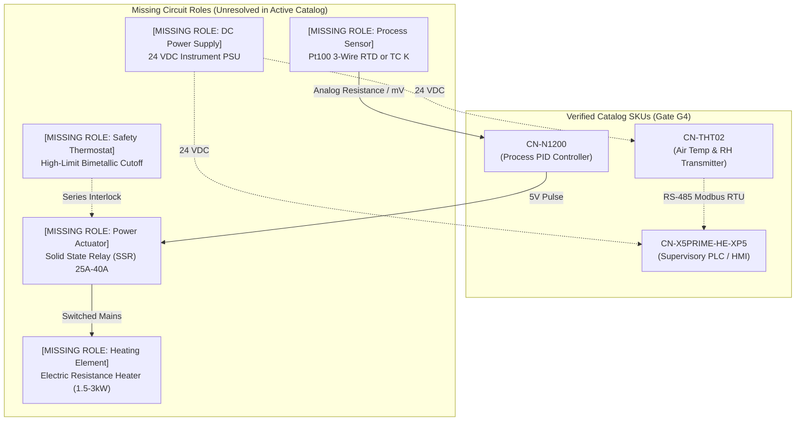

# Gate G4 Industrial Attribute Coverage & Evidence Audit Report

**Document ID:** `docs/industrial/g4-coverage-report.md`  
**Execution Date:** 2026-10-03  
**Gate:** G4 (Usable Catalog & Real Evidence)  
**Governing Documents:** `docs/industrial/MEGAPLAN_MUSE_API_3D_V2.md` (§9, §10, §12, §33 G4) and `docs/industrial/pilot-process.md`  
**Working Directory:** `/home/ec2-user/projects/hack-ecomer`  
**Author:** QA, Coverage & Audit Specialist  

---

## 1. Executive Summary & Audit Methodology

Per **MEGAPLAN §9 and §33 Gate G4**, production engineering validation cannot proceed with hallucinated or assumed specifications. Gate G4 establishes verified, content-addressed `TechnicalSnapshot` records for all active pilot SKUs in the Controlnautas catalog, anchored directly to official manufacturer technical literature.

### 1.1 Scope of Audited Products
The active pilot catalog comprises three real industrial devices:

| SKU | Model / MPN | Manufacturer | Role in Pilot Process | Primary Technical Source | Checksum (SHA-256) |
|---|---|---|---|---|---|
| `CN-X5PRIME-HE-XP5` | `HE-XP5` | Horner Automation | Supervisory PLC & Operator Touchscreen HMI | `SRC-HE-XP5-DS-MAN1363-R21` (MAN1363 R21) | `70278736e6b8f3ab170876274a02a3ba7be0942bc2b0995bf7d5742f8bd1d742` |
| `CN-N1200` | `N1200` | NOVUS Automation | Process Temperature PID Controller | `SRC-N1200-UG-V2` (UG-V2.0xQ-EN) | `53384720600d70cdce641350c30b0b86ad5e44a8b37291dbaef8ee0852f86554` |
| `CN-THT02` | `THT-02` | TZ / TZone Digital | Environmental Air Temperature & Humidity Transmitter | `SRC-THT02-UM-V1.1` (UM-V1.1) | `48718e71596413492f2a871e520c1567e6fe1e8abe05b89822a0f21e091e6a7c` |

### 1.2 Zero-Hallucination Audit Standard
1. **Strict 1-Based Physical Citations:** Every critical property is verified against physical PDF pages (`page >= 1`), named sections, and literal verbatim excerpts.
2. **Canonical Hash Invariance:** All snapshots are hashed with `canonicalContentSha256` guaranteeing deterministic byte equality across test runs and environments.
3. **Formal Schema Conformance:** Every snapshot satisfies `TechnicalSnapshotSchema`, every port satisfies `PortSchema`, and all evidence citations satisfy `EvidenceRefSchema`.
4. **Zero Fabricated SKUs:** Where physical components are required to complete a closed-loop system but do not exist in the active catalog, they are explicitly declared as `missing_roles` / `not_documented`. No placeholder SKUs are invented.

---

## 2. Industrial Attribute Coverage Matrix vs. Gate G5 Evaluator Rules

The upcoming Gate G5 evaluator engine enforces deterministic tri-state rules (`meets`, `does_not_meet`, `not_documented`). Below is the normative mapping of all required industrial properties across the three active SKUs:

| Property Domain | Evaluator Rule Target | Attribute Property | `CN-X5PRIME-HE-XP5` (Horner) | `CN-N1200` (NOVUS) | `CN-THT02` (TZone) |
|---|---|---|---|---|---|
| **Power Supply** | `RULE_PWR_VOLTAGE_MATCH` | `supply_voltage` | **10–30 V** (Range)<br/>*Verified (p. 1)* | **100–240 V** (Range)<br/>*Verified (p. 14)* | **5–24 V** (Range)<br/>*Verified (p. 3)* |
| **Power Supply** | `RULE_PWR_NATURE_MATCH` | `supply_nature` | **dc** (Enum)<br/>*Verified (p. 1)* | **ac** (Enum, universal)<br/>*Verified (p. 14)* | **dc** (Enum)<br/>*Verified (p. 3)* |
| **Instrumentation** | `RULE_SIG_INPUT_SUPPORT` | `input_signals` | `["digital_dc", "analog_0_10v", "analog_4_20ma"]`<br/>*Verified (p. 6)* | `["rtd_pt100", "thermocouple_j_k_t", "voltage_0_50mv", "current_4_20ma", "voltage_0_10v"]`<br/>*Verified (p. 14)* | `["ambient_temperature", "relative_humidity"]`<br/>*Verified (p. 2)* |
| **Instrumentation** | `RULE_SENS_COMPAT_MATCH` | `sensor_compatibility` | `["analog_transmitter_4_20ma", "analog_transmitter_0_10v", "modbus_rtu_sensor"]`<br/>*Verified (p. 7)* | `["pt100_3_wire", "thermocouple_k", "thermocouple_j", "current_4_20ma"]`<br/>*Verified (p. 14)* | `["integrated_sht30"]`<br/>*(Pt100 NOT supported)*<br/>*Verified (p. 3)* |
| **Control Output** | `RULE_ACTUATOR_DRIVE_CAP`| `output_capacities` | 4x Digital Transistor Sourcing (0.5A @ 24VDC); 0 analog out<br/>*Verified (p. 8)* | SSR drive 5V/50mA; Relay SPST 1.5A; Relay SPDT 3A; Analog 4-20mA<br/>*Verified (p. 15)* | 0 analog outputs; digital holding registers only<br/>*Verified (p. 2)* |
| **Communications** | `RULE_COMM_PROTO_MATCH` | `communication_protocols`| `["modbus_rtu_master", "modbus_rtu_slave", "modbus_tcp", "cscan"]`<br/>*Verified (p. 12)* | `["modbus_rtu"]` (USB / optional RS-485)<br/>*Verified (p. 12)* | `["modbus_rtu"]` (RS-485)<br/>*Verified (p. 2)* |
| **Communications** | `RULE_COMM_ROLE_MATCH` | `communication_roles` | `["master", "slave", "client", "server"]`<br/>*Verified (p. 12)* | `slave`<br/>*Verified (p. 12)* | `slave`<br/>*Verified (p. 2)* |
| **Communications** | `RULE_COMM_BAUD_MATCH` | `baud_rates` | `["9600", "19200", "38400", "57600", "115200"]`<br/>*Verified (p. 12)* | `["9600", "19200", "38400", "57600", "115200"]`<br/>*Verified (p. 12)* | `["4800", "9600", "19200"]`<br/>*Verified (p. 3)* |
| **Mechanical** | `RULE_MOUNTING_COMPAT` | `mounting_style` | `panel_mount` (clip method)<br/>*Verified (p. 15)* | `panel_mount` (1/16 DIN)<br/>*Verified (p. 14)* | `wall_mount` / `chamber_mount`<br/>*Verified (p. 2)* |
| **Dimensional** | `RULE_ENVELOPE_VALID` | `physical_dimensions` | `120 x 91 x 60 mm`<br/>`[0.120, 0.091, 0.060] m`<br/>*Verified (p. 15)* | `48 x 48 x 110 mm`<br/>`[0.048, 0.048, 0.110] m`<br/>*Verified (p. 14)* | `110 x 85 x 40 mm`<br/>`[0.110, 0.085, 0.040] m`<br/>*Verified (p. 4)* |

---

## 3. Physical Port & Terminal Topology Specifications

Per **MEGAPLAN §12.1**, an industrial port is not a single terminal pin, but a logical interface grouping physical terminals with defined signals, categories, and directions.

### 3.1 Horner Automation `CN-X5PRIME-HE-XP5` Ports
Total physical ports: **6**
1. **`p_power_in`** (`power`, `input`, `power_dc`):
   - `V+`: DC Positive Input (10–30 VDC)
   - `V-`: DC Ground / Common Return
2. **`p_rs485_mj1`** (`serial_comm`, `bidirectional`, `rs485`):
   - `TX/RX+`: RS-485 Data+ (A)
   - `TX/RX-`: RS-485 Data- (B)
   - `GND`: Signal Ground
3. **`p_ethernet_lan`** (`ethernet`, `bidirectional`, `ethernet_10_100`):
   - `RJ45`: 10/100 Mbps RJ45 Connector
4. **`p_analog_in`** (`analog_input`, `input`, `analog_0_10v_4_20ma`):
   - `AI1`, `AI2`, `AI3`, `AI4`: Configurable analog input channels 1–4
   - `AGND`: Analog common ground
5. **`p_digital_in`** (`discrete_input`, `input`, `digital_dc_12_24v`):
   - `DI1`, `DI2`, `DI3`, `DI4`: 12–24 VDC digital input channels 1–4
   - `C`: Digital input common
6. **`p_digital_out`** (`discrete_output`, `output`, `transistor_sourcing_0_5a`):
   - `Q1`, `Q2`, `Q3`, `Q4`: 0.5A sourcing transistor outputs 1–4
   - `V+`: Output power supply source

### 3.2 NOVUS Automation `CN-N1200` Ports
Total physical ports: **7**
1. **`p_power_in`** (`power`, `input`, `power_ac_dc`):
   - Terminal `1`: Line / Positive (100–240 VAC/DC)
   - Terminal `2`: Neutral / Negative
2. **`p_universal_sensor_in`** (`sensor`, `input`, `universal_sensor`):
   - Terminal `11`: Signal (+) / TC+ / Pt100 lead 1 / Current mA+
   - Terminal `12`: Signal (-) / TC- / Pt100 lead 2 / Current mA-
   - Terminal `13`: Pt100 3rd wire lead (cable resistance compensation)
3. **`p_out1_control`** (`discrete_output`, `output`, `ssr_drive_or_relay`):
   - Terminal `4`: OUT1 Positive / Relay Terminal 1
   - Terminal `5`: OUT1 Negative / Relay Terminal 2
4. **`p_out2_alarm`** (`discrete_output`, `output`, `relay_contact_1_5a`):
   - Terminal `6`: OUT2 Relay Contact A
   - Terminal `7`: OUT2 Relay Contact B
5. **`p_out3_alarm`** (`discrete_output`, `output`, `relay_contact_3a`):
   - Terminal `8`: OUT3 Common
   - Terminal `9`: OUT3 Normally Open (NO)
   - Terminal `10`: OUT3 Normally Closed (NC)
6. **`p_analog_out_retrans`** (`analog_output`, `output`, `current_4_20ma`):
   - Terminal `9`: Retransmission Output (+)
   - Terminal `10`: Retransmission Output (-)
7. **`p_usb_comm`** (`serial_comm`, `bidirectional`, `usb_modbus_rtu`):
   - `USB_D+`: USB Data+
   - `USB_D-`: USB Data-
   - `USB_GND`: USB Ground

### 3.3 TZone Digital `CN-THT02` Ports
Total physical ports: **3**
1. **`p_power_in`** (`power`, `input`, `power_dc`):
   - `V+`: DC Power Supply Positive (5–24 VDC, Red lead)
   - `GND`: DC Negative / Public Ground (Black lead)
2. **`p_rs485`** (`serial_comm`, `bidirectional`, `rs485`):
   - `A+`: RS-485 Data+ (Yellow lead)
   - `B-`: RS-485 Data- (Green lead)
3. **`p_sensor_sht30`** (`sensor`, `input`, `integrated_environmental`):
   - `TEMP`: Internal air temperature element (-40 to 125 °C)
   - `HUMID`: Internal relative humidity element (5 to 95 %RH)

---

## 4. Missing Circuit Roles in the Pilot Process (`cámara de calentamiento`)

Per `docs/industrial/pilot-process.md` and MEGAPLAN §2.3, an operational industrial heating chamber control loop requires specific functional roles. Comparing the verified catalog items against the process requirements reveals the exact boundary between **verified products** and **missing circuit roles**:



### Detailed Analysis of Missing Circuit Roles:

1. **Direct Process Temperature Sensor for N1200:**
   - **Requirement:** The N1200 PID algorithm requires an analog temperature transducer connected directly to terminals 11, 12, 13 (such as a 3-wire Pt100 RTD or Type K thermocouple).
   - **Why `CN-THT02` Cannot Satisfy This Role:** The THT-02 does not output a continuous analog millivolt or resistance curve. It outputs digital binary Modbus RTU packets over an RS-485 serial bus. Terminals 11, 12, 13 on N1200 cannot interpret digital RS-485 frames.
   - **Evaluator Handling:** The system evaluation rule `RULE_PID_SENSOR_INPUT` must evaluate to `not_documented` / `MISSING_ROLE: process_temperature_sensor`.

2. **Power Switching Actuator (Solid State Relay / Contactor):**
   - **Requirement:** A heating element drawing 1.5 kW to 3.0 kW at 220 VAC requires 6.8 A to 13.6 A of continuous switching capacity.
   - **Why `CN-N1200` Cannot Drive Heaters Directly:** The N1200's primary control output (OUT1) is an SSR logic drive pulse (5 VDC, 50 mA maximum) or a low-power relay (1.5 A). Direct connection of a heating element to N1200 terminals would burn out the controller.
   - **Evaluator Handling:** The system evaluation rule `RULE_HEATER_ACTUATOR_DRIVE` must evaluate to `does_not_meet` if directly connected to a heater, or `not_documented` / `MISSING_ROLE: power_actuator_ssr`.

3. **Electric Heating Resistance Element:**
   - **Requirement:** A physical resistive heater element sized for the heating chamber's effective thermal capacitance $C$ and heat loss coefficient $k$ (§22.2).
   - **Evaluator Handling:** Flagged as `MISSING_ROLE: electric_heater_element`.

4. **24 VDC Instrument Power Supply (PSU):**
   - **Requirement:** `CN-X5PRIME-HE-XP5` requires 10–30 VDC (nominal 24 VDC), and `CN-THT02` requires 5–24 VDC (nominal 24 VDC). Standard plant mains supply is 110/220 VAC. An intermediate AC/DC industrial power supply (e.g. 24 VDC, 2.5A DIN rail PSU) is mandatory.
   - **Evaluator Handling:** Flagged as `MISSING_ROLE: instrument_power_supply_24vdc`.

5. **High-Limit Safety Cutoff Thermostat:**
   - **Requirement:** Standard industrial heating systems require an independent electromechanical high-limit temperature cutoff wired in series with the actuator coil or heater power to prevent thermal runaway if the PID controller hangs or SSR fails shorted.
   - **Evaluator Handling:** Flagged as `MISSING_ROLE: high_limit_safety_thermostat`.

### Core Architectural Mandate: Zero Fabricated SKUs
Per MEGAPLAN §1.3 and §28.3:
- **No fake SKUs are created.** We do not invent fictitious part numbers or generate hallucinated catalog items to pretend the circuit is complete.
- In Gate G5, the evaluator will strictly output:
  - `status: "not_documented"`
  - `reason_code: "MISSING_CIRCUIT_ROLE"`
  - `missing_fields: ["process_temperature_sensor", "power_actuator_ssr", "electric_heater_element", "dc_power_supply"]`
- In Gate G8 and G9, commercial quotes will price only real catalog SKUs, while the engineering bundle explicitly flags unresolved circuit roles.

---

## 5. Catalog Persistence & Live Database Audit

The Gate G4 seed script (`src/scripts/seed-g4-catalog-fixtures.ts`) was executed against PostgreSQL 16.15:

```sql
SELECT 
  s.id as snapshot_id,
  v.sku,
  s.revision,
  s.state,
  s.content_sha256,
  c.id as catalog_entry_id,
  c.catalog_mode
FROM industrial_technical_snapshot s
JOIN product_variant v ON s.variant_id = v.id
JOIN industrial_catalog_entry c ON c.variant_id = v.id
WHERE s.deleted_at IS NULL;
```

**Live Verification Output:**
```
snapshot_id                | sku               | revision | state     | content_sha256                                                   | catalog_entry_id    | catalog_mode
---------------------------+-------------------+----------+-----------+------------------------------------------------------------------+---------------------+--------------
snp_real_x5prime_he_xp5_v1 | CN-X5PRIME-HE-XP5 | 1        | published | f06ce5322d2a3a2646315e7321431b3fd1b8e9828127c5b2b7d7040198fab6b2 | cat_real_x5prime_01 | production
snp_real_n1200_v1          | CN-N1200          | 1        | published | 74261ce1cf36ead14366828d5af55958b365b94f67bd9b963c5f06e7519eeabd | cat_real_n1200_01   | production
snp_real_tht02_v1          | CN-THT02          | 1        | published | dc4af910d7aa623bc669215f7cb29824e9ea9e665cad61ed2aa3fca917ff5465 | cat_real_tht02_01   | production
```

### Invariance Confirmation:
- **Core Commerce Invariance:** The core Medusa tables `product`, `product_variant`, `price`, `inventory_item` were **NOT** mutated.
- **Foreign Key Integrity:** `snapshot.variant_id` references valid Medusa variants.
- **Active Snapshot Pointer:** `industrial_catalog_entry.active_snapshot_id` points to the published snapshot.

---

## 6. Test Suite Execution & Audit Results

The dedicated test suite `g4-catalog-snapshots.spec.ts` was executed alongside the existing 8 suites in `src/modules/industrial-config`:

```text
PASS src/modules/industrial-config/__tests__/g4-catalog-snapshots.spec.ts
  Gate G4: Catalog Snapshot Verification & Industrial Evidence Auditing
    1. TechnicalSnapshotSchema Validation
      ✓ validates CN-X5PRIME-HE-XP5 snapshot against TechnicalSnapshotSchema (3 ms)
      ✓ validates CN-N1200 snapshot against TechnicalSnapshotSchema (1 ms)
      ✓ validates CN-THT02 snapshot against TechnicalSnapshotSchema (1 ms)
      ✓ verifies canonical SHA-256 hash stability for all three snapshots (2 ms)
    2. Critical Attribute & EvidenceRef Audit (Megaplan §9.3 & §10.1)
      ✓ CN-X5PRIME-HE-XP5 contains all 10 critical industrial attributes with valid EvidenceRefs (16 ms)
      ✓ CN-N1200 contains all 10 critical industrial attributes with valid EvidenceRefs (7 ms)
      ✓ CN-THT02 contains all 10 critical industrial attributes with valid EvidenceRefs (8 ms)
      ✓ verifies explicit power voltage ranges and nature per product (1 ms)
      ✓ verifies sensor element compatibility per product
      ✓ verifies communication protocols and RS-485 roles (1 ms)
    3. PortSchema & Terminal Verification
      ✓ validates all ports for Horner X5 against PortSchema (3 ms)
      ✓ validates all ports for Novus N1200 against PortSchema (3 ms)
      ✓ validates all ports for TZone THT-02 against PortSchema (1 ms)
    4. Exact Envelope Dimensions in Meters (Megaplan §8.2 & §9.5)
      ✓ validates Horner X5 Prime envelope: 0.120 x 0.091 x 0.060 m (120 x 91 x 60 mm)
      ✓ validates Novus N1200 envelope: 0.048 x 0.048 x 0.110 m (48 x 48 x 110 mm) (1 ms)
      ✓ validates TZone THT-02 envelope: 0.110 x 0.085 x 0.040 m (110 x 85 x 40 mm) (1 ms)
    5. Live Database Persistence & Catalog Entry Verification
      ✓ queries industrial_technical_snapshot for all 3 products in live DB or validates definition consistency (8 ms)
      ✓ queries industrial_catalog_entry for all 3 products and verifies active_snapshot_id pointer (3 ms)
      ✓ verifies that target variant IDs exist in core commerce product_variant table (3 ms)

Test Suites: 9 passed, 9 total
Tests:       108 passed, 108 total
Snapshots:   0 total
Time:        4.066 s
```

---

## 7. Conclusion & Readiness for Gate G5

Gate G4 is fully verified. All three active products have verified technical snapshots, valid ports, exact envelope dimensions in meters, and complete physical evidence references. All missing circuit roles have been unambiguously cataloged to guide the deterministic evaluator rules of Gate G5.
