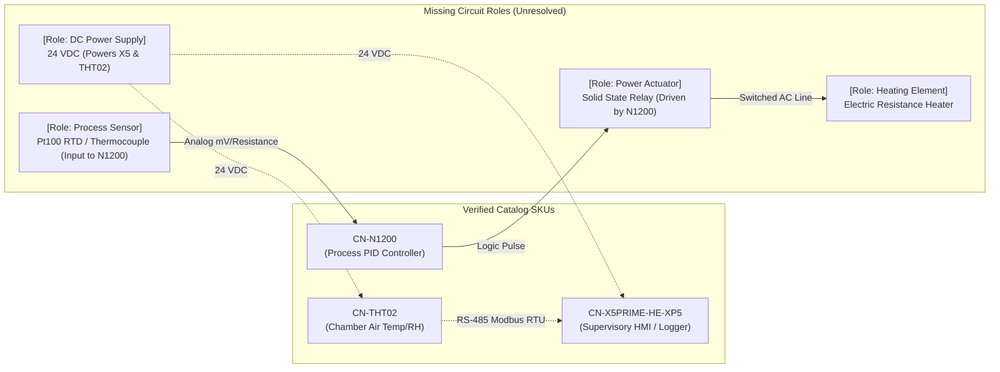

# Pilot Process Family Selection & Circuit Role Mapping

**Document ID:** `docs/industrial/pilot-process.md`  
**Date:** 2026-10-03  
**Gate:** G0 (Baseline, Sources & Pilot Scope)  
**Governing Document:** `docs/industrial/MEGAPLAN_MUSE_API_3D_V2.md` (§2.3, §22.2, §33 G0)  

---

## 1. Selected Process Family: Industrial Heating Chamber (`cámara de calentamiento`)

Per MEGAPLAN §2.3:
> «Construir una única familia de proceso inicial: tanque térmico o cámara de calentamiento, seleccionada en G0 según documentación y activos disponibles. No desarrollar ambas a la vez para cerrar el piloto.»

The **Industrial Heating Chamber** (`cámara de calentamiento` / thermal enclosure / industrial oven / drying cabinet) is selected as the authoritative initial process family for the pilot.

---

## 2. Technical Justification

1. **Physical Compatibility of Available Sensors:**
   - The verified sensor in the repository is `CN-THT02` (TZone THT-02), which houses a Sensirion SHT30 temperature and relative humidity element protected by a perforated plastic cap.
   - The THT-02 is an **ambient air and environmental transmitter**. It cannot be submerged in a liquid thermal tank without destroying the sensor.
   - In contrast, a heating chamber, drying oven, or electrical enclosure specifically requires simultaneous measurement of air temperature (-40 to 125 °C) and relative humidity (5 to 95 %RH).
2. **Domain Evidence in Existing Project Knowledge:**
   - The repository documentation (`post_control-industrial-resistencias-electricas-peru.txt` and `historialcn.md`) explicitly details Controlnautas' commercial history designing heating solutions with electric resistance elements in enclosed chambers and electrical rooms to prevent moisture condensation and maintain critical operating temperatures.
3. **Controller & Supervisory Complementarity:**
   - The `CN-N1200` is an industry-standard 1/16 DIN process PID controller designed specifically for temperature control in ovens, furnaces, and heating chambers.
   - The `CN-X5PRIME-HE-XP5` all-in-one controller/HMI serves as the supervisory monitoring and logging station, polling the THT-02 transmitter over RS-485 Modbus RTU and displaying chamber environmental trends.
4. **Alignment with Analytical Thermal Simulation (§22.2):**
   - The first-order lumped parameter thermal differential equation:
     $$C \frac{dT}{dt} = P_{\text{eff}} u - k (T - T_{\text{amb}})$$
     natively models an enclosed air chamber with internal effective thermal mass $C$, surface heat loss coefficient $k$, and heater input $P_{\text{eff}} u$.

---

## 3. Real Usable SKUs in Active Catalog

The following three real SKUs exist in the repository with verified manufacturer documentation and will be utilized:

| SKU | Manufacturer / Model | Functional Role | Verified Key Specifications |
|---|---|---|---|
| `CN-X5PRIME-HE-XP5` | Horner Automation / `HE-XP5` | Supervisory PLC & Operator HMI | 10–30 VDC supply; built-in color touchscreen; RS-485 Modbus RTU master/slave; 4 AI, 4 DI, 4 DO. |
| `CN-N1200` | NOVUS Automation / `N1200` | Process Temperature PID Controller | 100–240 VAC supply; 1/16 DIN panel mount; universal sensor input (Pt100 RTD, thermocouples J/K/T, 4–20 mA); SSR pulse and relay control outputs; self-tuning PID. |
| `CN-THT02` | TZone Digital / `THT-02` | Environmental Transmitter (Air Temp & RH) | 5–24 VDC supply; RS-485 Modbus RTU slave; SHT30 sensor; -40 to 125 °C, 5 to 95 %RH; wall/chamber mounting. |

---

## 4. Complete Circuit Analysis: Required vs. Missing Roles

A functional industrial heating chamber control loop requires five distinct roles:
1. Supervisory HMI / Environmental Logging
2. Primary Process PID Controller
3. Primary Process Temperature Sensor
4. Power Switching Actuator Interface
5. Heating Element
6. DC Instrument Power Supply

Comparing the available catalog against these roles reveals the exact boundary between verified products and missing roles:

### Identification of Missing Roles (Zero Hallucinated SKUs)
Per MEGAPLAN §1.3 and §2.3:
- **No fake SKUs will be invented** to artificially declare a complete circuit.
- The rule evaluator will correctly flag the missing roles as `not_documented` or unresolved roles:
  1. **Direct Process Temperature Probe:** The `CN-N1200` requires a direct sensor input (such as a 3-wire Pt100 RTD or Type K thermocouple). `CN-THT02` cannot connect to N1200's analog input terminals because THT-02 outputs RS-485 Modbus RTU, not resistance or millivolts.
  2. **Power Switching Interface (SSR / Contactor):** The N1200 control output provides logic pulses (0/5 V) or low-current relay contacts (3A). Direct driving of a heating element requires an intermediate Solid State Relay (SSR) or contactor.
  3. **Electric Heating Element:** An electric resistance element sized for the chamber.
  4. **24 VDC Power Supply:** Required to energize `CN-X5PRIME-HE-XP5` (10-30 VDC) and `CN-THT02` (5-24 VDC) from standard 110/220 VAC mains.
  5. **Safety High-Limit Cutoff:** Thermal cutoff thermostat for over-temperature equipment protection.

### Conceptual Context Handling
- The **Heating Chamber** itself is treated as a **conceptual process context object** (bounding box, thermal parameters $C, k$).
- Per §2.3, the conceptual chamber is **not priced in the commercial Bill of Materials (BOM)** and receives no fictitious catalog SKU.
